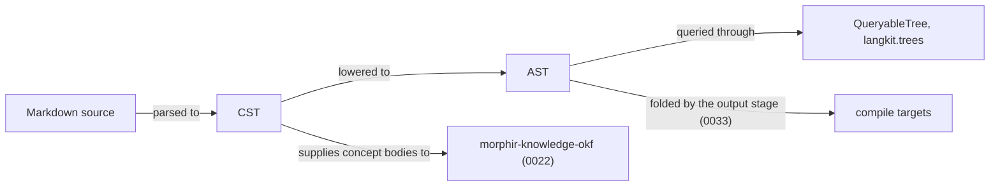

# 0021 — Markdown langkit

Publish `morphir-langkit-markdown`, a cross-platform parser producing a Markdown CST and AST on JVM, JS,
and Native.

## Problem

OKF concept bodies are markdown, and the kb skill already parses them with `commonmark-java`, which is JVM-only.
Library users and `morphir-knowledge-okf` need the same parse on JVM, JS, and Native. Markdown is a source language,
so the work belongs in `langkit`, beside Elm, not in `kit` or `connector`.

## Approach

Publish `morphir/langkit/markdown` as `org.finos.morphir::morphir-langkit-markdown`. It depends on
`langkit.core` for `Span` and diagnostics. A `QueryableTree` instance is later work in this module, against
`langkit.trees`. [0033](/0033-markdown-compilation.md) adds writer modules beneath this one without renaming
it; the coordinate this intent ships is unchanged.

The module produces two trees. The parser emits a concrete syntax tree, which keeps every token and its source
span, and an explicit lowering step produces an abstract syntax tree, which drops the punctuation and keeps the
meaning. Both belong to this intent. The output stage that folds the AST belongs to
[0033](/0033-markdown-compilation.md).

`commonmark-java` must not enter the core module. That module owns a CommonMark parser that runs on JVM, JS, and
Native. It began as a subset — ATX headings, paragraphs, fenced code, unordered lists and thematic breaks, with
inlines left as raw text — and is now complete against CommonMark 0.31.2: all 652 examples parse and render byte
for byte. A third-party engine remains allowed later if one compiles on all three platforms.

**Figure 1:** the proposed scope line. This intent delivers the parser and both trees; everything downstream of
the AST fold belongs to [0033](/0033-markdown-compilation.md).

The first tests parse those block forms to a CST on JVM, JS, and Native. The CommonMark conformance suite is the
acceptance oracle beyond that, and it needs the HTML output that [0033](/0033-markdown-compilation.md)
produces.

## Alternatives

**`commonmark-java`.** Considered and rejected. It is the parser the kb skill already uses, so adopting it would
have cost nothing to write. It is JVM-only, and the whole point of this intent is that `morphir-knowledge-okf`
and library users need the same parse on JS and Native. It must not enter the core module.

**Another third-party CommonMark engine.** Considered and deferred, not rejected. No engine was found that
compiles on JVM, JS and Native. One remains allowed later if it appears, which is why the owned parser is
written behind an ordinary module boundary rather than spread through callers.

**Placing markdown in `kit` or `connector`.** Considered and rejected. `kit` means a bridge to one upstream
library carrying no Morphir types, and `connector` means a client for an external system. Markdown is a source
language, so it belongs in `langkit` beside Elm, as [decision 0013](../morphir/morphir-scala/decisions/0013-published-library-families.md)
sets out.

## Unresolved

**Whether a third-party engine eventually replaces it.** Settled by one appearing that compiles on all three
platforms and maps onto the CST without losing spans. Until then this stays open, and it would reopen the
Approach rather than merely extend it. The case for replacing it is weaker than it was: the owned parser now
covers the whole of CommonMark 0.31.2.

*Settled: whether the CST and the AST stay one tree.* Two trees, related by a total lowering. The CST
(`CstNode`) holds every byte under the leaf-tiling invariant — its leaves partition the source, so printing it
reproduces the document exactly, checked over the whole conformance corpus. The AST (`Document`) holds the
meaning. `Lower.lower: CstNode.Document => Document` is total, and a second conformance suite proves the lowered
pipeline renders all 652 examples byte for byte, same as the direct parse. What remains inside the module is
mechanical: the parser still builds the AST directly as well, and retiring that path — deleting the deferred
prose machinery and the threaded definitions map so the AST is produced only by lowering — is the tail of the
same slice.

*Settled: how much of CommonMark the owned parser covers.* All of it — 652 of 652 examples, every section of the
specification. *Settled: whether the AST shape survives the conformance suite.* It did, though it grew: list
items became containers of blocks, block quotes and raw HTML and hard line breaks arrived as node kinds, and
lists gained the tight-or-loose flag the spec's rendering turns on. None of that reopened the shape; each was an
addition to it.

## Relationships

Depends on [decision 0013](../morphir/morphir-scala/decisions/0013-published-library-families.md).
[0022](/0022-okf-knowledge-library.md) depends on this intent for concept bodies.
[0033](/0033-markdown-compilation.md) supplies the HTML this intent's CommonMark conformance suite compares
against, and renames the artifact published here.
The narrative home is the
[published library families Design Note](../morphir/morphir-scala/design/published-library-families.md).
