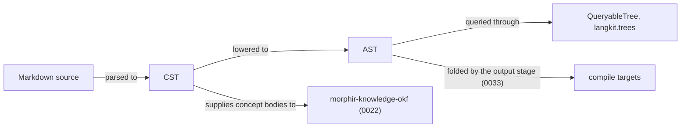

# 0021 — Markdown langkit

Publish `morphir-langkit-markdown`, a cross-platform parser producing a Markdown CST and AST on JVM, JS,
and Native.

## Problem

OKF concept bodies are markdown, and the kb skill already parses them with `commonmark-java`, which is JVM-only.
Library users and `morphir-knowledge-okf` need the same parse on JVM, JS, and Native. Markdown is a source language,
so the work belongs in `langkit`, beside Elm, not in `kit` or `connector`.

## Approach

Publish `morphir/langkit/markdown` as `org.finos.morphir::morphir-langkit-markdown`. It depends on
`langkit.core` for `Span` and diagnostics. A `QueryableTree` instance is later work in this module, against
`langkit.trees`. [0033](/0033-markdown-compilation.md) adds writer modules beneath this one without renaming
it; the coordinate this intent ships is unchanged.

The module produces two trees. The parser emits a concrete syntax tree, which keeps every token and its source
span, and an explicit lowering step produces an abstract syntax tree, which drops the punctuation and keeps the
meaning. Both belong to this intent. The output stage that folds the AST belongs to
[0033](/0033-markdown-compilation.md).

`commonmark-java` must not enter the core module. That module owns a CommonMark parser that runs on JVM, JS, and
Native. It began as a subset — ATX headings, paragraphs, fenced code, unordered lists and thematic breaks, with
inlines left as raw text — and is now complete against CommonMark 0.31.2: all 652 examples parse and render byte
for byte. Adopting a third-party engine instead is no longer under consideration: this parser measures full
conformance against CommonMark 0.31.2, and, since [0035](/0035-github-flavored-markdown-profile.md), 662 of 663
measured examples against GitHub Flavored Markdown, with the one gap tracked as beads `morphir-t3p.8`.

**Figure 1:** the proposed scope line. This intent delivers the parser and both trees; everything downstream of
the AST fold belongs to [0033](/0033-markdown-compilation.md).

The first tests parse those block forms to a CST on JVM, JS, and Native. The CommonMark conformance suite is the
acceptance oracle beyond that, and it needs the HTML output that [0033](/0033-markdown-compilation.md)
produces.

## Alternatives

**`commonmark-java`.** Considered and rejected. It is the parser the kb skill already uses, so adopting it would
have cost nothing to write. It is JVM-only, and the whole point of this intent is that `morphir-knowledge-okf`
and library users need the same parse on JS and Native. It must not enter the core module.

**Another third-party CommonMark engine.** Considered and deferred at the time, not rejected — no engine was
found that compiled on JVM, JS and Native, which is why the owned parser is written behind an ordinary module
boundary rather than spread through callers. Settled since; see Unresolved.

**Placing markdown in `kit` or `connector`.** Considered and rejected. `kit` means a bridge to one upstream
library carrying no Morphir types, and `connector` means a client for an external system. Markdown is a source
language, so it belongs in `langkit` beside Elm, as [decision 0013](../morphir/morphir-scala/decisions/0013-published-library-families.md)
sets out.

## Unresolved

*Settled: whether a third-party engine eventually replaces it.* It does not. The owned parser now measures full
conformance against CommonMark 0.31.2, and, since [0035](/0035-github-flavored-markdown-profile.md), 662 of 663
measured examples against GitHub Flavored Markdown, with one gap tracked as beads `morphir-t3p.8` — the case a
replacement would have to make against that record only gets harder, and nothing here proposes reopening the
Approach to make it. Recorded as
[decision 0016](../morphir/morphir-scala/decisions/0016-the-markdown-parser-is-our-own.md).

*Settled: whether the CST and the AST stay one tree.* Two trees, related by a total lowering, and the lowering
is the parse. The CST (`MdCstNode`) holds every byte under the leaf-tiling invariant — its leaves partition the
source, so printing it reproduces the document exactly, checked over the whole conformance corpus. The AST
(`MdNode`, rooted at `MdNode.Root`) holds the meaning. `Lower.lower: MdCstNode.Document => MdNode.Root` is
total, `Parser.parse` produces its AST only by lowering the CST, and a second conformance suite proves the
lowered pipeline renders all 652 examples byte for byte. The AST now speaks mdast vocabulary: one node type
(`MdNode`) instead of a case class per kind, content-category unions (`FlowContent`, `PhrasingContent`) in
place of separate block/inline hierarchies, and an optional `Span` carried only where a node was produced by
lowering rather than generated. The deferred-prose machinery inside the parser survives as the engine that
fills the CST's inline slots once every definition is known; the definitions map is that machinery's internal
bookkeeping, no longer the AST's source of truth — lowering re-collects definitions from the CST's own nodes. The
module now also writes: authored `MdNode` trees, built with the `dsl` package and carrying `MdMeta`
position-and-data, serialize to Markdown through `MdWriter.write` under a given `MdStyle`, and `MdWriter.raise`
produces tiled CSTs by write-then-parse — both held to the rendering oracle corpus-wide. Parsing is profiled as
well: an `MdProfile` names which frontmatter kinds a parse recognizes, each kind carrying its own delimiter, and an
opt-in YAML block travels the whole way — a CST node, the `frontmatter` seat on `MdNode.Root`, and back out through
`MdWriter` — so `morphir-knowledge-okf` reads concept frontmatter through the parser rather than splitting the fence
itself.

*Settled: how much of CommonMark the owned parser covers.* All of it — 652 of 652 examples, every section of the
specification. *Settled: whether the AST shape survives the conformance suite.* It did, though it grew: list
items became containers of blocks, block quotes and raw HTML and hard line breaks arrived as node kinds, and
lists gained the tight-or-loose flag the spec's rendering turns on. None of that reopened the shape; each was an
addition to it.

## Relationships

Depends on [decision 0013](../morphir/morphir-scala/decisions/0013-published-library-families.md).
[0022](/0022-okf-knowledge-library.md) depends on this intent for concept bodies.
[0033](/0033-markdown-compilation.md) supplies the HTML this intent's CommonMark conformance suite compares
against, and renames the artifact published here.
The narrative home is the
[published library families Design Note](../morphir/morphir-scala/design/published-library-families.md).
