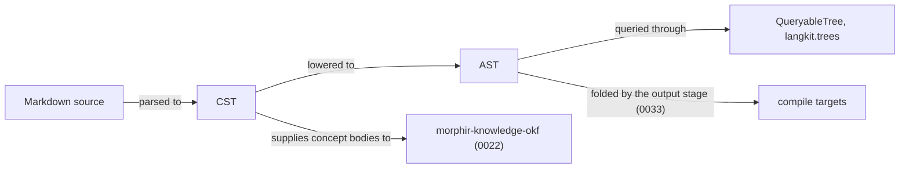

# 0021 — Markdown langkit

Publish `morphir-langkit-markdown-core`, a cross-platform parser producing a Markdown CST and AST on JVM, JS,
and Native.

## Problem

OKF concept bodies are markdown, and the kb skill already parses them with `commonmark-java`, which is JVM-only.
Library users and `morphir-knowledge-okf` need the same parse on JVM, JS, and Native. Markdown is a source language,
so the work belongs in `langkit`, beside Elm, not in `kit` or `connector`.

## Approach

Publish `morphir/langkit/markdown/core` as `org.finos.morphir::morphir-langkit-markdown-core`. It depends on
`langkit.core` for `Span` and diagnostics. A `QueryableTree` instance is later work in the core module, against
`langkit.trees`. [0033](/0033-markdown-compilation.md) splits the langkit into this core and a sibling compiler
module; the coordinate this intent ships is the core.

The module produces two trees. The parser emits a concrete syntax tree, which keeps every token and its source
span, and an explicit lowering step produces an abstract syntax tree, which drops the punctuation and keeps the
meaning. Both belong to this intent. The output stage that folds the AST belongs to
[0033](/0033-markdown-compilation.md).

`commonmark-java` must not enter the core module. That module owns a CommonMark subset parser that runs on JVM,
JS, and Native: ATX headings, paragraphs, fenced code, unordered lists, and thematic breaks. Inlines stay raw
text. A third-party engine remains allowed later if one compiles on all three platforms.

**Figure 1:** the proposed scope line. This intent delivers the parser and both trees; everything downstream of
the AST fold belongs to [0033](/0033-markdown-compilation.md).

The first tests parse those block forms to a CST on JVM, JS, and Native. The CommonMark conformance suite is the
acceptance oracle beyond that, and it needs the HTML output that [0033](/0033-markdown-compilation.md)
produces.

Depends on [decision 0013](../morphir/morphir-scala/decisions/0013-published-library-families.md).
[0022](/0022-okf-knowledge-library.md) depends on this intent for concept bodies.
[0033](/0033-markdown-compilation.md) supplies the HTML this intent's CommonMark conformance suite compares
against, and renames the artifact published here.
The narrative home is the
[published library families Design Note](../morphir/morphir-scala/design/published-library-families.md).
