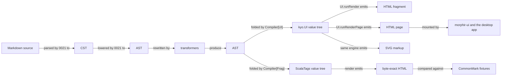
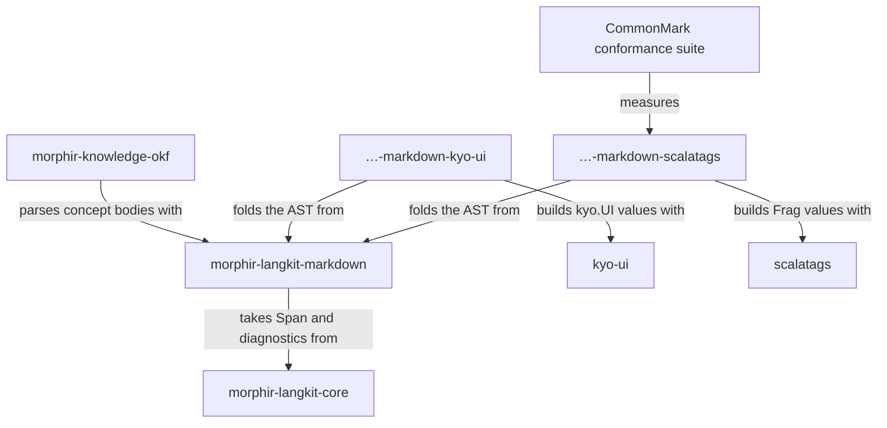

# 0033 — Markdown compilation

Compile the Markdown AST through one fold algebra to two cross-platform writers: kyo-ui for the browser and ScalaTags for CommonMark conformance.

## Problem

[Intent 0021](/0021-markdown-langkit.md) parses Markdown into a concrete syntax tree, which keeps every token
and its source span, and lowers that to an abstract syntax tree, which drops the punctuation and keeps the
meaning. Both are that intent's work, and neither exists yet: the module today holds one flat `Document`/`Block`
tree. Background on the distinction is in
[syntax trees and intermediate representations](../programming-language-tooling/syntax-trees-and-intermediate-representations.md).

Parsing is where 0021 stops. Nothing turns the AST back into output.

Two consumers need output, and they need it to agree. The [CommonMark](https://spec.commonmark.org/)
conformance suite compares our parse against the expected HTML for each example, so it needs an HTML writer.
The `morphir-ui` client and the Electron desktop app display concept bodies, so they need markup they can
mount. Today that client does not compile Markdown at all: `KnowledgeBrowserView.conceptView` puts the raw
Markdown source in a paragraph element. If the two paths are written separately, the conformance suite measures
a writer that no user ever sees.

The output stage is also not one format. HTML is the first target. SVG, plain text, and formats we have not
named yet are plausible later. A design that hardcodes HTML string building has to be rewritten for the second
target.

## Approach

Publish the output stage as two writer artifacts over one shared algebra:
`org.finos.morphir::morphir-langkit-markdown-kyo-ui` for the browser, and
`…-markdown-scalatags` for the conformance oracle. Both sit beneath the existing
`morphir-langkit-markdown`, which keeps its name and gains the shared algebra; neither depends on the other.



**Figure 1:** the proposed compile path. Morphir owns everything up to the value tree and writes no HTML itself;
kyo-ui emits what users see, ScalaTags emits what the conformance suite measures, and the shared
`Compiler` algebra is what keeps the two node mappings aligned.

Both writers are built and the path is complete: the ScalaTags writer reproduces all 652 CommonMark 0.31.2
fixtures byte for byte. The algebra grew as the parser did — it gained `blockQuote`, `rawHtml`, `lineBreak` and
`blockSeparator`, and `listItem` came to take compiled blocks rather than compiled prose — and every addition
reached both writers at once, because a new method does not compile until both implement it. That is the property
the shared algebra was chosen for, and it held.

### The browser path, owned by kyo-ui

The compiler produces `kyo.UI` values, not strings. `kyo.UI` is a value tree of HTML elements: `div`, `p`, `ul`,
`ol`, `li`, `pre`, `code`, `blockquote`, and the rest. kyo-ui turns a `kyo.UI` into markup through
`UI.runRender(ui)`, which returns a `Stream[String, Async]` of an HTML fragment.
`UI.runRenderPage(head)(ui)` returns the same stream wrapped as a complete document. A snapshot takes the first
emission. kyo-ui emits again whenever a signal changes, which is how it drives a live page, and a static render
never reaches the second emission.

This means Morphir writes no HTML writer at all (Figure 1). What it does not mean is that one writer can serve
both consumers: a spike measured kyo-ui's HTML against the CommonMark fixtures and found it unusable as a
conformance oracle. ScalaTags supplies the second writer, and both stay honest because they fold the same
algebra. [Two writers, one algebra](#two-writers-one-algebra) sets out the measurement and the consequence.

`kyo-ui` publishes for JVM, Scala.js, and Scala Native at the version the build pins in
`ScalaVersions`/`Versions`, and its HTML renderer lives in shared sources, so the same call works on every
platform the langkit targets. These two claims were checked by resolving the published `1.0.0-RC6` artifacts and
reading their contents, not from documentation; the API signatures quoted above come from the same inspection.
Those artifacts are compiled for Java 25, so every consumer of the kyo-ui writer needs that runtime. The
ScalaTags writer does not depend on kyo-ui, so the conformance suite does not inherit that floor.

SVG needs no second writer. Every `Svg.*` node is a `kyo.UI` element, and the same engine emits `<svg>`,
`<circle>`, and `<path>`. `Svg.circle(...)` does not have kyo-ui's `HtmlContent` type, so it will not compile as
a child of an HTML element. A caller wraps it: `div(Svg.svg(...))`.

### Two writers, one algebra

kyo-ui renders what users see. It cannot also be the conformance oracle. A spike built `kyo.UI` values by hand
for CommonMark examples, rendered them through `UI.runRender`, and compared the first emission to each fixture's
expected HTML. None of the samples matched.

| Divergence | kyo-ui emits | CommonMark expects | Removable |
| --- | --- | --- | --- |
| Bookkeeping attribute on every element | `<p data-kyo-path="">` | `<p>` | by a canonicalization pass |
| Reactive wrapper anchors | `<span data-kyo-path="0" data-kyo-reactive>` | nothing | by a canonicalization pass |
| Apostrophe | `&#39;` | `'` | by a canonicalization pass |
| Emphasis and strong emphasis | no such element | `<em>`, `<strong>` | **no** |

The first three are cosmetic, and stripping them makes the samples match. `data-kyo-path` is unconditional —
kyo-ui writes it into the open tag of every element and exposes no render mode that omits it — but a
canonicalizing oracle could still remove it, at the cost of soundness: CommonMark passes HTML blocks through
verbatim, so a document that itself contains that attribute would be corrupted by the strip.

The fourth divergence ends the single-writer design. kyo-ui has no `em` and no `strong` element, and emphasis is
core CommonMark. Rendering it as `span` produces the wrong tag, not a formatting difference. `del`, `thead`,
`sup` and `sub` are missing too, which would block GFM later. `UI.rawHtml` renders a string verbatim and does
match, but a compiler that reaches for it to spell `<em>` has made Morphir the author of that tag and its
escaping — the very writer this intent set out not to write.

So the conformance oracle is a second `Compiler` instance built on [ScalaTags](https://github.com/com-lihaoyi/scalatags),
whose output was measured the same way and matched every sample byte for byte with no canonicalization at all,
including attribute values carrying quotes and ampersands. ScalaTags publishes for JVM, Scala.js and Scala
Native, so the oracle runs everywhere the langkit does.

This keeps the property the Problem section actually needs. Morphir still writes no HTML: one writer belongs to
kyo-ui, the other to ScalaTags. What changed is the claim that a single writer could serve both, and the guard
that replaces it is structural — both instances fold the same `Compiler[Out]` algebra over the same AST, so a
node the conformance suite exercises is a node the browser path must also implement. The suite no longer
measures the browser's writer directly; it measures the compiler's node mapping, which both writers share.

### A fold, not a visitor

The output stage is an algebra with one method per node kind, each taking children that are already compiled:

```scala
trait Compiler[Out]:
  def document(children: Chunk[Out]): Out
  def heading(level: HeadingLevel, children: Chunk[Out]): Out
  def paragraph(children: Chunk[Out]): Out
  def text(value: String): Out
```

`Chunk` is Kyo's array-backed sequence. `HeadingLevel` is the type for `depth` on `MdNode.Heading` in the AST.

A fold walks the tree bottom-up. Children are compiled first, and each node combines the compiled children into
one `Out`. One driver owns that traversal, and each output format supplies only the node mapping.

Two other shapes were considered for this stage and rejected; see Alternatives.
[Tree traversal, visitors, cursors and rewriting](../programming-language-tooling/tree-traversal-visitors-cursors-and-rewriting.md)
compares them in general.

Kyo writes an effectful value as `A < S`: a value of type `A` with the effect `S` still pending. `Out` can
therefore be instantiated at `UI < Async`, so effects reach the output without appearing in the algebra. The
algebra itself stays pure, because an effectful signature would spread across every format and buy nothing.

### Module shape

The Markdown langkit gains two artifacts and keeps its own. `morphir-langkit-markdown` still holds everything
that parses, so no coordinate is renamed and nothing that depends on it moves.

| Module | Holds | Depends on |
| --- | --- | --- |
| `morphir-langkit-markdown` | CST, AST, transformers, the `Compiler` algebra, and the parser | `langkit-core`, `prelude` |
| `morphir-langkit-markdown-kyo-ui` | `Compiler[UI]`, the writer users see | the base module, `kyo-ui` |
| `morphir-langkit-markdown-scalatags` | `Compiler[Frag]`, the conformance oracle | the base module, `scalatags` |

Both writers publish for JVM, Scala.js and Scala Native, so conformance can be measured and markup produced
wherever the langkit runs. A Wasm link variant of the kyo-ui writer proved necessary and exists too: `morphir/ui`
compiles concept bodies in sources shared by its Scala.js and Wasm modules, so the writer had to link for both,
which in turn gave `morphir-langkit-markdown` and `langkit-core` Wasm variants. None of the three is a publish
module.

Scala Native needs one thing from the consuming build. `kyo-ui` reaches `kyo-net` through `kyo-http`, and kyo-net
compiles its TLS shim into the binary while deliberately emitting no `@link` — there is no `kyonet_openssl` shared
library to name. kyo's own source says the system OpenSSL is linked through `-lssl -lcrypto`, so supplying those is
the consumer's job; `MorphirNativeOpenSsl` in `build.mill` does it. No `-L` is required, because Scala Native
already searches `/opt/homebrew/lib` on macOS and `/usr/lib` on Linux. The flags must be mixed into the test module
as well as the module itself: a nested `object test` does not inherit `nativeLinkingOptions`, and a module that
links while its tests do not is the failure this causes.

An earlier draft split the parser into a `-core` artifact beneath a container directory. That is not needed:
`morphir/langkit/markdown` can be a published module *and* the parent of the writer modules at once, the way
`morphir/model` is published as `morphir-model` while `morphir/model/lowering` publishes as
`morphir-model-lowering`. Keeping the base name spends no rename on a distinction consumers do not make —
what they want from this family is the Markdown langkit, and the writers are the qualified additions.

One writer per artifact, named for the library it binds, follows the kit convention already used for
`kit/kyo`. All three declare `package morphir.langkit.markdown`, so a caller writes one import and has whatever
the classpath offers; the module directories shape the coordinate, not the package. That makes the package a
split one, which a classpath accepts and a Java module path would not — noted so the trade is deliberate rather
than discovered later. It also keeps each dependency where it is wanted: the conformance suite takes the ScalaTags
artifact and never resolves `kyo-ui`, so it does not inherit that library's Java 25 floor, and the browser
takes the kyo-ui artifact and never resolves ScalaTags.



**Figure 2:** the proposed three-artifact split. No path runs from `morphir-knowledge-okf` to either writer,
which is what keeps a parse-only consumer free of the output stage, and no path runs between the two writers.

No artifact is renamed, so `breaking: false` holds without argument: `morphir-langkit-markdown` keeps its
coordinate, its package, and every consumer it already has. The two writers are new coordinates alongside it.

The names follow unified's pipeline, which runs parser, then transformers, then compiler, and the sibling shape
of `morphir/langkit/elm/core` and `elm/compiler`. This repository already implements unist, the tree shape
unified's tools share, in `morphir.langkit.trees.unist`, so the pipeline names follow names already in use. The
fuller rationale belongs to the family taxonomy and lives in the
[published library families Design Note](../morphir/morphir-scala/design/published-library-families.md); see
also [transformation pipelines](../programming-language-tooling/transformation-pipelines.md).

Transformers rewrite one AST into another and need no output target, so they live in the core beside the AST.
The compiler module holds only the targets. A caller that rewrites an AST therefore does not pull in `kyo-ui`.

`morphir-knowledge-okf` parses concept bodies and does not compile them. It depends on the core and never pulls
in `kyo-ui` (Figure 2). It is the only consumer of the Markdown langkit today.

## Alternatives

**A Morphir-owned `Compiler[String]` writing HTML directly.** Considered and rejected. It would cost the
langkit no output-library dependency at all, which is a real saving, and it would be byte-exact. It also puts
Morphir in the business of spelling tags and escaping text, which is the maintenance burden and the
correctness hazard this intent exists to avoid. ScalaTags buys the same byte-exactness from a library that has
solved escaping already, for the price of one well-established dependency, so the saving is not worth it.

**Canonicalizing kyo-ui's output instead of adding a second writer.** Considered and rejected once the spike
measured it. Stripping `data-kyo-path` and rewriting `&#39;` does make the cosmetic divergences disappear, and
had emphasis been the only gap it would have been the cheaper answer. It fails on two counts: kyo-ui has no
`em` or `strong` element to canonicalize into the right shape, and the strip is unsound against CommonMark's
verbatim HTML blocks. Waiting for kyo-ui to grow the missing elements was also considered, and rejected as a
schedule dependency on an upstream release that blocks 0021's conformance work meanwhile.

**A `Monoid[Out]`, supplying an associative combine and an empty value.** Considered and rejected. A monoid
concatenates siblings, and a heading wraps its children rather than sitting beside them, so the shape cannot
express nesting.

**A visitor over the AST.** Considered and rejected. It works, but traversal then lives in every output format
instead of in one driver, and each new target repeats it.

**A third module separating the model from the parser.** Considered and deferred, not rejected outright. It
would help only a consumer that compiles a programmatically built AST without parsing, and none exists. Adding
it later is not breaking, because the core would depend on it and Maven passes the model through transitively,
whereas publishing three artifacts now and collapsing to two later would break consumers. The reversible order
is to start with two.

## Unresolved

**Does the kyo-ui writer need its own conformance measure?** The ScalaTags writer is measured against all 652
CommonMark fixtures and matches every one. The kyo-ui writer folds the same algebra, so its node mapping cannot
drift silently, but nothing checks its *output* — and it has one known structural divergence, carrying emphasis on
a `span` with a class because kyo-ui has no `em` or `strong`. Settled either by kyo-ui gaining those elements or by
a canonicalizing measure that scores it on the divergences that are not cosmetic.

**Do the kyo-ui platform claims hold at the pinned version?** The JVM, Scala.js, and Scala Native artifacts were
read at `1.0.0-RC6`. A version bump could move the HTML renderer out of shared sources or change the
`runRender` signature. Re-reading the artifacts on each kyo bump settles it.

## Relationships

[0021](/0021-markdown-langkit.md) depends on this intent for its conformance oracle, and this intent depends on
0021 for the AST it folds.
The narrative home is the
[published library families Design Note](../morphir/morphir-scala/design/published-library-families.md).
The client that will mount this output is the morphir-ui client, whose structure is described in the
[morphir-ui architecture Design Note](../morphir/morphir-scala/design/morphir-ui-architecture.md).
