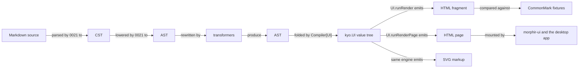
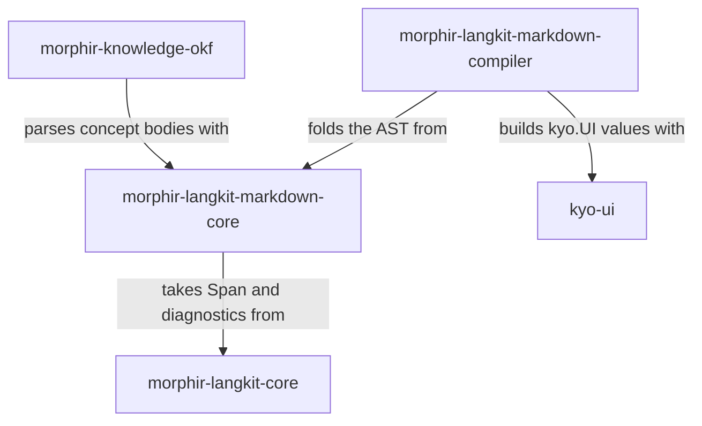

# 0033 — Markdown compilation

Compile the Markdown AST to `kyo.UI` values so HTML and SVG come from a single cross-platform output stage.

## Problem

[Intent 0021](/0021-markdown-langkit.md) parses Markdown into a concrete syntax tree, which keeps every token
and its source span, and lowers that to an abstract syntax tree, which drops the punctuation and keeps the
meaning. Both are that intent's work, and neither exists yet: the module today holds one flat `Document`/`Block`
tree. Background on the distinction is in
[syntax trees and intermediate representations](../programming-language-tooling/syntax-trees-and-intermediate-representations.md).

Parsing is where 0021 stops. Nothing turns the AST back into output.

Two consumers need output, and they need it to agree. The [CommonMark](https://spec.commonmark.org/)
conformance suite compares our parse against the expected HTML for each example, so it needs an HTML writer.
The `morphir-ui` client and the Electron desktop app display concept bodies, so they need markup they can
mount. Today that client does not compile Markdown at all: `KnowledgeBrowserView.conceptView` puts the raw
Markdown source in a paragraph element. If the two paths are written separately, the conformance suite measures
a writer that no user ever sees.

The output stage is also not one format. HTML is the first target. SVG, plain text, and formats we have not
named yet are plausible later. A design that hardcodes HTML string building has to be rewritten for the second
target.

## Approach

Publish the output stage as `org.finos.morphir::morphir-langkit-markdown-compiler`, on JVM, JS, and Native. It
depends on the Markdown core and on `kyo-ui`.



**Figure 1:** the proposed compile path. Morphir owns everything up to the `kyo.UI` value, and kyo-ui owns every
emission, so the conformance suite and the browser measure one writer.

### One HTML path, owned by kyo-ui

The compiler produces `kyo.UI` values, not strings. `kyo.UI` is a value tree of HTML elements: `div`, `p`, `ul`,
`ol`, `li`, `pre`, `code`, `blockquote`, and the rest. kyo-ui turns a `kyo.UI` into markup through
`UI.runRender(ui)`, which returns a `Stream[String, Abort[Nothing]]` of an HTML fragment.
`UI.runRenderPage(head)(ui)` returns the same stream wrapped as a complete document. A snapshot takes the first
emission. kyo-ui emits again whenever a signal changes, which is how it drives a live page, and a static render
never reaches the second emission.

This means Morphir writes no HTML writer at all (Figure 1). The conformance suite and the browser share
kyo-ui's, so the suite measures the writer that ships.

`kyo-ui` publishes for JVM, Scala.js, and Scala Native at the version the build pins in
`ScalaVersions`/`Versions`, and its HTML renderer lives in shared sources, so the same call works on every
platform the langkit targets. These two claims were checked by resolving the published `1.0.0-RC6` artifacts and
reading their contents, not from documentation; the API signatures quoted above come from the same inspection.

SVG needs no second writer. Every `Svg.*` node is a `kyo.UI` element, and the same engine emits `<svg>`,
`<circle>`, and `<path>`. `Svg.circle(...)` does not have kyo-ui's `HtmlContent` type, so it will not compile as
a child of an HTML element. A caller wraps it: `div(Svg.svg(...))`.

A `Compiler[String]` writing HTML directly was considered and rejected. It would cost the langkit no dependency
on `kyo-ui` at all. It is also exactly the writer the Problem section rules out: the conformance suite would
then measure output the browser never produces. The `kyo-ui` dependency is confined to the compiler module, so a
parse-only consumer still avoids it (Figure 2).

### A fold, not a visitor

The output stage is an algebra with one method per node kind, each taking children that are already compiled:

```scala
trait Compiler[Out]:
  def document(children: Chunk[Out]): Out
  def heading(level: HeadingLevel, children: Chunk[Out]): Out
  def paragraph(children: Chunk[Out]): Out
  def text(value: String): Out
```

`Chunk` is Kyo's array-backed sequence. `HeadingLevel` replaces today's `level: Int` in `Block.Heading`, and
introducing it belongs to this intent.

A fold walks the tree bottom-up. Children are compiled first, and each node combines the compiled children into
one `Out`. One driver owns that traversal, and each output format supplies only the node mapping.

A `Monoid[Out]`, which supplies only an associative combine and an empty value, does not work, because a heading
wraps its children instead of concatenating with them. A visitor works, but then every format repeats the
traversal. [Tree traversal, visitors, cursors and rewriting](../programming-language-tooling/tree-traversal-visitors-cursors-and-rewriting.md)
compares these shapes in general.

Kyo writes an effectful value as `A < S`: a value of type `A` with the effect `S` still pending. `Out` can
therefore be instantiated at `UI < Async`, so effects reach the output without appearing in the algebra. The
algebra itself stays pure, because an effectful signature would spread across every format and buy nothing.

### Module shape

The Markdown langkit splits into two artifacts. The foundation module is named `core`, matching `langkit/core`,
`buildkit/core` and `langkit/elm/core`. It is not named `model`, because `morphir/model` already means the
Morphir IR data model.

| Module | Holds | Depends on |
| --- | --- | --- |
| `morphir-langkit-markdown-core` | CST, AST, transformers, the `Compiler` algebra, and the parser | `langkit-core`, `prelude` |
| `morphir-langkit-markdown-compiler` | output targets, starting with `Compiler[UI]` | the core, `kyo-ui` |



**Figure 2:** the proposed two-artifact split. No path runs from `morphir-knowledge-okf` to `kyo-ui`, which is
what keeps a parse-only consumer free of the output stage.

This renames the artifact 0021 declares. `morphir-langkit-markdown` has never been published to Maven Central,
so no released coordinate breaks and `breaking: false` holds. Intent 0021 and the published library families
Design Note carry the new names.

The names follow unified's pipeline, which runs parser, then transformers, then compiler, and the sibling shape
of `morphir/langkit/elm/core` and `elm/compiler`. This repository already implements unist, the tree shape
unified's tools share, in `morphir.langkit.trees.unist`, so the pipeline names follow names already in use. The
fuller rationale belongs to the family taxonomy and lives in the
[published library families Design Note](../morphir/morphir-scala/design/published-library-families.md); see
also [transformation pipelines](../programming-language-tooling/transformation-pipelines.md).

Transformers rewrite one AST into another and need no output target, so they live in the core beside the AST.
The compiler module holds only the targets. A caller that rewrites an AST therefore does not pull in `kyo-ui`.

`morphir-knowledge-okf` parses concept bodies and does not compile them. It depends on the core and never pulls
in `kyo-ui` (Figure 2). It is the only consumer of the Markdown langkit today.

A third module holding the model apart from the parser was considered and deferred. It would only help a
consumer that compiles a programmatically built AST without parsing, and no such consumer exists. Adding it
later is not a breaking change, because the core would depend on it and Maven passes the model through
transitively. Publishing three artifacts now and collapsing to two later would break consumers, so the
reversible order is to start with two.

## Open questions

**Does kyo-ui's HTML match the CommonMark fixtures?** The fixtures are exact about whitespace, void-tag
spelling, and entity escaping. Comparing structurally instead would need an HTML parser on three platforms,
which the project does not have. A spike measures the real gap, and the fallback is a canonicalization pass on
both sides. Until that spike runs, this is unverified, and a large structural divergence would force a
spec-exact writer and defeat the single-path design.

**Does the compiler need a Wasm link variant?** `morphir/ui` declares a `wasm` module that takes `kyo-ui`, so a
Wasm consumer of the knowledge browser would need the compiler linked for Wasm too. Building the morphir-ui
Wasm variant against a compiled concept body settles it.

**Do the kyo-ui platform claims hold at the pinned version?** The JVM, Scala.js, and Scala Native artifacts were
read at `1.0.0-RC6`. A version bump could move the HTML renderer out of shared sources or change the
`runRender` signature. Re-reading the artifacts on each kyo bump settles it.

## Relationships

[0021](/0021-markdown-langkit.md) depends on this intent for its conformance oracle, and this intent depends on
0021 for the AST it folds.
The narrative home is the
[published library families Design Note](../morphir/morphir-scala/design/published-library-families.md).
The client that will mount this output is the morphir-ui client, whose structure is described in the
[morphir-ui architecture Design Note](../morphir/morphir-scala/design/morphir-ui-architecture.md).
