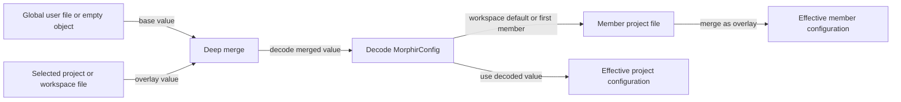

# Morphir Rust configuration support at cdfa6c63

At commit `cdfa6c6323ab0f08a285b77a8a857eb9915a83fb`, Morphir Rust parses TOML and YAML with explicit profile checks
into a shared JSON value. It discovers canonical project and global files and uses YAML in the CLI and daemon. Its
layer loading is narrower than the normative six-layer [Merge Rules](/merge-rules.md). Configuration context loading
merges a global user file below the selected project or workspace file. For a workspace, it then tries the
`default_member` or first `members` value as a literal path and may merge that project file.
[discovery](https://github.com/finos/morphir-rust/blob/cdfa6c6323ab0f08a285b77a8a857eb9915a83fb/crates/morphir-design/src/config.rs)

## Baseline

All claims on this page were verified against `finos/morphir-rust` commit
`cdfa6c6323ab0f08a285b77a8a857eb9915a83fb`. Re-read the pinned files and update this reference when the commit pin
moves. [Configuration Overview](/overview.md) provides the specification baseline and bundle orientation.

## Parsing

| Input | Selection | Normalization |
| --- | --- | --- |
| `.toml` | Explicit path or discovery | `toml::Value` to `serde_json::Value` |
| `.yaml` | Explicit path or discovery | `serde_yaml::Value` to `serde_json::Value` after syntax and value checks |
| `.yml` | Explicit path only | Same path as `.yaml` |
| `.json` | Explicit path or legacy fallback during discovery | Legacy project model converted to `MorphirConfig` |

The parser lowercases the extension before selection. It rejects unsupported extensions. File-read errors and the
TOML or `serde_yaml` parse errors include the source path.
[parser](https://github.com/finos/morphir-rust/blob/cdfa6c6323ab0f08a285b77a8a857eb9915a83fb/crates/morphir-common/src/config/mod.rs#L35-L72)

The YAML checks reject nulls, non-string mapping keys, a non-mapping root, tags, anchors, aliases, and the `<<` merge
key. Tests also pin rejection of duplicate keys and multiple documents. The Rust parser accepts `.yml` when passed
as an explicit path, while discovery never lists it as a candidate.
[parser](https://github.com/finos/morphir-rust/blob/cdfa6c6323ab0f08a285b77a8a857eb9915a83fb/crates/morphir-common/src/config/mod.rs#L75-L127)

## Discovery

| Scope | Candidates | Behavior |
| --- | --- | --- |
| Project or workspace | `morphir.toml`, `morphir.yaml`, `.morphir/morphir.toml`, `.morphir/morphir.yaml` | Returns one, reports every conflicting path, or falls back to `morphir.json` |
| XDG global | `$XDG_CONFIG_HOME/morphir/` when absolute, otherwise `$HOME/.config/morphir/`; plus `$HOME/.morphir/` | Checks TOML and YAML across both roots as one candidate set |
| macOS global | Absolute `$XDG_CONFIG_HOME`, otherwise Application Support; plus `$HOME/.morphir/` | Checks TOML and YAML across both roots as one candidate set |
| Windows global | roaming application data; plus the profile's `.morphir` directory | Ignores XDG and checks TOML and YAML across both roots |

Project discovery walks from the start directory toward the filesystem root. Exact-directory discovery is also
public for workspace-member and daemon use. Any candidate set with more than one existing file fails with
`Ambiguous Morphir configuration; found:` followed by the paths.
[discovery](https://github.com/finos/morphir-rust/blob/cdfa6c6323ab0f08a285b77a8a857eb9915a83fb/crates/morphir-design/src/config.rs#L36-L93)

The `config_root` function maps `.morphir/morphir.toml` and `.morphir/morphir.yaml` back to the directory above
`.morphir`. Configuration context and relative path resolution use that root. A source directory such as `src`
therefore resolves beside `.morphir`, not inside it.
[discovery](https://github.com/finos/morphir-rust/blob/cdfa6c6323ab0f08a285b77a8a857eb9915a83fb/crates/morphir-design/src/config.rs#L162-L176)

## Implemented merge sequence

Figure 1 shows the values that the Rust context loader combines.

**Figure 1:** The Rust context loader implements global, selected file, and optional workspace-member merging, not
the specification's complete six-layer sequence.

Objects merge recursively. Every other overlay value replaces the base value, which makes arrays replace rather
than concatenate. The selected project or workspace file overrides global user values. A selected workspace member
then overrides the decoded workspace value. The context loader does not expand a glob in that member value.
[discovery](https://github.com/finos/morphir-rust/blob/cdfa6c6323ab0f08a285b77a8a857eb9915a83fb/crates/morphir-design/src/config.rs#L197-L278)

The implementation does not load built-in defaults as a separate value layer, system configuration, user override
files, or `MORPHIR_*` environment variables in this path. Rust struct defaults still apply during deserialization.
That is not the same as loading the six normative sources.

## CLI and daemon use

The `compile` and `generate` commands accept an explicit configuration path. Without one, both call upward discovery
and report that no `morphir.toml`, `morphir.yaml`, or `morphir.json` was found. Both load the resulting configuration
through `load_config_context`, so they receive global-below-project merging and hidden-path root resolution.
[compile-cli](https://github.com/finos/morphir-rust/blob/cdfa6c6323ab0f08a285b77a8a857eb9915a83fb/crates/morphir/src/commands/compile.rs#L48-L62)
[generate-cli](https://github.com/finos/morphir-rust/blob/cdfa6c6323ab0f08a285b77a8a857eb9915a83fb/crates/morphir/src/commands/generate.rs#L25-L39)

The daemon uses exact-directory discovery to open a workspace and load each project file directly. Member discovery
only expands patterns ending in `/*` by listing that pattern's parent directory. It does not apply `workspace.exclude`
or support other glob forms at this commit. Tests cover a single YAML project and YAML workspace members.
[daemon](https://github.com/finos/morphir-rust/blob/cdfa6c6323ab0f08a285b77a8a857eb9915a83fb/crates/morphir-daemon/src/workspace.rs#L82-L156)

## Verified gaps from the normative YAML specification

The parser does not call the shared `morphir-config-v1` JSON Schema. It converts the parsed value to Rust
`MorphirConfig`, which checks the fields represented by that type but is not schema validation. The source also has
no explicit check for YAML 1.2 Core Schema scalar resolution or finite numeric values. These are implementation gaps
relative to the [YAML specification](https://github.com/finos/morphir/blob/4d2a6d836da1c3a114241e911f1af0f38b97b453/docs/spec/morphir-yaml/morphir-yaml-specification.md#implementation-checklist), not claims that a known input currently parses incorrectly.
[parser](https://github.com/finos/morphir-rust/blob/cdfa6c6323ab0f08a285b77a8a857eb9915a83fb/crates/morphir-common/src/config/mod.rs#L35-L127)

The custom YAML validation helpers return messages without the source path, line, or column. The specification
requires parse and validation diagnostics to include the source path and YAML location.
[parser](https://github.com/finos/morphir-rust/blob/cdfa6c6323ab0f08a285b77a8a857eb9915a83fb/crates/morphir-common/src/config/mod.rs#L75-L127)
[yaml-spec](https://github.com/finos/morphir/blob/4d2a6d836da1c3a114241e911f1af0f38b97b453/docs/spec/morphir-yaml/morphir-yaml-specification.md#implementation-checklist)
