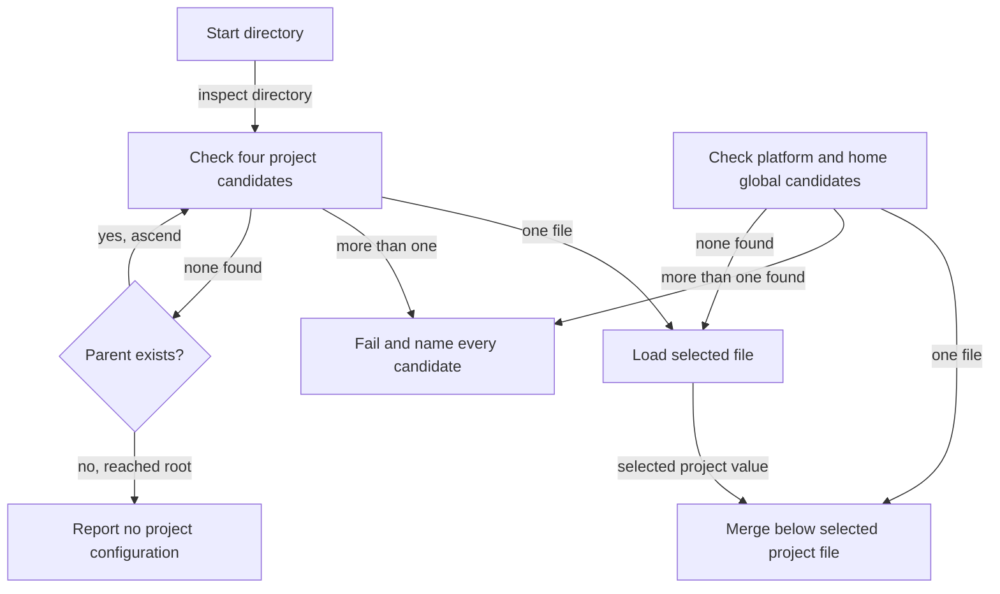

# Configuration Overview

`morphir.toml` and `morphir.yaml` serialize the same Morphir tooling configuration model. Equivalent files must
produce the same nested value. Defaults, validation, path resolution, and merging operate on that value rather than
on TOML or YAML syntax. The model covers workspaces, projects, tasks, workflows, and toolchains. It does not define
the Morphir IR format. [toml-spec](https://github.com/finos/morphir/blob/4d2a6d836da1c3a114241e911f1af0f38b97b453/docs/spec/morphir-toml/morphir-toml-specification.md)
[yaml-spec](https://github.com/finos/morphir/blob/4d2a6d836da1c3a114241e911f1af0f38b97b453/docs/spec/morphir-yaml/morphir-yaml-specification.md)

## Baseline

This reference uses `finos/morphir` commit `4d2a6d836da1c3a114241e911f1af0f38b97b453`. Re-read the pinned TOML,
YAML, and merge specifications when that pin moves. The Rust behavior at the matching implementation milestone has
its own [commit-pinned reference](/morphir-rust-configuration-cdfa6c63.md).

## Discovery

The canonical project and workspace candidates are `morphir.toml`, `morphir.yaml`,
`.morphir/morphir.toml`, and `.morphir/morphir.yaml`. These are alternatives at one location. Discovery must fail
when more than one exists. It must not merge sibling TOML and YAML files or prefer an extension.
[yaml-spec](https://github.com/finos/morphir/blob/4d2a6d836da1c3a114241e911f1af0f38b97b453/docs/spec/morphir-yaml/morphir-yaml-specification.md#file-names-and-discovery)

The specification leaves hidden-file root resolution ambiguous. The TOML specification says an omitted workspace
root defaults to the directory containing the configuration file, while the YAML design rule says path resolution
does not change with serialization. The Rust implementation resolves either hidden serialization from the directory
above `.morphir`, so `src` remains a project-root-relative path. This is verified implementation behavior, not a
settled normative rule.
[toml-spec](https://github.com/finos/morphir/blob/4d2a6d836da1c3a114241e911f1af0f38b97b453/docs/spec/morphir-toml/morphir-toml-specification.md#workspace)
[yaml-spec](https://github.com/finos/morphir/blob/4d2a6d836da1c3a114241e911f1af0f38b97b453/docs/spec/morphir-yaml/morphir-yaml-specification.md#design-rule)
[rust-config-root](https://github.com/finos/morphir-rust/blob/cdfa6c6323ab0f08a285b77a8a857eb9915a83fb/crates/morphir-design/src/config.rs#L162-L176)

`morphir.yaml` is the canonical YAML name. Discovery must ignore `morphir.yml`, but a command that accepts an
explicit path may load it. The distinction keeps automatic discovery deterministic while allowing an existing
`.yml` file to be selected directly.

Global user configuration has two alternate roots. The platform root contains `morphir/morphir.toml` or
`morphir/morphir.yaml`. The home alternative contains `.morphir/morphir.toml` or `.morphir/morphir.yaml`.
Discovery must find at most one file across both roots and both serializations.

| Platform | Platform configuration directory |
| --- | --- |
| Linux and other XDG systems | Absolute, non-empty `$XDG_CONFIG_HOME`; otherwise `$HOME/.config` |
| macOS | Absolute, non-empty `$XDG_CONFIG_HOME`; otherwise `$HOME/Library/Application Support` |
| Windows | `FOLDERID_RoamingAppData`, commonly `%APPDATA%` |

An XDG system ignores a relative `XDG_CONFIG_HOME`. Windows resolves the home alternative through
`FOLDERID_Profile`. `XDG_CONFIG_DIRS` does not define the user-global location.
[merge-spec](https://github.com/finos/morphir/blob/4d2a6d836da1c3a114241e911f1af0f38b97b453/docs/spec/morphir-toml/morphir-toml-merge-rules.md#global-user-path-resolution)

Figure 1 separates upward project discovery from the global candidate check.

**Figure 1:** Project discovery walks upward, while global discovery checks two roots at one precedence level.

The normative model merges six sources into an effective configuration. The current Rust implementation covers a
subset. See [Merge Rules](/merge-rules.md) for the specification and
[Morphir Rust configuration support](/morphir-rust-configuration-cdfa6c63.md) for verified implementation behavior.

## Data model

Both serializations normalize to an equivalent JSON-like object model.

| TOML | YAML | Object model |
| ---- | ---- | ------------ |
| `[workspace]` table | `workspace:` mapping | `{ "workspace": { ... } }` |
| `[toolchain.morphir-elm.tasks.make]` dotted table | nested mappings | `toolchain["morphir-elm"]["tasks"]["make"]` |
| Array | Sequence | JSON array |
| Inline table | Mapping | JSON object |

The shared value model lets either file format participate in the same merge. It also defines conversion: a converter
must preserve the parsed value, but it does not need to preserve comments, key order, quoting, or whitespace.

## Restricted YAML profile

The YAML format uses YAML 1.2 with the Core Schema, UTF-8 encoding, one document, and a mapping root. Mapping keys
must be case-sensitive strings. Values may be mappings, sequences, strings, finite numbers, or booleans.

The profile rejects nulls, duplicate keys, custom tags, anchors, aliases, and the `<<` merge key. These restrictions
remove YAML features that libraries interpret differently and keep conversion to the shared value deterministic.
Authors should quote values such as versions, durations, dates, `null`, `true`, and `1.0` when a parser could assign
the wrong scalar type.
[yaml-spec](https://github.com/finos/morphir/blob/4d2a6d836da1c3a114241e911f1af0f38b97b453/docs/spec/morphir-yaml/morphir-yaml-specification.md#yaml-profile)

## Top-level keys

All are optional; an absent section uses defaults.

| Key | Covers | Concept |
| --- | ------ | ------- |
| `morphir` | Core settings for IR version constraints | [IR, Codegen, and Runtime](/ir-codegen-and-runtime.md) |
| `workspace` | Workspace discovery and output layout | [Workspace and Project](/workspace-and-project.md) |
| `project` | Project metadata | [Workspace and Project](/workspace-and-project.md) |
| `ir` | IR processing settings | [IR, Codegen, and Runtime](/ir-codegen-and-runtime.md) |
| `codegen` | Code generation settings | [IR, Codegen, and Runtime](/ir-codegen-and-runtime.md) |
| `cache` | Cache settings | [IR, Codegen, and Runtime](/ir-codegen-and-runtime.md) |
| `logging` | Logging settings | [IR, Codegen, and Runtime](/ir-codegen-and-runtime.md) |
| `ui` | UI and TUI settings | [IR, Codegen, and Runtime](/ir-codegen-and-runtime.md) |
| `tasks` | Project task definitions | [Tasks and Workflows](/tasks-and-workflows.md) |
| `workflows` | Named staged workflows | [Tasks and Workflows](/tasks-and-workflows.md) |
| `bindings` | External binding type mapping for WIT, Protobuf, and JSON | No separate concept |
| `toolchain` | External tool adapters and task catalogs | [Toolchains](/toolchains.md) |

`bindings` is listed in the specification's top-level key map but has no section of its own; treat its shape as
unspecified.

## Naming convention

Keys use `snake_case` (`source_directory`, `output_dir`, `format_version`) in both serializations. `morphir.json`
uses camelCase. See [Relationship to morphir.json](/relationship-to-morphir-json.md).

## Machine-readable schema

- `https://morphir.finos.org/schemas/morphir-config-v1.yaml`
- `https://morphir.finos.org/schemas/morphir-config-v1.json`

The schema describes the equivalent JSON model, not TOML syntax.
