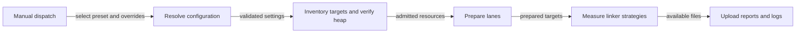

# Continuous Integration

GitHub Actions runs linting, cross-platform tests and knowledge base checks on pull requests targeting supported
branches.

## Jobs

| Job | Runs |
| --- | ---- |
| `lint` | Mill `ci.lint`: scalafmt `checkFormatAll` over resolved `morphir.__.sources` tasks. `--exclude` drops matching module paths. |
| `squire-policy` | `mise run test:squire`. Squire and release-policy gates. |
| `knowledge-base` | `kb check` and `kb intent check` |
| `test-jvm` | Mill `ci.testJvm`: the curated non-classic JVM platform inventory, including the Cucumber/JUnit5 `langkit.itest` suite. The generated-fixture-backed classic runtime remains in its separate jobs. |
| `test-js` | ScalaJS tests, including the WebAssembly link variants, for every JS/Wasm module except the desktop/UI subset (see `test-js-desktop`) |
| `test-js-desktop` | The same ScalaJS/WebAssembly workload as `test-js`, scoped to `morphir.ui`, `morphir.desktop` and `morphir.appkit.electron`. Split into its own runner because linking that subset alongside the rest of the JS tree in one Mill daemon exceeded the 8 GB heap in `.mill-jvm-opts`; `ci.testJs`/`ci.testJsWasmLink` (`ci/MorphirCi.mill`) resolve the shared wildcard once and partition it with `millbuild.JsTestSelectors`, so the two jobs' targets are exhaustive and disjoint by construction. |
| `test-native` | Mill `ci.testNativePrepare` followed by four `ci.testNative` shards. `millbuild.NativeTestSelectors` resolves and partitions every Native test target; the Mise launcher gives each shard a fresh daemonless Mill JVM. |
| `publish` | Sonatype publication via Mill `ci.publish`. Branch snapshots on `main`; VCS milestones and releases on `0.4.x` and tags. The publish set is whatever Mill resolves for `__.publishSonatypeCentral`, including the Mill Morphir plugin family (`org.finos.morphir.mill`); the test-only `integration` module is not a publish module and is not uploaded. Destination tasks live under `ci.sonatype.*`. |
| `desktop-package` | Matrix job, one runner per platform token (`mac-aarch64`, `mac-amd64`, `linux-amd64`, `linux-aarch64`, `win-amd64`). Links Scala.js with `fullLinkJS` and runs `electron-builder`, then uploads the raw output as a workflow artifact. Runs only when a GitHub Release publishes or the ref is a tag. |
| `desktop-release` | One Linux runner. Canonicalizes the staged assets, signs `checksums.txt`, verifies, then uploads to the GitHub Release and to Sonatype Central as one bundle. Destination tasks live under `ci.desktop.*`. Same trigger scope as `desktop-package`, and needs it to finish first. |
| `ci` | Aggregate gate, depending on lint, knowledge-base and all four test jobs |

See [Packaging and Release](/packaging-and-release.md) for what `publish`, `desktop-package` and
`desktop-release` actually ship, the ordered steps each one runs, and the signing keys involved. This page is
the job inventory; that one is the release story.

CI runs on pull requests into `main` and `0.4.x`; pushes to those same branches; published releases; and
manual dispatch. Older runs of the same pull request are cancelled automatically. Hosted mill invocations pass
`--ticker false`. That includes the workflow, the local `lint` mise wrapper, and `test:jvm-platform`. The GitHub
log is then a linear task trace rather than a replayed progress ticker.

The platform test inventories belong to Mill's `ci.*` command surface in `ci/MorphirCi.mill`. The hosted jobs and
the local `test:jvm-platform`, `test:js` and `test:native` Mise tasks call the same commands; Mise only supplies the
process boundaries that cannot be expressed inside one Mill evaluation. Scala.js, Wasm and Scala Native linkers are
in-process Mill workers in the pinned Mill release, so JVM test forking does not isolate their heap. A direct
`./mill __.test` still puts every matched linker in one build JVM and can exhaust it; the platform tasks and
`mise run ci:local` split link-heavy groups across fresh daemonless invocations instead.

## Manual linker profiling

`.github/workflows/linker-benchmark.yml` is a read-only, `workflow_dispatch`-only profiler for comparing linker
worker lifetimes on a hosted runner. It is separate from ordinary and required CI. GitHub offers the manual dispatch
only after the workflow file exists on the default branch.

The profiler compares three worker-lifetime strategies. A long-lived child handles all selected targets in one case
and then exits. A fresh child handles one target and then exits. A recycled child handles up to the configured batch
size sequentially and then exits.

The five presets fix the initial comparison matrix:

| Preset | Platforms | Strategies | Trials | Targets | Timeout |
| --- | --- | --- | ---: | --- | ---: |
| `quick-smoke` | Scala.js, Wasm, Native | long-lived, fresh, recycled | 1 | first sorted target per platform | 30 minutes |
| `js-strategies` | Scala.js | long-lived, fresh, recycled | 3 | all | 30 minutes |
| `wasm-strategies` | Wasm | long-lived, fresh, recycled | 3 | all | 30 minutes |
| `native-long-lived` | Native | long-lived | 1 | all | 40 minutes |
| `native-fresh-recycled` | Native | fresh, recycled | 3 | all | 30 minutes |

| Setting | Preset/default | Hosted cap or validation | Inheritance |
| --- | --- | --- | --- |
| Platforms | Preset matrix | Nonempty, unique known platform tokens | Empty string inherits |
| Strategies | Preset matrix | Nonempty, unique known strategy tokens | Empty string inherits |
| Trials | 1 or 3 by preset | Positive, at most 100 | Number-typed zero inherits |
| Order seed | 0 | Nonnegative; no hosted cap | Empty string inherits; explicit `0` sets zero |
| Target filter | None | Substring match; rejects control characters and an empty target result | Empty string inherits |
| Target limit | One for `quick-smoke`; otherwise all | Positive, at most 10,000; selection is sorted per platform | Number-typed zero inherits |
| Memory budget | 16 GiB | Positive, at most 16 GiB; must pass resource admission | Number-typed zero inherits |
| Reserve | 4 GiB | Positive override, at most 15 GiB and less than memory | Number-typed zero inherits |
| Mill jobs | 2 | Positive, at most 64 | Number-typed zero inherits |
| Active children | 1 | Positive, at most 16; must pass resource admission | Number-typed zero inherits |
| Recycled batch size | 4 | Positive, at most 256 | Number-typed zero inherits |
| Timeout | 30 minutes, except 40 for `native-long-lived` | Positive, at most 360 minutes | Number-typed zero inherits |
| Continue after failure | `true` | Choice of `preset`, `true`, or `false` | `preset` inherits |

Resource admission requires the rounded-up observed heap multiplied by active children, plus reserve, to fit within
the memory budget. Malformed or unknown settings and failed admission stop the run before linker work. Hosted runs
use the fixed CI profile and expose no profile override. They also expose no heap override and use the fixed 8 GiB
heap from `.mill-jvm-opts`. The hosted runner budget is 16 GiB. An override may lower that budget or explicitly
restate 16 GiB, but it cannot claim memory the runner does not have. The reserve cap follows at 15 GiB so it always
leaves room for a positive admitted workload.

The pinned Mill version, `1.2.0-RC1-46-16168f`, ignores the documented `MILL_JVM_OPTS_PATH`. `_JAVA_OPTIONS` is not
a safe substitute because it also changes Java descendants. The hosted profile therefore keeps the heap at 8 GiB.
Inventory records `Runtime.maxMemory`, verifies it within 256 MiB of that value, and rounds the observed heap up to
whole GiB for admission. A lane is an isolated child-JVM workspace. Figure 1 shows the boundary between validation
and measurement.



**Figure 1:** A manual linker-profile run validates its configuration and observed heap before it starts preparation
or measurement.

Each run writes configuration and inventory as it reaches those early stages. Results, summaries, preparation
records, process logs, and garbage collection (GC) logs appear only after their corresponding phases run. A worker
record is the per-child JSON account of targets, timing, memory, runtime, and outcome. Worker records appear only
after their child phase runs. Normal benchmark failure handling also retains timeout, teardown, and recovery evidence
when it produces that evidence. The hosted workflow does not run the separate recovery-smoke mode, and an early
failure may leave only partial artifacts.

The workflow uploads the files that exist after ordinary success or failure and makes a best effort after
cancellation. It explicitly includes hidden `.dev` files and retains the artifact for 14 days. Structured JSON and
Markdown redact workspace paths. Raw logs may contain the checkout path. The artifact name safely encodes the
preset, ref, run id, and run attempt.

The rollout has two stages. First, the profiler lands while production test grouping stays unchanged. After that
workflow reaches the default branch, `quick-smoke` runs on a hosted runner, followed by the more expensive presets.
No complete hosted result exists yet.

### Local evidence and adoption gates

The complete local evaluation ran on a 36 GiB host with a 9 GiB reserve, an 8 GiB heap, two lanes, recycled batches
of four, three trials, and seed zero. It found 45 targets and completed 24 of 27 strategy cases. Native long-lived
preparation timed out in all three trials. Fresh and recycled completed all three trials on every platform, and
Scala.js and Wasm long-lived completed all three. All 177 measured worker records succeeded. Peak aggregate RSS for
the whole run, the combined resident set size (RSS) of live process trees, was 15,322,800 KiB.

Median fresh and recycled measurements differ by platform:

| Platform | Fresh median | Recycled median | Local interpretation |
| --- | ---: | ---: | --- |
| Native | 352,866 ms | 257,860 ms | Recycled is about 27% faster, with higher memory and GC use. |
| Scala.js | 120,220 ms | 74,504 ms | Recycled is about 38% faster, with roughly twice the RSS. |
| Wasm | 22,219 ms | 8,698 ms | Recycled is faster; long-lived is 7,238 ms and reliable locally. |

A focused local workflow acceptance on 2026-08-24 resolved all five presets in plan-only mode exactly as specified.
Its `quick-smoke` run completed all 9 cases, one target per platform under all three strategies, in 551.77 seconds
and observed the 8 GiB heap. This validates local wiring only. It does not establish hosted policy.

A production candidate must complete all three hosted trials, keep peak aggregate RSS below the 12 GiB budget left
after reserve, avoid out-of-memory failures, remain reliable, and avoid an unacceptable wall-time or cache
regression. A recycled candidate must also improve reliability over long-lived workers. Every failure and timeout
remains in the evidence. Three trials support medians and ranges, not confidence intervals. The candidates are
recycled with batches of four for Scala.js, recycled with batches of four for Native with fresh as fallback, and
long-lived for Wasm. If recycled proves unsafe, that platform returns to fresh grouping without removing the
profiler. Any production change starts with one platform and remains under observation before the policy expands.
Recycled workers are candidates, not current production policy.

The Release step runs `ci.sonatype.writeMillEnv` first, with Morphir `GPG_*` and `SONATYPE_*` names in that mill.
It sources the written file and then starts `./mill --ticker false -i ci.publish`. Mill snapshots `Task.env` at process start, so
conversion has to happen in an earlier mill. Live Central upload is the first `main` publish job after merge.

## Branch snapshots

A push or merge to `main` must pass the full aggregate `ci` gate before publishing. On `main`, the
exact coordinate is `$releaseLine-$distance-SNAPSHOT`, for example `0.5.0-M04-57-SNAPSHOT` or `0.5.0-57-SNAPSHOT`.
On any other publishing branch, the coordinate is `$releaseLine-$branch.$distance.g$abbrev-SNAPSHOT`, for example
`0.5.0-M04-0.4.x.57.gbd4cd2-SNAPSHOT`: the release line may have a qualifier, and the coordinate records the branch,
the distance from the nearest version tag, and a six-character Git abbreviation before the terminal `SNAPSHOT`
marker.

Only non-PR runs in the canonical `finos/morphir-scala` repository can reach publication and its credentials. Pull
requests validate without publishing, and contributors do not receive publication credentials locally. Consumers
add `https://central.sonatype.com/repository/maven-snapshots` and select the exact coordinate; resolution and
availability follow the snapshot repository's behavior. The revision-bearing logical version is traceable, but its
`-SNAPSHOT` artifact is mutable and may be overwritten. Sonatype says snapshots are
[currently cleaned up after 90 days](https://central.sonatype.org/publish/publish-portal-snapshots/), so the coordinate
must not be treated as an immutable, reproducible-release lock. Publication from `0.4.x` and tags keeps the ordinary
VCS-derived milestone and release flow, with no snapshot environment.

## The knowledge-base job

It needs a JVM and nothing else. The kb skill is a self-contained Mill script, so there is no build file to resolve
and no mise setup to perform.

Provenance checks are skipped with `--no-provenance`. They compare commit-pinned sources against reference checkouts
under `.refs/`, which is gitignored and therefore absent on a runner; running them there would report every source as
unverifiable rather than telling anyone anything.

Errors fail the job; warnings do not. Obligations are errors, staleness is a warning, and a
warning that fails the build is a warning people route around.

## Locally

```bash
mise run kb:check
mise run test:squire
mise run test:jvm-platform
mise run test:js
mise run test:native
```

These run the knowledge-base checks, policy tests and platform tests through the same entry points used by CI.
`mise run ci:local` includes them in the full local aggregate workflow.
