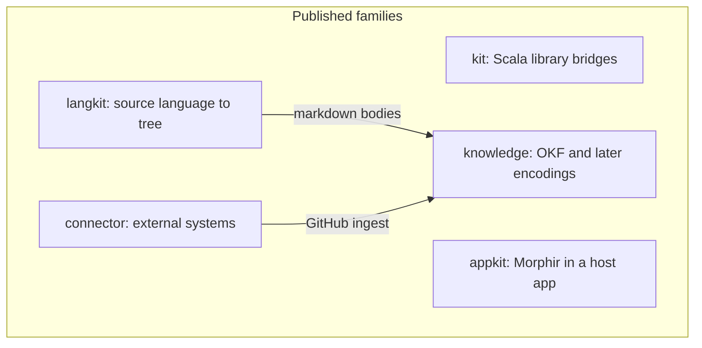

# 0013 — Published library families are kit, connector, appkit, langkit, and knowledge

Published Morphir libraries sit in five families. `kit` wraps a Scala library Morphir builds on. `connector` wraps an external system. `appkit` integrates Morphir into a host application. `langkit` reads a source language into a queryable tree. `knowledge` holds knowledge encodings, with OKF as `morphir/knowledge/okf`. Kit and connector both compile for the JVM, Scala.js, and Scala Native. They differ by what they wrap, not by platform.

**Figure 1:** family boundaries and the two edges the first skeletons actually use. Kit does not depend on connector. Appkit has no children yet.

## Why

`morphir/kit` already had a sharp rule: one upstream library, no Morphir types, JVM plus JS plus Native. GitHub, markdown, Electron, and Codeium do not all fit that rule. Stretching `kit` to hold them would make the rule unenforceable. Inventing a sixth top-level name for each new kind of library would scatter the tree.

The families reuse the mill-path convention already in force: `morphir/<family>/<leaf>` publishes as `org.finos.morphir::morphir-<family>-<leaf>`. Singular family names match `kit`, `langkit`, and `buildkit`.

Connectors compile for all three platforms because a GitHub client that only exists on the JVM is a different product from the one Scala.js and Native users can take. The later `github-cli` sibling may be JVM-only, because `gh` is a process. That exception belongs on the CLI intent, not on the GraphQL connector.

OKF lives at `morphir/knowledge/okf` rather than `morphir/kb` or `morphir/okf`. The repository already uses `kb/` for the document tree. A Scala module at `morphir/kb` would make "kb" mean two things. Nesting under `knowledge` leaves room for a second encoding without renaming the first artifact.

GitHub issues, pull requests, and discussions mapped onto OKF concepts mention Morphir knowledge types. That mapping is not a connector. It lives in `knowledge/okf` and depends on `connector/github`.

## Alternatives

**Connectors are kits, and kit drops the Native rule.** Rejected because a kit is scoped to one Scala library Morphir builds on. GitHub is a hosted API, not a library on the classpath. Relaxing Native for kits would also let JVM-only wiring accumulate inside `kit` unnoticed.

**Kit holds the HTTP client; connector is the Morphir-facing adapter.** Rejected because Morphir-facing ingest belongs in `knowledge/okf`. A GitHub client with no Morphir types is already a connector. Two published artifacts for one HTTP client would split the thing users actually depend on.

**Everything except kit lives under `appkit`.** Rejected because a published GitHub client is not host-application integration. Electron and Codeium are. Mixing them would force every library user to read an application-kit namespace.

**Connectors start JVM-only.** Rejected. The family would then mean "whatever platform we felt like", and Native would land as a compile stub. Kit and connector share the three-platform rule; they differ by what they wrap.

**First-class work lands in `contrib/`.** Rejected. `contrib/knowledge` is microkanren, not OKF, and `contrib/` is a parking lot. New knowledge work does not go there. The microkanren module stays until a separate migration intent.

**`kyo-caliban` is the GitHub client.** Rejected at the family layer because `kyo-caliban` is a GraphQL server. The GitHub connector consumes GitHub's API. Client codegen and HTTP belong in the [published library families Design Note](/design/published-library-families.md), not in this record.

## Consequences

New mill modules for GitHub, markdown, and OKF follow the family table. They mix `MorphirPublishModule` from the first commit so the README coordinate is the published artifact.

Root `morphir`, `runtime.classic`, `interop/zio`, and `testing/zio` do not grow this work. `morphir/toolkit` is not revived as a namespace. `contrib/` is not a destination for first-class libraries.

The condition that would reopen the platform half of this record is evidence that the GitHub HTTP stack cannot run on Scala Native or Scala.js, only compile. In that case the connector family rule would need a recorded exception, rather than a quiet JVM-only module.

The condition that would reopen the `knowledge/okf` path is a second knowledge encoding that does not fit under `morphir/knowledge/`. Until that encoding exists, the extra directory is cheap.
