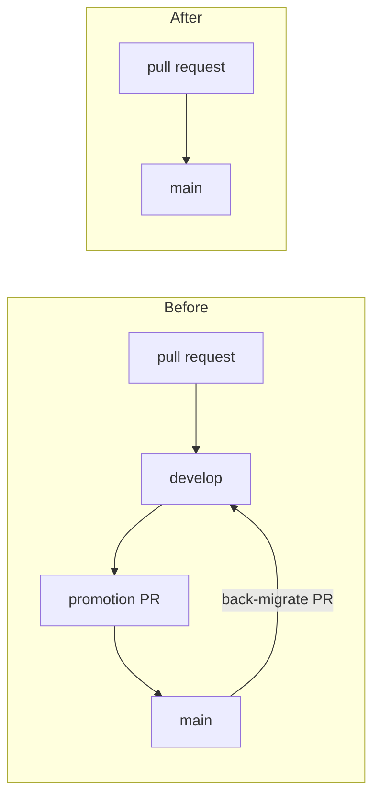

# 0014 — Trunk-based development on `main`; the `develop` branch is retired

`main` is the trunk. Contributor and maintainer pull requests target it and merge into it. There is no integration
branch in front of it, and the `develop` branch has been deleted.

**Figure 1:** the loop that came out. `develop` needed promoting forward and back-migrating back, and both directions
were pull requests a person had to open, merge and then repair when they drifted.

## Why

The two-branch flow asked for four things that a one-branch flow does not.

A **promotion pull request** from `develop` to `main` for every release, which had to be squash-merged, and which
CONTRIBUTING had to explain because GitHub cannot report which merge method was used.

A **back-migration** the other way, because `main` also received commits directly — dependency bumps landed there —
so the two branches diverged in both directions at once. The final state before this decision had `develop` three
commits ahead of `main` and `main` one commit ahead of `develop`, with an open back-migration pull request to repair
it.

A **refresh command** — `squire branch refresh` — built to move `develop` forward safely after a promotion, with SHA
and ancestry proofs, because doing it by hand risked losing commits.

A **branch in every predicate**. `develop` appeared in the CI triggers, the publish predicate, the snapshot
configuration step, three cache-save conditions, the desktop packaging matrix, and the squire policy tests that hold
all of those in place.

What it returned was a staging area for `main` — which the pull-request gate already provides. Every pull request
runs the full aggregate CI gate before it can merge, so `develop` was not catching anything `main` would not have
caught. It was a second place for the same commits to sit.

## What this changes

Snapshots publish from `main` alone. The branch-qualified snapshot coordinate
(`0.5.0-M04-develop.57.gbd4cd2-SNAPSHOT`) is still produced for any publishing branch that is not `main`, so a
release line keeps its own coordinate; `main` keeps the shorter `0.5.0-M04-57-SNAPSHOT` form.

`squire branch refresh` survives, and `--target` is now required. It defaulted to `develop`, and with that branch
gone there is no branch it would be right to assume. The command is still the safe way to move a long-lived branch —
a release line such as `0.4.x` — forward from `main`.

`0.4.x` is untouched. Retiring `develop` is not a statement about release lines, which exist to diverge from the
trunk deliberately and are not integration branches.

## Alternatives

**Keep `develop` and automate the back-migration.** This treats the symptom. The divergence came from commits landing
on both branches, and automation would have made the repair quieter rather than unnecessary.

**Keep `develop` and forbid direct commits to `main`.** This would have removed the back-migration but not the
promotion, and it would have meant routing dependency-bump automation through the integration branch as well —
more configuration, for a staging area the pull-request gate already covers.

## Revisit when

Pull requests start merging into `main` in a state that the gate did not catch and an integration branch would have —
a batch that only fails when several changes meet. That would be evidence the gate is measuring the wrong thing, and
the answer might be an integration branch again, or might be a better gate.
