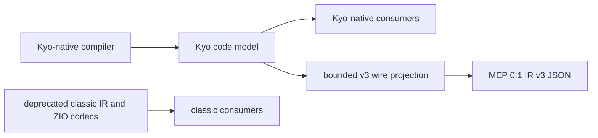

# 0017: Deprecated IR formats are emitted as wire projections

New Kyo-native modules emit a deprecated Morphir IR format only through a bounded one-way wire projection. The Kyo
code model remains the domain model. A projection writes the external format directly and rejects values that the
format cannot represent. It does not construct the deprecated `org.finos.morphir.ir` object graph.

## Summary

Morphir Extension Protocol 0.1 requires IR v3 JSON, while new Morphir Scala modules use the Kyo code model. A direct
wire projection preserves that external contract without moving deprecated model or ZIO dependencies inside the
strangler boundary established by [decision 0005](/decisions/0005-bridge-nothing-between-zio-and-kyo.md).

| Option | Outcome | Why |
| --- | --- | --- |
| Project the Kyo code model directly to the deprecated wire format | Chosen | It preserves the external contract while keeping one current domain model. |
| Reconstruct classic IR objects and run their codecs | Rejected | It moves deprecated types and ZIO dependencies into new modules. |
| Keep a second protocol implementation on zio-json | Rejected | It makes one new extension straddle both sides of the migration. |
| Change MEP 0.1 to IR v4 for this extension | Rejected | It would change the shared host and reference provider contract before the v4 model is ready. |

## Why

The strangler migration needs a stable direction. New compilation produces the Kyo code model. Existing v1, v2, and
v3 object models and codecs remain available to classic code outside that boundary. Reconstructing those objects
from the Kyo model would create the reverse bridge that decision 0005 prohibits.

An external format does not require its former in-memory model. The projection can encode v3 names, paths, tagged
arrays, modules, packages, types, and expressions from the Kyo values that own those concepts. It can return a typed
error when a Kyo feature has no v3 representation. This keeps information loss explicit at the compatibility edge.

**Figure 1:** New compilation stays on the Kyo path. The deprecated wire contract crosses the boundary as data, not
as a second domain model.

## Alternatives rejected

### Reconstructing the classic model

A Kyo-to-classic conversion followed by the existing codec looks smaller because the codec already exists. It also
makes the compiler depend on the full deprecated model and its ZIO JSON closure. That deepens the path the project is
removing and creates a reverse model bridge that other new modules could reuse.

### Keeping zio-json only in the process adapter

Keeping the compiler Kyo-native while decoding and encoding MEP with zio-json still makes the new executable own two
JSON stacks and two error models. `kyo-jsonrpc` and Kyo Schema already provide the current protocol abstractions, so
the second stack has no independent responsibility.

### Moving this provider to IR v4

IR v4 is the direction for the new runtime and code model. MEP 0.1, its Rust host, and the reference Elm provider
currently use IR v3. Changing only the Scala provider would stop the shared conformance contract from comparing both
providers. A later protocol version can advertise v4 when the common contract supports it.

## Consequences

The Kyo code model becomes the only domain target for new compilers. Compatibility projectors are isolated modules
with golden wire tests and typed unsupported-feature errors. Their dependency closures exclude classic IR, ZIO, and
ZIO interoperability.

The first use is the morphir-scala Elm MEP extension described by
[intent 0037](../../../intent/0037-morphir-scala-elm-frontend-extension.md) and its
[Design Note](/design/elm-frontend-extension.md). Architecture policy checks reject classic IR and ZIO imports in
that compiler and adapter.

## Revisit when

Revisit the IR v3 projector when the shared Morphir Extension Protocol and both Elm providers can require a Kyo-native
or IR v4 wire contract. Retire the projector when no supported external consumer requests v3.
