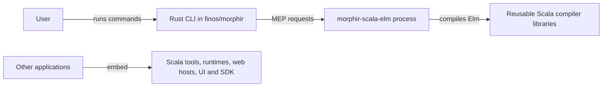

# Consolidate the human-facing CLI in finos/morphir

The project retired the Scala CLI and assigned human-facing commands to the Rust CLI in
[finos/morphir](https://github.com/finos/morphir). Scala retained its reusable libraries and the
`morphir-scala-elm` Morphir Extension Protocol (MEP) provider, which exposes the Elm compiler to compatible hosts.

## Summary

Maintaining a second general CLI required command routing, installers, packaging, and release checks in Scala.
The extension protocol already supplied a boundary through which the Rust host could use the Scala compiler.
The project chose to maintain that boundary and stop distributing the Scala command application.

| Option | Outcome | Why |
| --- | --- | --- |
| Rust CLI with Scala libraries and MEP extensions | Chosen | One command owner with independently usable Scala capabilities |
| Keep both general CLIs | Rejected | Duplicated command and distribution maintenance |
| Keep a Scala `server`-only CLI | Rejected | Retained a separate command application and its packaging |
| Remove every command-adjacent Scala module | Rejected | Reusable compilers, runtimes, tools, web hosts, and UI libraries still had consumers |

## Why

The [official installation guide](https://morphir.finos.org/docs/getting-started/morphir-cli/) identified the Rust
implementation under `crates/morphir` and directed installation to `finos/morphir` releases. Keeping Scala's root
wrappers and Coursier channels would have continued to advertise a second general CLI.

The [Elm extension design](/design/elm-frontend-extension.md) supplied a process contract independent of command
parsing. Retiring the Scala CLI therefore did not require changing the extension's provider identity, framing,
initialization, or compile protocol.

**Figure 1:** Command ownership moved to Rust while Scala capabilities remained available through libraries and MEP.

## Alternatives rejected

### Keep both general CLIs

The project rejected continued Scala command development because it duplicated the command application maintained
in `finos/morphir`.

### Keep a Scala server-only CLI

The project retired `morphir server` with the rest of the Scala dispatcher. The reusable web server and renderer
modules remained, without a promise that the Rust CLI offered an equivalent launch command.

### Remove every command-adjacent Scala module

The project kept reusable tools, runtimes, compiler libraries, web and UI modules, and the intelligence SDK.
Only the intelligence application retired. A module's former use by a CLI did not make it disposable.

## Consequences

The retirement removed `morphir/main`, dormant `morphir/tools/cli` and its launcher, the intelligence application,
root command wrappers, installers, and Coursier channels. It stopped publishing `morphir-main` and general CLI
native archives or JVM assemblies. Historical release notes remained historical records.

Extension release tasks moved to `ci.extensions`, using the root `streamVersion`. Public
`morphir-scala-elm-<platform>-<version>` names, Windows `.exe` suffixes, SHA-256 sidecars, and MEP identity remained.
Ordinary CI retained three native hosts; root releases retained five. The surviving `cli-*` workflow job IDs
remained to preserve required-check names, while the JVM packaging job retired.

[Intent 0017](../../../intent/0017-morphir-cli-buildkit-integration.md) was dropped because Scala no longer owned
general command orchestration. [Intent 0038](../../../intent/0038-publish-the-morphir-scala-cli-to-github-releases.md)
was dropped as a general CLI distribution plan. The retained extension remained under
[intent 0037](../../../intent/0037-morphir-scala-elm-frontend-extension.md).

## Revisit when

A capability that cannot be exposed through a reusable library or an MEP extension would warrant a new ownership
decision. This decision did not establish Rust/Scala command parity or choose a replacement for the retired
`server` launch command. Migration of existing scripts requires checking the Rust CLI's documented commands.
