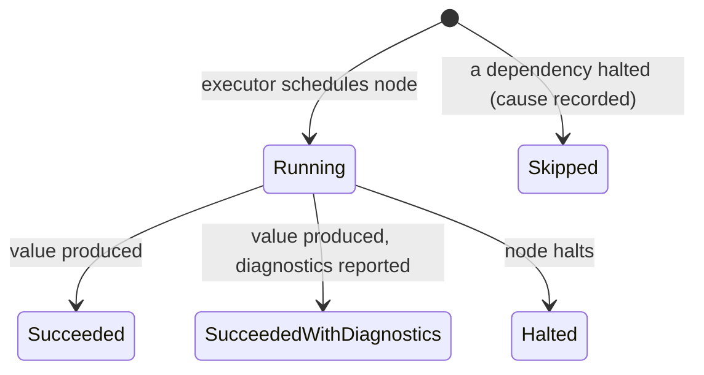
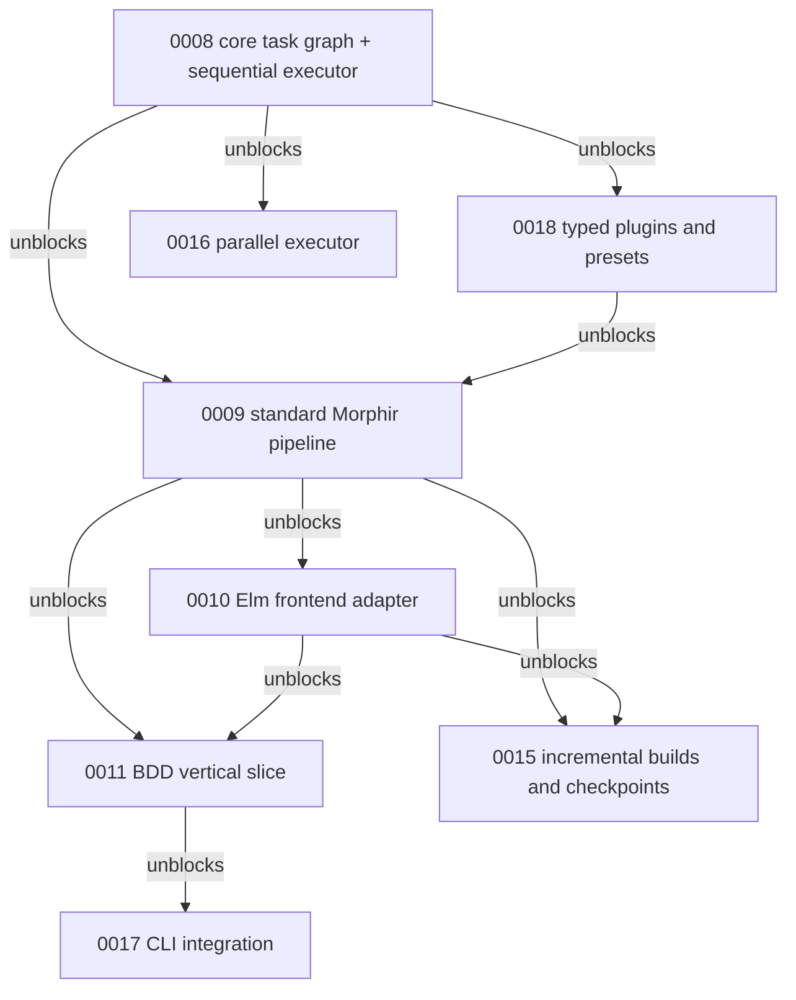

# Buildkit task-graph capability

The capability we want to unlock: any Morphir frontend, and any library user, composes a typed, immutable
pipeline graph and runs it through an interpreter that reports what happened as data. The executor gives each
node one of three active outcomes: it succeeds, it succeeds while reporting diagnostics, or it halts. The
executor then skips every dependent of a halted node and records the cause. Results, statuses, diagnostics,
and progress come back in a deterministic order that a later parallel interpreter must preserve.

**Figure 1:** the node outcomes the contract requires; the exact public outcome type is an open question below.

Today none of this exists: the only pipeline abstraction is a linear `Stage[I, O, S]` inside the Elm compiler
API, and the only halt semantics live inside `ElmParse`.

This document is the narrative home for that capability, per the
[altitude rule](../../../../../.agents/skills/kb/styles/altitude.md). It is updated as understanding improves;
the immutable records it links are not.

## Why

Morphir needs one transformation pipeline that many frontend languages plug into.[^issue-932] Each frontend
today would have to reinvent stage plumbing, diagnostic collection, and halt semantics; the Elm langkit already
did, and `Parse` and `Compile` stay reserved for the general pipeline that `ElmParse` is meant to become an
instance of. A shared, Morphir-agnostic task graph in `morphir/buildkit/core` is the missing piece, and its
executor design is the hard part: halting, skipping, and deterministic reporting are contracts, not
implementation details.

## The story so far

Work proceeds in rounds; each round's durable output lands in the documents linked here.

**Contracts stated (2026-07).** The intent family below fixed the initial contract: immutable graph values,
definition sealed and validated before execution, stable node identity, structured progress, explicit skipped
nodes, deterministic collation, sequential executor first. The
[pipeline and workspace boundaries note](/design/pipeline-workspace-boundaries.md) drew the phase and workspace
boundaries and holds the open questions, including the smallest public stage outcome. Two Decision Records constrain
everything that follows:

- [Bridge nothing between ZIO and Kyo](/decisions/0005-bridge-nothing-between-zio-and-kyo.md) makes the
  executor Kyo-native with no adapters.
- [Dependency-constrained modules](/decisions/0008-model-and-naming-are-dependency-constrained-modules.md) is
  the pattern for enforcing buildkit-core's no-Morphir-types rule by construction.

**Mechanism research (2026-07).** The general surveys established what any executor must decide, independent of
Kyo: the eight graph-semantics decisions and the diagnostic/rejection/defect distinction in
[transformation pipelines](../../../programming-language-tooling/transformation-pipelines.md), the causal
failed-versus-never-ran requirement in
[Morphir toolchain guidance](../../../programming-language-tooling/morphir-toolchain-guidance.md), and the
scope-relativity of node identity in
[node identity and addressability](../../../programming-language-tooling/node-identity-and-addressability.md).

**Typed-halting research (2026-08).** The design question for the first executor is whether it can be one Kyo
`ArrowEffect` handler with halting typed. The verified answer is yes:
[Kyo effect handlers and typed halting](../../../programming-language-tooling/kyo-effect-handlers-and-typed-halting.md)
pins, at Kyo 1.0.0-RC6, the handler variants, the four halting shapes, and selective halting through union
error types. It also pins the pitfalls that constrain the design: the executor's state handler must sit
outside the halting handler for partial progress to survive, a halting effect must not provide isolation, and
continuations are multi-shot. The [Scala 3 and Kyo implementation notes](../../../programming-language-tooling/scala-3-and-kyo-implementation-notes.md)
sit at the same pin and add the rule that Kyo concurrency must not define graph semantics. The in-repo
exemplars are `ElmParse` (single domain effect, one-`Frame` implicit bill, second-interpreter test) and
`QueryLogic` (stacked stock effects, seven-parameter implicit bill); the trade between them is a design
decision the current position below takes.

**Comparative research and design decisions (2026-08-13).** A survey of how Bazel, Buck2, Gradle, GitHub
Actions, GitLab CI, BSP, ZIO, and Kyo settle outcome models, identity, progress, and ordering is recorded in
the [task-graph comparative survey](../../../programming-language-tooling/task-graph-comparative-survey.md).
Against that evidence, the seven open questions were settled with the maintainer; the positions follow.

## Current position

These are settled design positions, held here until the vertical slice validates them; each becomes a Decision
Record when the gate opens. Evidence for the comparative claims lives in the
[survey](../../../programming-language-tooling/task-graph-comparative-survey.md); evidence for the Kyo
mechanics in [Kyo effect handlers and typed halting](../../../programming-language-tooling/kyo-effect-handlers-and-typed-halting.md).

1. **Node identity.** Hierarchical `NodeId`: enclosing phase or preset scope plus a user-declared leaf name,
   resolved to an absolute path at seal, validated unique per scope and segment-safe. An unnamed node gets an
   autogenerated leaf derived from its stage name, with an ordinal only on collision; sealing documents that
   inserting a same-named sibling renumbers, so nodes referenced by checkpoints should be named. Runtime
   fan-out children extend the parent with a domain key, unique per parent, validated at fan-out time as a
   structured error. Identity and display label are separate fields. Every surveyed system converged on
   scope-plus-declared-leaf; none uses positional child identity.
2. **Node outcome.** Five statuses:
   `Succeeded(value, provenance, diagnostics)`, `Failed(error, suppressed, diagnostics)`, `Cancelled`,
   `Skipped(reason)`, `Blocked(blockedBy, rootCauses)`. `provenance` starts as `Executed` and reserves the
   `UpToDate`/`FromCache` slots for incremental builds, keeping matches total when 0015 lands. `error` is
   Kyo-shaped: typed domain failure or defect, flat per node; the DAG already encodes composition between
   nodes. Splitting `Skipped` from `Blocked` corrects the conflation the survey identifies as the shared flaw
   of GitHub Actions, GitLab, and Gradle.
3. **Halt mechanism.** The node boundary is `I => O < (Abort[E] & S)` for a node-declared error type `E`. The
   executor runs `Abort` per node and folds the resulting `Result` (success, typed failure, panic) into the
   outcome and the finish event. A buildkit `halt` function is a plain veneer over `Abort.fail`, giving DSL
   ergonomics with no custom effect, no Tag, and no handler; a bespoke halting effect can still arrive later
   if an operation appears that `Abort` cannot express.
4. **Skip propagation.** `Blocked` records both the immediate blocking dependencies and the originating root
   causes, as `NodeId` references propagated down transitive chains without copying diagnostics: Bazel's
   reference-based root causes with stable identities, avoiding Buck2's documented-unstable cause indexes.
5. **Stop-or-continue policy.** Two knobs: a run mode, `FailFast` (remaining work closes as `Cancelled` or
   `Blocked`) or `KeepGoing` (independent branches continue), and a per-phase-boundary gate, `StopIfAnyFailed`
   or `Continue`, which is where the boundaries note places shared policy. Policy never rewrites a node's raw
   outcome. Per-node tolerance is deferred; the outcome-versus-verdict separation keeps it addable.
6. **Progress.** The executor emits `Emit[PipelineEvent]` with a minimal vocabulary: run started and finished,
   node started and finished with status, optional node progress. Every finish pairs with exactly one start
   and every started node closes even on halt, so events alone reconstruct final state. Events carry `NodeId`
   references and statuses only; diagnostics and values live solely in outcomes, so nothing double-reports.
   The emit handler sits outside the halting handler, so events survive halts.
7. **Determinism.** Sealing assigns each node an ordinal from declaration order; fan-out children slot at the
   parent's ordinal ordered by input position while keeping key-based identity. The sequential executor picks
   ready nodes by lowest ordinal, and collation, diagnostics, and events follow the same order. Because the
   order derives from the sealed graph rather than scheduling, the parallel executor of 0016 can reproduce
   the identical observable ordering.

Still open, deliberately: the concrete Scala signatures (the slice's job), join value shapes for
successful-subset collection, per-node tolerance, and checkpoint provenance semantics (0015). The
cross-capability open questions stay in the [boundaries note](/design/pipeline-workspace-boundaries.md). A
pipeline Decision Record is gated on a working vertical slice; until then this note carries the position.

## Delivery map

The capability is partitioned into intents; the graph below shows the dependencies inside this capability.
Three intents outside it also block delivery and are named below the diagram.

**Figure 2:** the intent dependencies inside this capability; everything flows from the core task graph.

The cross-capability blockers: 0012 workspace and manifest normalization, 0013 pluggable package resolution,
and 0014 backend generation and artifact reconciliation all gate 0017, and 0012 also gates 0015.

Everything flows from the core task graph; the sequential executor's observable ordering becomes the contract
the parallel executor must reproduce.

| Intent | Delivers |
| --- | --- |
| [0007](../../../intent/0007-multi-frontend-morphir-transformation-pipeline.md) | The parent feature: the multi-frontend pipeline over a workspace system |
| [0008](../../../intent/0008-buildkit-core-task-graph.md) | `morphir/buildkit/core`: the graph, sealing, and the sequential executor this note designs |
| [0018](../../../intent/0018-typed-pipeline-plugins-and-immutable-presets.md) | The public plugin and preset composition layer |
| [0009](../../../intent/0009-standard-morphir-build-pipeline.md) | The assembled standard Morphir pipeline |
| [0010](../../../intent/0010-elm-frontend-buildkit-adapter.md) | Elm as the first frontend instance |
| [0011](../../../intent/0011-buildkit-bdd-vertical-slice.md) | The end-to-end scenario that gates the Decision Record |
| [0015](../../../intent/0015-incremental-builds-and-checkpoints.md) | Checkpoint reuse and invalidation |
| [0016](../../../intent/0016-parallel-task-graph-executor.md) | Concurrency as a new interpreter, same observable contract |
| [0017](../../../intent/0017-morphir-cli-buildkit-integration.md) | The CLI running on the pipeline |

## Revisit conditions

This note is superseded in parts as decisions land: each settled question becomes a Decision Record and drops
off the open list here. The note itself retires when the capability ships and a Capability document records
what the system does; at that point the story here becomes its history section.

[^issue-932]: GitHub issue #932, the design-intent record for the multi-frontend pipeline.
