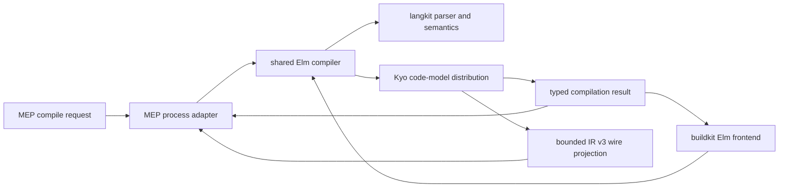
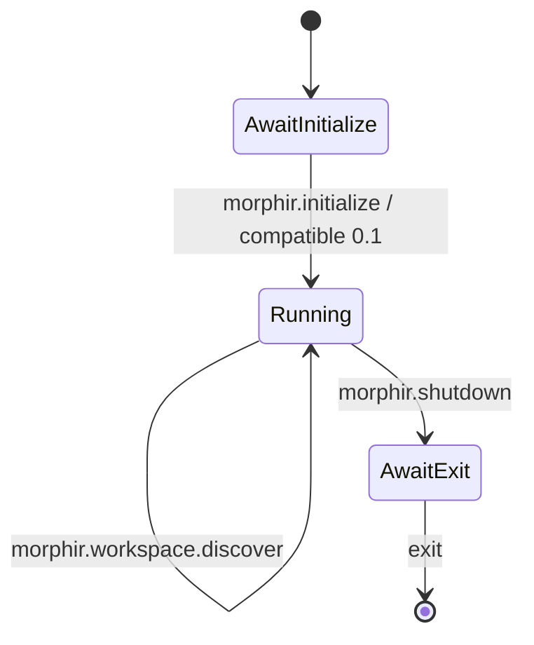

# morphir-scala Elm frontend extension

Morphir-scala should compile its Elm frontend on the JVM and ship a directly executable GraalVM Native Image MEP
provider named `morphir-scala-elm`. The process
adapter and the in-process buildkit adapter must call one pure Elm-to-Morphir-IR compiler. The MEP layer owns framing,
lifecycle, metadata, and conversion to protocol values. It does not own parsing, type checking, lowering, or a second
compiler pipeline.

This note is the Narrative Home for
[intent 0037](../../../intent/0037-morphir-scala-elm-frontend-extension.md). It records the first vertical slice while
implementation can still refine details. The shared pipeline boundary remains in
[Multi-frontend pipeline and workspace boundaries](/design/pipeline-workspace-boundaries.md).

## Shipped contract and observed gap

The Morphir CLI now hosts MEP 0.1 processes, installs checksum-verified executable artifacts into a content-addressed
store, locks exact versions, and validates installed bytes again before activation. The `morphir-elm` provider is the
reference implementation, and the host integration tests define a reusable single-file Elm compilation contract.

Morphir-scala currently parses Elm into CST and AST values on JVM, JavaScript, WebAssembly, and Scala Native. Its JSON
ABI exposes parse and query operations. It does not type-check Elm or compile an Elm module to the Kyo code model.
Wrapping that ABI in JSON-RPC would therefore preserve the missing compiler and publish the wrong abstraction.

## Compiler and adapter boundaries

The implementation has three dependency-directed layers:

**Figure 1:** Both public adapters depend on one Kyo-native compiler. Only the external adapter projects that model to
the IR v3 wire contract.

The shared compiler accepts immutable source and request context and returns a typed success or failure value with
diagnostics. It has no dependency on stdin, stdout, JSON-RPC envelopes, process termination, buildkit scheduling, or
the existing JSON ABI. The first API can be specialized to one source document while keeping package identity,
exposed modules, and requested IR version explicit.

`ElmParse` remains frontend-internal. The generic `Compile[I, O, D]` and typed `Frontend` contracts remain in-process
buildkit boundaries. The MEP adapter converts protocol values to the same compiler request and converts the result
back to MEP values. It never becomes a buildkit stage or another lowering implementation.

The compiler target is `org.finos.morphir.codemodel.Distribution`. This is the Kyo code model used by new Morphir
modules. The shared compiler depends on that model and does not depend on the classic runtime, classic IR model, or
ZIO interoperability modules.

MEP 0.1 requires Morphir IR v3 JSON. A separate compatibility projector walks the Kyo code model and emits the exact
v3 tagged JSON shape through Kyo JSON. It never constructs `org.finos.morphir.ir` objects. It fails with a typed
projection error when a Kyo-native feature has no unambiguous v3 representation. This is a wire boundary, not a
reverse of the existing v3-to-code-model lowering. [Decision 0017](/decisions/0017-deprecated-ir-formats-are-wire-projections.md)
records that rule.

## First supported Elm slice

The first slice compiles one complete Elm module supplied by value. It supports the package name, exposed module,
document URI, document version, and IR version supplied by the host. The initial conformance fixture requires:

- a valid module declaration with an exposing clause;
- top-level type annotations and definitions;
- curried functions over `Int`;
- local name references; and
- integer addition lowered to the Morphir SDK function used by the reference provider.

The valid external result must be schema-valid Morphir IR v3, preserve the requested `local/example` package identity,
and contain exactly the requested `Example` module in both IR and MEP result metadata. Invalid syntax returns
`success: false`, no IR, and no compiled modules. A malformed module header returns an error diagnostic with code
`elm.parser`, the request URI, and a nonempty zero-based source range.

This slice does not claim full Elm semantic compatibility. Multi-file projects, user-module imports, dependency
resolution, manifest discovery, complete type inference, incremental sessions, progress, cancellation, and backend
generation remain outside it. Each additional language feature should enter through a failing compiler test and a
shared conformance fixture.

## Protocol process

The executable reads and writes Content-Length-framed JSON-RPC 2.0. Kyo Schema and JSON define the protocol data.
`kyo-jsonrpc` owns JSON-RPC envelopes, IDs, method dispatch, and errors. A narrow process adapter owns framing and the
MEP lifecycle. Standard output contains frames only; diagnostics about the process itself go to standard error. The
state machine is:

**Figure 2:** The first executable implements the complete MEP lifecycle around a stateless compiler.

Initialization advertises protocol `0.1`, capabilities `frontend` and `workspace`, language `elm`, extension `.elm`,
IR version `3`, compile support, and workspace discovery protocol `0.1.0-draft.1`. The response identity must exactly match the acquired index record. Compilation failures are
normal MEP results. Invalid framing, invalid lifecycle transitions, unsupported protocol requests, and internal
failures are JSON-RPC errors.

Framing and decoding are bounded. The process rejects missing, duplicate, malformed, or oversized Content-Length
headers before allocating a body. EOF during a frame is an error. Unknown JSON fields remain forward-compatible where
MEP allows them, but required identity and compilation fields are validated before compiler invocation.

### Workspace discovery for a selection of files

The Morphir CLI compiles a selection of files, such as `morphir compile --input Example.elm`, as a project that the
provider synthesizes. It asks the provider with `morphir.workspace.discover` and the `ad-hoc-sources` purpose, and it
refuses a provider that does not declare the `workspace` capability. The provider answers with one project: its
package name, and its exposed modules in selection order.

The answer must be the same from every Elm provider, so this one ports the reference behaviour rather than designing
its own. The checks run in the order of morphir-rust `discover_with_identity`, and the codes and messages match it and
the morphir-elm extension. An explicit name comes only from the overlay's `project.name` and is trimmed. It may use
Elm or Morphir spelling: it splits into segments on `/` and `.`, each segment splits into words as morphir-elm
`Name.fromString` does, and the snapshot reports the normal form, the words joined with `-` and the segments with `/`
(finos/morphir#917). The normal form always satisfies the package identity that `morphir.frontend.compile` enforces.
An unnamed selection must
hold exactly one source and is named `local/<module lowercased, dots as dashes>`. A module name comes from the declared
header, read lexically, then from the file stem, then `Main`. Manifest discovery stays with the host.

The frontend compiles exactly one document per request, so it declares `frontend.multiDocument` as `false`. A named
selection of more than one file passes discovery, and the host then refuses it before compile.

### Known document-version gap

MEP 0.1 defines a source document version as an unsigned 64-bit integer. The Scala `DocumentVersion` domain type
retains that range, including validation at zero and `18446744073709551615`. Kyo `1.0.0-RC6`, the published version
used by this provider, reads self-describing JSON integers through signed `Long`. The executable therefore accepts
numeric document versions from zero through `9223372036854775807`. Larger valid MEP values cannot cross the RC6 JSON
boundary.

Kyo [PR 1920](https://github.com/getkyo/kyo/pull/1920) adds exact arbitrary-precision numbers to the self-describing
JSON path. Morphir-scala will adopt that behavior after it appears in a reviewed, published Kyo version. The current
extension does not pin the PR commit, use a local snapshot, encode protocol numbers as strings, or add a second JSON
library.

## Provider identity and host selection

Language and provider are separate dimensions. `morphir-elm` and `morphir-scala-elm` both compile Elm, but they are
independently versioned implementations and must be installable at the same time. The host therefore needs an
explicit provider selector while retaining language-based defaults for simple use.

The first host interface is `morphir compile --language elm --extension morphir-scala-elm`. Configuration may select
the same provider for repeated builds. Without an explicit selection, the existing `morphir-elm` default remains
compatible. The host validates that the selected provider advertises Elm frontend support.

Using the shared `morphir-elm` identity for both executables was rejected. It fits the current language-derived slot,
but causes unrelated provider versions to compete in one history, prevents side-by-side installation, and makes a
lock insufficient to explain which implementation produced an IR distribution.

## Artifact and release model

The first distributable artifact is one GraalVM Native Image executable built from the JVM compiler and MEP
application. This matches the host's shipped `runtime: process` contract without requiring Java at activation time, a
classpath, an archive launcher, or multiple installed files. It also reuses the repository's established native-image
build and CI conventions. Mill builds the executable, but the Morphir extension index and store distribute and
activate it.

Each supported operating-system and architecture pair has an immutable index artifact with:

- schema version 1, extension ID `morphir-scala-elm`, and one exact semantic version;
- channel membership, MEP version `0.1`, and capabilities `frontend` and `workspace`;
- runtime `process`, exact operating system and architecture, portable filename, and executable flag; and
- immutable source location plus SHA-256 digest.

The first CI tracer may cover only its build runner's platform. A platform is advertised as supported only after CI
produces its artifact and executes the common host conformance tests against that exact binary. Linux, macOS, Windows,
x86-64, ARM64, and any cross-build strategy remain claims to prove, not metadata to predict.

Acquisition publishes verified bytes to the host content-addressed store and records catalog and lock state
transactionally. Offline activation rehashes the installed artifact. A checksum mismatch during acquisition creates
no active catalog entry; a later mutation fails before process launch.

The extension index is not the source-package registry described by the Package URL design. Its store is not Mill's
machine tool cache. Mill may cache build inputs and produce the native executable, but the common host owns runtime
selection, installation, locking, and activation.

## Toolchain policy

Morphir is greenfield. Morphir-scala artifacts and the Rust host crates have not been published, and there are no
downstream compatibility consumers. The implementation uses current stable Scala, GraalVM, Mill, and Rust toolchains
rather than maintaining a legacy minimum supported version. Toolchain pins remain exact and reproducible; they are
upgraded deliberately and verified in CI. A compatibility floor becomes a product requirement only when a published
artifact or real consumer creates one.

This policy permits the host's Rust 1.98 baseline and allows the Scala extension to adopt the latest stable compiler
or GraalVM release needed for a safe process implementation. It does not permit unreviewed floating CI versions.

## Acceptance

The vertical slice is complete only when all of the following are repeatable:

1. Shared compiler tests fail first, then prove the valid function and invalid-header cases without a process.
2. Framing and lifecycle tests cover fragmented input, multiple frames, malformed headers, initialize, compile,
   shutdown, and exit.
3. The native executable passes the same ignored `elm_extension` integration suite as `morphir-elm`.
4. The host installs `morphir-scala-elm` from an index, explicitly selects it, and compiles after that index is gone.
5. Acquisition rejects altered source bytes, and activation rejects altered stored bytes before launch.
6. CI builds and tests every advertised platform artifact using pinned current toolchains.

Schema validity is necessary but not sufficient. For the supported subset, normalized semantic IR must also match
the reference provider. Differences in nonsemantic metadata may be normalized explicitly in the conformance helper.

## Alternatives and unresolved work

A JVM jar was rejected as the distributed artifact because the shipped acquisition model installs one executable file
and does not describe a Java launcher or classpath. JVM bytecode remains the compiler's build boundary and feeds
GraalVM Native Image. Scala Native was rejected for the first slice because the established release path already
builds GraalVM executables and changing runtimes would not improve the host contract. The existing JSON ABI was
rejected as the MEP implementation because it exposes parse/query
operations and does not define the compiler contract. Duplicating a minimal lowering inside the process adapter was
rejected because intent 0010 and intent 0037 must converge on one compiler.

Implementation must still determine which Kyo code-model features belong in the first v3 projection and which parser
positions need normalization to MEP's exclusive end range.
Multi-platform publication, complete Elm typing, source dependencies, and versioned protocol evolution remain later
slices.
