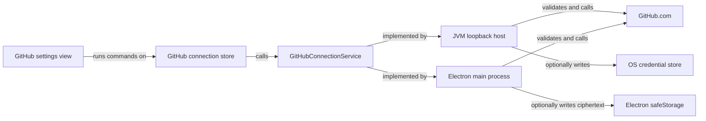
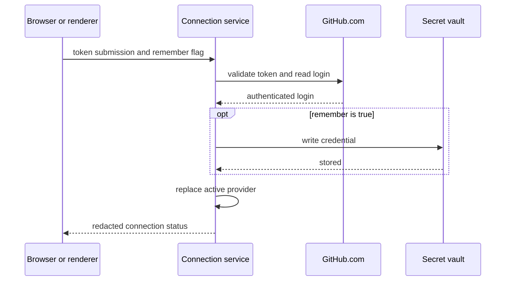

# GitHub connection settings and local web host

Browser and Electron clients use one `GitHubConnectionService` to establish a GitHub.com connection. The host
process validates, stores, and uses the token. The UI receives only redacted connection status. Session-only use is
the default. A user can choose operating-system-backed persistence.

This Design Note is the narrative home for [intent 0036](../../../intent/0036-local-web-host-and-github-connection-settings.md).
It builds on the shipped token-provider and secret-reader design in
[GitHub token providers and appkit secrets](./github-token-providers-and-appkit-secrets.md). It follows the UI
store, signal, and view rules in [morphir-ui architecture](./morphir-ui-architecture.md).

## Context

The GitHub connector already owns a redacted `Token` and named `TokenProvider` implementations. Appkit owns a
redacted `Secret` and a read-only `SecretStore`. The Electron appkit can decrypt a host-provided blob through
Electron `safeStorage`. None of these APIs accepts a token from the UI or writes a remembered credential.

The same `morphir-ui` value runs in a browser and in the Electron renderer. Those clients must submit a token once,
because a pasted-token flow cannot avoid that transfer. They must not retain it after submission or make GitHub
calls with it. The browser has a local backend launched from the Morphir CLI. Electron already has a main process and
an IPC-only JSON-RPC connection.

The first release supports GitHub.com only. The live connector posts to `https://api.github.com/graphql`, so adding a
hostname field to the UI would imply support the connector does not have.

## Language

A **token submission** is the one-use value sent from a password input to the host. `TokenSubmission` renders as
redacted, has a constant hash code, and has no public raw accessor.

A **GitHub connection** is safe status data. It says whether the host is disconnected, connected for the session,
connected with a remembered credential, or holding a remembered credential that GitHub rejected.

A **secret store** reads a secret. The existing `SecretStore` keeps that meaning. A **secret vault** reads, writes,
and removes secrets. `SecretVault` extends `SecretStore` so existing token providers can consume either capability.

## Architecture

`morphir-ui` owns the connection contract, store, and view. Each host implements the contract with the GitHub
connector and an optional `SecretVault`. Other services consume the active `TokenProvider`; they never ask the UI
for a token.



**Figure 1:** Both clients use one contract, while each host owns GitHub access and persistence.

The public contract has three operations:

```scala
trait GitHubConnectionService:
  def status(): GitHubConnectionStatus < (Async & Abort[GitHubConnectionError])
  def connect(
      submission: TokenSubmission,
      remember: Boolean
  ): GitHubConnectionStatus < (Async & Abort[GitHubConnectionError])
  def disconnect(): Unit < (Async & Abort[GitHubConnectionError])
```

`TokenSubmission` needs a custom `Schema`. Derived case-class machinery would expose the raw string through
ordinary rendering and product inspection. The schema writes the raw token only into the request payload and reads
it only inside the host. Protocol responses never contain `TokenSubmission`, `Token`, or `Secret`.

Scala and JavaScript represent the submitted value as immutable strings. Neither runtime can guarantee immediate
memory erasure. Browser developer tools can also retain a recorded request body. The design limits how long the
value stays reachable and prevents application-level persistence; it does not claim secure zeroization. A malicious
browser extension, open developer-tools recording, or process with access to the same user session remains part of
the later security audit.

The GitHub connector adds a narrow token-verification operation that returns the authenticated login. The connection
service depends on that operation rather than on a broad client fixture. This keeps service tests local and makes
validation behavior part of the connector that owns GitHub HTTP details.

## Connection flow

The host validates and changes a connection as one ordered operation. A failed attempt leaves a working connection
untouched.



**Figure 2:** Persistence and provider replacement happen only after GitHub accepts the token.

The active provider reads a process-local token cell owned by the host. Session-only disconnect drops its reference.
Remembered disconnect also removes the vault entry. The service does not build a fallback chain across submitted,
remembered, CLI, or environment tokens. The host chooses this UI-managed provider for its UI services.

On startup, the host reads the GitHub.com vault entry and validates it before reporting a connected state. A revoked
or expired entry produces `StoredCredentialRejected`. The host does not retry it in a loop. The UI can replace or
remove it, with `disconnect` implementing removal.

## Module placement

The work follows the module boundaries already established for the connector, UI, appkit, and desktop application.

| Module | Responsibility |
| --- | --- |
| `morphir/connector/github` | Token verification and authenticated login |
| `morphir/appkit` | Read-only `SecretStore` and writable `SecretVault` contracts plus the JVM vault |
| `morphir/appkit/electron` | Asynchronous `safeStorage` cipher and ciphertext blob persistence |
| `morphir/ui` | Connection protocol, store, view, safe status, and errors |
| `morphir/web/renderer` | Browser entry point that mounts the shared UI |
| `morphir/web/server` | Loopback HTTP, sessions, static assets, JSON-RPC routes, and host services |
| `morphir/main` | Pure Kyo `serve` command and options |

The UI module adds a JVM variant so the web server can use the same schema and route definitions as the Scala.js
clients. The web modules form an unpublished application like `morphir/desktop`; the published libraries keep host
assembly and static assets out of their artifacts.

## Browser host

The existing CLI entry point is a Kyo CaseApp dispatcher whose legacy commands call ZIO. `morphir serve` is a pure
Kyo command. It runs a new JVM web-host module directly and does not add another ZIO-to-Kyo adapter. This follows
[Decision Record 0005](../decisions/0005-bridge-nothing-between-zio-and-kyo.md).

The command binds `127.0.0.1` only. Its default port is selected by the operating system. It serves the compiled
browser UI and JSON-RPC endpoint from one origin, then opens the browser. `--no-open` disables browser launch.
Remote binding and multi-user sessions are outside the first release.

Each server launch creates an unguessable one-use launch credential. The CLI opens a URL that carries the credential
in its fragment, which HTTP requests and server access logs do not receive. The UI exchanges it once for an
`HttpOnly`, `SameSite=Strict` session cookie and removes the fragment with `history.replaceState`. The CLI does not
print the credential.

The server accepts API requests only when all of these conditions hold:

- `Host` matches the bound loopback address and selected port.
- `Origin` matches the served UI origin.
- The request carries the current session cookie.
- The request uses the expected JSON content type.

The server sends no CORS allowance. UI and API responses use `Cache-Control: no-store` and
`Referrer-Policy: no-referrer`. The UI uses a content security policy that limits scripts and connections to its own
origin. These controls cover browser-origin attacks. A malicious process running as the same operating-system user
is outside the first threat model and remains a subject for the security audit.

## Electron host

Electron registers the connection routes beside the current IR, knowledge, and shell routes. The renderer sends them
through the existing `morphirIpc` message port. The preload does not expose `safeStorage`, filesystem access, or a
token-specific Electron API. Context isolation and renderer sandboxing remain enabled.

`ElectronSecretVault` expands the current read-only implementation. Its cipher encrypts and decrypts through the
asynchronous `safeStorage` API. Its blob store reads, atomically replaces, and deletes ciphertext under the app data
directory.

Electron reports whether secure persistence is available. On Linux, a synchronous `safeStorage` implementation can
select `basic_text` when no desktop secret service exists. Electron documents that backend as encryption with a
hardcoded plaintext password. Morphir checks `getSelectedStorageBackend()` after the app is ready and rejects
remembered storage when it returns `basic_text` or `unknown`. It continues to offer session-only connections. The
cipher uses the asynchronous encryption API after that gate. Electron documents both APIs in its
[safeStorage reference](https://www.electronjs.org/docs/latest/api/safe-storage).

## Appkit persistence

Appkit adds `SecretVault` without changing the meaning of `SecretStore`:

```scala
trait SecretVault extends SecretStore:
  def put(service: String, account: String, secret: Secret): Unit < (Abort[SecretException] & Async)
  def remove(service: String, account: String): Unit < (Abort[SecretException] & Async)
```

The JVM web host uses an operating-system credential backend. Electron uses its own `safeStorage` vault. Both use a
stable service name owned by Morphir and `github.com` as the account key. A hostname-shaped key reserves a clean path
for later GitHub Enterprise Server support without mixing credentials.

If the user asks to remember a token and persistence fails, `connect` fails before changing the active provider. It
does not silently fall back to session-only use. A user can retry with remember unchecked.

## UI states

Settings adds a Connections section. Its GitHub.com panel follows four states:

| State | View | Available action |
| --- | --- | --- |
| `Disconnected` | Password input and unchecked remember control | Connect |
| Connecting | Disabled form and progress text | None |
| `Connected` | Login and session or device persistence | Disconnect |
| `StoredCredentialRejected` | Stored credential rejected message | Replace or remove |

The password input disables spelling and automatic capitalization. The token remains in the DOM input until submit.
It never enters a `SignalRef`. The submit adapter reads it, creates `TokenSubmission`, clears the input after the
attempt, and calls the store command. Signals hold status, progress, and safe error text only.

`GitHubConnectionError` exposes a small set of user-safe cases: rejected token, GitHub unavailable, secure storage
unavailable, secure storage failure, and expired local session. GitHub response bodies, headers, storage exception
messages, and submitted values stay in the host. Logs record operation names and safe outcomes only.

Successful authentication proves the token belongs to a GitHub account. It does not prove access to every
repository. Repository operations continue to report their own authorization failures without changing connection
status.

## Testing

Automated tests use fake stores, transports, ciphers, and recorded GitHub responses. They do not call GitHub.com or a
developer credential store.

- Appkit contract tests cover read, write, delete, missing entries, failed persistence, and redaction.
- Connector tests cover login verification, rejection, transport failure, and malformed responses.
- UI tests cover schema round trips, redacted rendering, store commands, every view state, duplicate submission,
  input clearing, and the unchecked remember default.
- Loopback integration tests cover ephemeral binding, launch exchange, replay rejection, cookies, Host and Origin
  checks, absent CORS headers, cache policy, and session expiry.
- Electron tests cover IPC routing, encryption availability, Linux weak-backend rejection, atomic blob replacement,
  deletion, corrupt blobs, and redacted output.
- CLI tests cover command parsing, loopback defaults, automatic port selection, browser launch, and `--no-open`.
- The desktop smoke test connects through a fake verifier, observes status, disconnects, and captures output for
  token leaks.

The tests define expected behavior. A separate security audit must challenge the assumptions and record residual
risks before the capability is considered release-ready.

## Delivery

[Intent 0036](../../../intent/0036-local-web-host-and-github-connection-settings.md) owns this capability. It builds
on the connector from [intent 0020](../../../intent/0020-github-graphql-connector.md), Electron appkit from
[intent 0025](../../../intent/0025-electron-appkit.md), shared UI from
[intent 0029](../../../intent/0029-morphir-ui-kyo-ui-client-library.md), and the desktop host from
[intent 0030](../../../intent/0030-morphir-desktop-electron-app.md).

GitHub Enterprise Server support is separate follow-up work. Its live GraphQL endpoint, hostname input, and
hostname-keyed validation need connector changes beyond the GitHub.com release.

## Alternatives

**One shared connection service.** Accepted because the existing UI contract is transport-blind. Browser and
Electron behavior stays identical while each host keeps its own persistence adapter.

**Dedicated HTTP and preload credential APIs.** Considered and rejected. They duplicate protocol and errors, expose
another Electron bridge, and require host-specific UI adapters.

**Renderer-owned token management.** Considered and rejected. Browser storage is not an acceptable persistence
mechanism for a personal access token. Exposing Electron encryption or filesystem APIs to the renderer weakens the
existing process boundary.

**A built-in provider fallback chain.** Considered and rejected for the same reason as the earlier token-provider
design. The host must know which credential it uses. A submitted token does not silently fall back to `gh`, a flag,
or another vault entry.

**OAuth in the first release.** Considered and deferred. A pasted token works with the current connector and needs no
registered GitHub application. OAuth needs a separate decision about authorization-code flow with PKCE, device flow,
app ownership, client credentials, expiration, and refresh.

## Unresolved

The implementation has not received a focused security audit. The audit must review loopback request controls,
session establishment, token serialization, logging, Electron IPC, persistence, disconnect behavior, and memory
lifetime. Findings can change any security control in this draft.

GitHub Enterprise Server support is not designed here. The future design must validate hostnames, construct the
Enterprise GraphQL endpoint, and keep credentials isolated by normalized host.

OAuth remains open. GitHub recommends authorization-code flow with PKCE for browser-capable public clients, but its
current [authorization flow](https://docs.github.com/en/apps/oauth-apps/building-oauth-apps/authorizing-oauth-apps)
still requires an OAuth app client secret for code exchange. Device flow avoids that secret and carries a different
phishing risk. The project should revisit this after the pasted-token capability ships.
