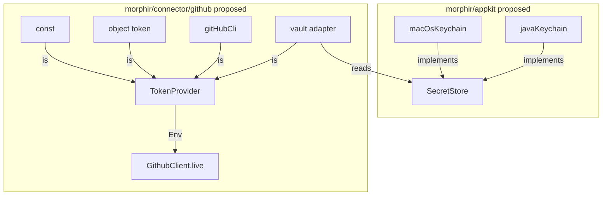

# GitHub token providers and appkit secrets

Live GitHub calls need a token from the program's effect row (`Env[TokenProvider]`). The host installs one named source, often as a Kyo `Layer`. The token is a class that will not print the secret. OS password stores live in `morphir/appkit` as `SecretStore`. The GitHub connector only adapts that store. This note is proposed. It serves the [published library families](/design/published-library-families.md) capability. It extends [intent 0020](../../../intent/0020-github-graphql-connector.md).

## Context

`GithubClient.live` currently takes a `Token` the caller already parsed. Tests and `recorded` / `fixture` clients do not take a token. That constructor is not enough for CLIs and desktop hosts. Those hosts get a GitHub personal access token (PAT) from a flag, from `gh auth token`, or from an OS vault.

A PAT is a secret string GitHub accepts as a Bearer token. A vault here means the OS password store (macOS Keychain, Windows Credential Manager, Linux secret service), not HashiCorp Vault.

Kyo is the effect system this module uses. `Env[A]` means the running program must be given an `A` before it can run. A `Layer` is a recipe that builds that `A`, and any dependencies it needs. `Env.runLayer` installs those recipes at the edge of the program.

A vault is not GitHub-specific. Other Morphir tools will need the same read. It is not a kit: a kit wraps one Scala library Morphir builds on ([decision 0012](/decisions/0012-published-library-families.md)). It is not a dedicated vault module either. Appkit is the family for host applications (CLIs, Electron). `SecretStore` is an early appkit surface, not a secrets kit.

`Token` is a `final class` with a private constructor. It is not a case class and not an opaque `String`. Case class `toString`, `copy`, and `productIterator` leak the secret. An opaque alias is still a `String` at runtime.

## Argument

### Effect slot, then named providers

The live client methods take `Env[TokenProvider]`. That is the start: the client asks the effect row for a provider (call this C). Named providers are an immediate follow (call this A): the host names flags, `gh`, vault, or a literal token. The host picks one source. There is no built-in fallback chain. A chain hides which secret was used.

```scala
trait TokenProvider:
  def token: Token < (Abort[GithubError] & Async)
```

`TokenProvider.const(token)` wraps a value the host already has. `GithubClient.live(token)` stays as that helper so scripts and tests need no `Env`.

Recorded and fixture clients stay token-free.

### Layers

Kyo `Layer` is how the host supplies `Env` values. Install layers with `Env.run`, `Env.runLayer`, or `.provide` when combinators is on the classpath. Each token source is a layer. The vault provider also needs `Env[SecretStore]`. See Figure 1.



**Figure 1:** proposed provider graph. Appkit owns `SecretStore`. GitHub owns `TokenProvider` and the vault adapter.

Proposed layers:

| Layer | Produces | Needs |
| --- | --- | --- |
| `TokenProvider.const(token)` | `TokenProvider` | `Any` |
| `TokenProvider.flags` | `TokenProvider` | `Any` |
| `TokenProvider.gitHubCli(user, hostname)` | `TokenProvider` | `Abort[GithubError]` and `Async` |
| `TokenProvider.vault(service, account)` | `TokenProvider` | `Env[SecretStore]`, `Abort[GithubError]`, and `Async` |
| `SecretStore.macOsKeychain` | `SecretStore` | `Abort[SecretError]` and `Async` |
| `SecretStore.javaKeychain` | `SecretStore` | `Abort[SecretError]` and `Async` (JVM) |

Example:

```scala
Memo.run(Env.runLayer(SecretStore.javaKeychain, TokenProvider.vault("gh", "morphir")) {
  GithubClient.live.listIssues(repo)
})
```

### Token is a redacted class

`Token` is a `final class` with a private constructor. It is not a case class and not an opaque `String`. Case class `toString`, `copy`, and `productIterator` leak the secret. An opaque alias is still a `String` at runtime.

`toString` shows a GitHub type prefix (or the first four characters) and the last four characters when at least 16 characters stay hidden, for example `Token(ghp_...abcd)`. Shorter values print `Token(redacted)`. `hashCode` is `0` so a dump of a map does not show a token hash. Equality still compares the secret.

There is no public string accessor. The HTTP layer uses `private[github] def unsafeReveal: String`. Tests assert parse, equality, and redacted `toString`. `Token` does not derive `Schema`.

`Token.parse` trims and rejects blank input. Every provider goes through `parse`.

### Flags

The flag is `object token extends StaticFlag[String]("")` in package `morphir.connector.github`. Kyo's key is that fully qualified name. The environment variable is `MORPHIR_CONNECTOR_GITHUB_TOKEN`. The system property is `morphir.connector.github.token`. The default is empty. Blank becomes `Unauthorized`.

The token class cannot live in that same package at the JVM level. `Token.class` and `token.class` collide on macOS and Windows. The class and companion are `private[github]` in `internal`. The public package exports them, so hosts still write `morphir.connector.github.Token`. The StaticFlag object keeps the public JVM name.

This flag does not also read `GITHUB_TOKEN` or `GH_TOKEN`. Those remain host or `gh` concerns.

`StaticFlag` resolves once per process. `DynamicFlag` is later work if a host must rotate without restart.

The GitHub module takes `kyo-config` for this flag.

### GitHub CLI

`gh` supports more than one login per host, and more than one host. `gh auth token` without flags uses the default host and that host's active account. The Morphir provider must let the host name both. Otherwise a second logged-in user silently supplies the wrong PAT.

```scala
TokenProvider.gitHubCli(
  user: Maybe[String] = Absent,
  hostname: Maybe[String] = Absent
)
```

That layer runs `gh auth token`, and adds `--user` / `--hostname` when those arguments are present. Stdout is trimmed and passed to `Token.parse`. A missing binary or a non-zero exit is `Unauthorized` with the process detail, not `Transport`. JVM and Node spawn the process. Native fails with `Transport` until a process floor exists.

`Absent` for both is a valid choice: use whatever `gh` treats as active. The provider does not pick among accounts on its own. The rest of `gh` stays [intent 0024](../../../intent/0024-github-cli-connector.md).

### Appkit SecretStore

`morphir/appkit` publishes `org.finos.morphir::morphir-appkit`. It is the first appkit mill module. It is not Electron and not a vault kit.

```scala
trait SecretStore:
  def get(service: String, account: String): Maybe[String] < (Abort[SecretError] & Async)
```

A missing entry is `Absent`. The GitHub vault adapter turns `Absent` or a failed `parse` into `GithubError.Unauthorized`.

Two early JVM-facing backends:

- `macOsKeychain` talks to the macOS Keychain (process `security`, or the Mac path of a Java keyring).
- `javaKeychain` is a JVM backend Morphir provides. It uses a Java keyring library as an implementation detail, not a published kit. On the JVM that path also reaches Windows Credential Manager and Linux secret service.

JS and Native keep the `SecretStore` trait. `javaKeychain` is JVM-only, the same kind of split as live GitHub HTTP.

Which Java keyring artifact to pin is unverified until implementation.

Kit does not depend on connector. GitHub may depend on appkit for the vault adapter. Flags and `gh` do not depend on appkit.

Electron remains a later leaf ([intent 0025](../../../intent/0025-electron-appkit.md)).

### Delivery order

1. `TokenProvider`, `Env` on live methods, `const`, redacted `Token`, `live(token)`.
2. `TokenProvider.flags`, then `TokenProvider.gitHubCli`.
3. Appkit `SecretStore` with both vault backends, then `TokenProvider.vault`.

### Tests

Tests do not call `api.github.com`. Flag tests assert `token.name` and `token.envName`, and that a blank value is `Unauthorized`. They do not set the system property in-process: `StaticFlag` reads once at class load. `gh` and keychain use a fake `SecretStore` or a process seam. The `gh` seam records `--user` and `--hostname` when present. CI does not require a real Keychain.

## Alternatives

**Built-in fallback chain (flag, then `gh`, then vault).** Rejected because the host cannot see which secret won. A CLI can compose layers itself.

**Constructor-only `GithubClient.live(provider)` with no `Env`.** Rejected as the start because the host cannot install a provider in the effect row. `live(token)` remains as `const` closed over.

**`Env[Token]` only, providers run at the edge.** Rejected because rotation, `gh`, and vault lookup would sit outside the client. Named providers would not exist inside the module.

**`SecretStore` inside `connector/github`.** Rejected because vault read is a host capability other tools need.

**A `kit/secrets` leaf wrapping one upstream library.** Rejected as too granular. Appkit holds host capabilities. A Java keyring library may appear as an implementation detail of `javaKeychain`, not as a published kit.

**`SecretStore` as `connector/secrets` because the OS is an external system.** Rejected for the first cut. The OS store is reached from app hosts. Decision 0012 still allows a connector later if appkit grows a GitHub-shaped HTTP client for a vault product. That is not this work.

**Keep opaque `Token = String`.** Rejected because the runtime representation is `String`. Logs and print statements leak it.

## Unresolved

- The exact Java keyring Maven coordinate for `javaKeychain`.
- Whether `macOsKeychain` is `security(1)` or the Mac backend of the same Java library.
- Whether `.provide` needs `kyo-combinators` on the GitHub classpath, or `Env.runLayer` from prelude is enough.
- `DynamicFlag` for in-process rotation.
- Native process spawn for `gh` and `security`.
- Whether `morphir/appkit` is a family-root mill module or `morphir/appkit/core`. The working name is `morphir/appkit` publishing `morphir-appkit`.

A Decision Record is not warranted until the first providers ship and the mill path is in the build.
