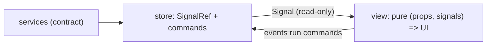

# morphir-ui architecture

`morphir-ui` is the client surface for Morphir: kyo-ui views and the service contract they consume
([intent 0029](../../../intent/0029-morphir-ui-kyo-ui-client-library.md)), mounted today by the
local web host started by `morphir server` (`morphir/web/renderer`, `morphir/web/server`). It was
also shared, unchanged, by the Electron desktop app (`morphir/desktop`) until that app retired in
favor of [finos/morphir-ui](https://github.com/finos/morphir-ui)
([intent 0039](../../../intent/0039-remove-the-electron-desktop-ui-in-favor-of-finos-morphir-ui.md)).
This note records how its code is organized, which UI-to-model paradigm it uses, and how styling is
expressed. It is a Design Note: it changes as the library grows.

## Paradigm: store → signal → view

kyo-ui builds a `UI` value once and re-renders per-signal subscriptions; there is no virtual DOM and
no component re-execution. The architecture follows that grain:

- A **store** owns `SignalRef`s and exposes read-only `Signal`s plus command methods — kyo effects
  that call services and write the refs. `layout.ShellState` is the first store.
- A **view** is a pure function `(props, signals) => UI`. Views accept `Signal` (read) and command
  callbacks; **a view never holds a `SignalRef`** — that single rule keeps state changes
  unidirectional and views trivially testable.
- **Services** stay the transport-blind kyo-jsonrpc contract in `morphir.ui.services`; stores are
  the only layer that talks to clients.

Elm-style MVU was considered and rejected: its whole-view re-run per message is exactly what kyo-ui
refuses to do, and binding one model signal at the root would forfeit fine-grained patching.



**Figure 1:** unidirectional flow; only commands write state, only signals reach views.

Testing has three independent layers: contract round-trips over the in-memory jsonrpc transport, store commands
asserted on signal values with no DOM, and views rendered through `UI.runRender(ui).take(1)`. The render stream never
ends because it emits on every signal change. A fourth layer, an Electron smoke run against the real desktop app,
retired with `morphir/desktop` (see [Desktop smoke boundary](#desktop-smoke-boundary) below).

## Animation and other DOM-level work

Some behaviour cannot be expressed as a pure `UI` value. Pointer drags have no kyo-ui events at RC6, and animation
runs into a sharper limit: a reactive `style` binding re-creates the element on every emission, so the browser never
sees a start value and a CSS transition cannot play. Both therefore live in small adapters under
`morphir.ui.internal`, hidden with `private[ui]` and reached through one public entry (`AppShell.attachShellDom`).

The rule that keeps them honest: **an adapter reads the store and writes the DOM; it never owns state.**
`PointerResize` turns drags into `resize*` commands, and `PanelMotion` subscribes to the store's extent signals and
sets the size on the element already on screen, letting the panel's own typed transition animate it. The animation
setting is honoured one level up, by a class on the shell root: the root re-renders when the setting changes, so an
inline gate written by an adapter would be lost along with the element it was written to. Collapsing a
region drives its extent to zero rather than unmounting it, which is what lets the neighbours reflow with the slide.
Adapters were proven in the retired Electron smoke run rather than in unit tests; the store's commands and the views
stay unit-tested as usual. No replacement adapter-level smoke coverage exists today.

## Desktop smoke boundary (retired)

`morphir/desktop` carried a desktop smoke scenario: a test-only Scala.js DOM driver
(`runMorphirDesktopSmoke`) drove the settings UI inside a real Electron process, and a named, cached
`morphir.desktop.smokeRun` Mill task owned process-tree ownership, artifact verification, and a
sentinel-token leak scan across Darwin, Linux and Windows. It retired with the rest of
`morphir/desktop` when the Electron desktop UI moved to
[finos/morphir-ui](https://github.com/finos/morphir-ui)
([intent 0039](../../../intent/0039-remove-the-electron-desktop-ui-in-favor-of-finos-morphir-ui.md)).
No replacement end-to-end smoke run exists for the local web host today; its adapters (see
[Animation and other DOM-level work](#animation-and-other-dom-level-work) above) are unit-tested only.

## Package layout

```
morphir.ui
  services/    contract: DTOs, service traits, kyo-jsonrpc routes
  theme/       Tokens (CSS variables), Base, aggregation in Theme
  icons/       stroke-drawn glyphs, recolored via currentColor
  layout/      ShellState store, Sidebar, Topbar, RegionPanel, Shell class names
  components/  feature views (IR explorer, knowledge browser) — package root today
  AppShell     composition only
```

Each layout/component object carries its class names as constants (`Sidebar.Css.root`) and a
`sheet: Stylesheet` next to the markup that uses them; `ThemeTests` asserts every emitted class is
styled, so markup and stylesheet cannot drift apart silently.

## Styling: typed stylesheets first

Styles are kyo-ui `Stylesheet`/`Style` values by default: tokens once as CSS variables
(`Stylesheet.vars`, referenced by `Color.variable`), one sheet per object, aggregated by `Theme` and
rendered to the single string hosts inject. `scopedVars` on a `data-theme` selector is the intended
door to alternate themes.

Because every color the shell paints is a token, a color scheme is a set of values rather than a second stylesheet:
`Tokens.sheet` emits the dark palette at the root and the light palette under `scopedVars`, and the shell root carries
a scheme class. Note that the vars are scoped to that root, so the root — not the document body above it — has to paint
the surface. `System` follows the host: kyo types `prefers-color-scheme: dark` only, so the light palette is the base
and the media query puts the dark one back.

Raw CSS survives only in a quarantine block, one comment per rule naming the missing vocabulary.
At Kyo 1.0.0-RC6 that is: `-webkit-app-region` (frameless-window drag regions), CSS grid,
inset `box-shadow`, `background-clip: text`, and the global resets (universal selector, scrollbar
pseudo-elements, font smoothing). If Kyo grows the vocabulary, the quarantine shrinks.

## Host boundary

`morphir/web/renderer` mounts the shell in the browser; `morphir/web/server` is the JVM loopback host
`morphir server` starts. Hosts adopt the theme by injecting `Theme.css`.

The retired Electron desktop app split the same way: `morphir/desktop/main` held testable services (no
Electron types, so its test bundle never linked `require("electron")`), `morphir/desktop/boot` held
the Electron bootstrap, and `morphir/desktop/renderer` mounted the shell.

The browser host and shared GitHub connection store follow the host-boundary rule above. The UI owns a
transport-blind connection contract and safe status signals. Host processes own submitted tokens, validation, and
persistence. See [GitHub connection settings and local web host](./github-connection-settings-and-local-web-host.md).
