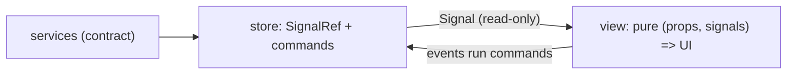

# morphir-ui architecture

`morphir-ui` is the client surface for Morphir: kyo-ui views and the service contract they consume,
shared by the browser and the Electron desktop app ([intent 0029](../../../intent/0029-morphir-ui-kyo-ui-client-library.md)).
This note records how its code is organized, which UI-to-model paradigm it uses, and how styling is
expressed. It is a Design Note: it changes as the library grows.

## Paradigm: store → signal → view

kyo-ui builds a `UI` value once and re-renders per-signal subscriptions; there is no virtual DOM and
no component re-execution. The architecture follows that grain:

- A **store** owns `SignalRef`s and exposes read-only `Signal`s plus command methods — kyo effects
  that call services and write the refs. `layout.ShellState` is the first store.
- A **view** is a pure function `(props, signals) => UI`. Views accept `Signal` (read) and command
  callbacks; **a view never holds a `SignalRef`** — that single rule keeps state changes
  unidirectional and views trivially testable.
- **Services** stay the transport-blind kyo-jsonrpc contract in `morphir.ui.services`; stores are
  the only layer that talks to clients.

Elm-style MVU was considered and rejected: its whole-view re-run per message is exactly what kyo-ui
refuses to do, and binding one model signal at the root would forfeit fine-grained patching.



**Figure 1:** unidirectional flow; only commands write state, only signals reach views.

Testing has four independent layers, each cheap: contract round-trips over the in-memory jsonrpc
transport; store commands asserted on signal values with no DOM; views rendered through
`UI.runRender(ui).take(1)` (the stream never ends — it emits on every signal change); and the
Electron smoke test driving the real app.

## Package layout

```
morphir.ui
  services/    contract: DTOs, service traits, kyo-jsonrpc routes
  theme/       Tokens (CSS variables), Base, aggregation in Theme
  icons/       stroke-drawn glyphs, recolored via currentColor
  layout/      ShellState store, Sidebar, Topbar, RegionPanel, Shell class names
  components/  feature views (IR explorer, knowledge browser) — package root today
  AppShell     composition only
```

Each layout/component object carries its class names as constants (`Sidebar.Css.root`) and a
`sheet: Stylesheet` next to the markup that uses them; `ThemeTests` asserts every emitted class is
styled, so markup and stylesheet cannot drift apart silently.

## Styling: typed stylesheets first

Styles are kyo-ui `Stylesheet`/`Style` values by default: tokens once as CSS variables
(`Stylesheet.vars`, referenced by `Color.variable`), one sheet per object, aggregated by `Theme` and
rendered to the single string hosts inject. `scopedVars` on a `data-theme` selector is the intended
door to alternate themes.

Raw CSS survives only in a quarantine block, one comment per rule naming the missing vocabulary.
At Kyo 1.0.0-RC6 that is: `-webkit-app-region` (frameless-window drag regions), CSS grid,
inset `box-shadow`, `background-clip: text`, and the global resets (universal selector, scrollbar
pseudo-elements, font smoothing). If Kyo grows the vocabulary, the quarantine shrinks.

## Host boundary

The desktop app splits the same way: `morphir/desktop/main` holds testable services (no Electron
types, so its test bundle never links `require("electron")`), `morphir/desktop/boot` holds the
Electron bootstrap, and `morphir/desktop/renderer` mounts the shell. Hosts adopt the theme by
injecting `Theme.css`.
