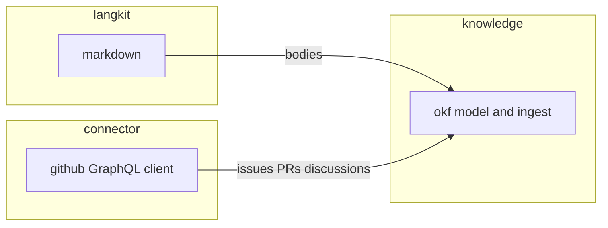

# Published library families

The capability this note tracks: Morphir publishes general-purpose libraries beside its IR tooling, in five families whose mill paths and artifacts a reader can predict. The taxonomy is settled in
[decision 0013](/decisions/0013-published-library-families.md). This note is the narrative home for delivering the first three modules and for the questions that still move: markdown parsing on Native, and an HTTP stack that actually runs on JS and Native.

**Figure 1:** proposed first skeletons and the two dependency edges. Appkit is reserved and has no mill children yet.

## Why this is in flight

Kit already exists and means one thing: a bridge to a Scala library Morphir builds on, with no Morphir types, on JVM, JS, and Native. GitHub, markdown, Electron, and Codeium were going to land somewhere. Putting them in kit would empty that rule. Putting them in `contrib/` would hide first-class work in a parking lot. The families in decision 0013 are the place.

The first skeletons exist so GitHub, markdown, and OKF work can proceed in parallel. They compile, test, and mix `MorphirPublishModule`. They do not yet speak to `api.github.com`, parse CommonMark, or round-trip a real `kb/` bundle.

## Constraints that stay

New code is Kyo. Existing ZIO modules are left untouched. No ZIO-to-Kyo adapter.
See [decision 0005](/decisions/0005-bridge-nothing-between-zio-and-kyo.md).

Root `morphir`, `runtime.classic`, `interop/zio`, and `testing/zio` do not grow this work. `contrib/` is not a destination. `morphir/toolkit` is not a namespace to revive.

Public APIs in the new modules use `kyo.Result` and `kyo.Maybe`. Types that must not exist are `Option` and `Either` in those signatures. Tests use kyo-test. Case classes are `final`.

## First skeletons

### `morphir/connector/github`

Artifact `org.finos.morphir::morphir-connector-github`. Package `morphir.connector.github`. JVM, JS, and Native.

The module holds GitHub-shaped types (issue, pull request, discussion), a token, a typed error ADT, and a client that can list those objects for a repository. It holds no OKF types and no Morphir IR types.

`kyo-caliban` is a GraphQL server and is out of scope. The client path is `caliban-client` plus an HTTP backend, against a **subset** of GitHub's schema. REST is used only for endpoints GraphQL lacks. The `gh` CLI is a later sibling module, `morphir/connector/github-cli`, and may be JVM-only.

**Codegen (settled for this skeleton).** Generated client Scala is checked in, produced by a documented command, not by a Mill task. Caliban's codegen plugin is sbt-shaped, and no Mill equivalent is in this repository. GitHub's subset schema will change slowly enough that a checked-in file is reviewable. A Mill codegen task can be added later if regeneration becomes frequent. Until the command has been run once, the skeleton hand-writes the operation types the subset schema will generate. The subset schema itself is vendored in the module and pinned to an upstream commit in the README.

**HTTP stack (open).** `kyo-http` and `caliban-client` must run on Scala.js and Scala Native, not merely compile. That is unverified here. The skeleton therefore uses a fixture-backed client and takes neither dependency. Adding them is part of the GitHub connector intent, gated on a recorded platform check.

Tests replay recorded GraphQL fixtures. They do not call `api.github.com`.

### `morphir/langkit/markdown`

Artifact `org.finos.morphir::morphir-langkit-markdown`. Package `morphir.langkit.markdown`. JVM, JS, and Native. Depends on `langkit.core` for `Span`. A `QueryableTree` instance is later work and depends on `langkit.trees`.

`langkit.core` mixes `MorphirPublishModule` so a published markdown module can depend on it. Mill's `PublishModule` will not take an unpublished `moduleDep`.

**Parser (open).** `commonmark-java` is JVM-only and must not enter this module. A cross-platform parser, or a shared AST with per-platform engines, has to be named before the module grows past the stub. The stub parses ATX headings and paragraphs into a CST so tests run on all three platforms with no third-party parser.

### `morphir/knowledge/okf`

Artifact `org.finos.morphir::morphir-knowledge-okf`. Package `morphir.knowledge.okf`. JVM, JS, and Native.

The shared sources hold the OKF model (bundle, concept, frontmatter) and depend on `langkit.markdown` for bodies. GitHub ingest depends on `connector.github` and also lives in shared sources, so it follows the connector onto JS and Native. JVM-only pieces, if any appear, go in `jvm/src`.

The kb skill (`KbModel.scala` and friends) does not move in this pass. The published library is a new API. Switching the skill onto it is a later intent.

`morphir/contrib/knowledge` (microkanren) stays where it is.

### `morphir/appkit`

A reserved mill container with a README. No `electron` or `codeium` children until those intents leave the backlog.

## Delivery intents

The intent bundle records the work. This note is the narrative they serve.

| Intent | Role |
| --- | --- |
| [0020 GitHub GraphQL connector](../../../intent/0020-github-graphql-connector.md) | The published GitHub client |
| [0021 Markdown langkit](../../../intent/0021-markdown-langkit.md) | Cross-platform markdown CST |
| [0022 OKF knowledge library](../../../intent/0022-okf-knowledge-library.md) | OKF model on top of markdown |
| [0023 Import GitHub sources into OKF](../../../intent/0023-import-github-sources-into-okf.md) | Ingest, after 0020 and 0022 exist |
| [0024 GitHub CLI connector](../../../intent/0024-github-cli-connector.md) | `gh` wrapper, may be JVM-only |
| [0025 Electron appkit](../../../intent/0025-electron-appkit.md) | Host-app integration, later |
| [0026 Codeium appkit](../../../intent/0026-codeium-appkit.md) | Host-app integration, later |
| [0027 Stop using contrib for first-class work](../../../intent/0027-stop-using-contrib-for-first-class-work.md) | Deprecation of the parking lot |
| [0028 Remove or absorb morphir/toolkit](../../../intent/0028-remove-or-absorb-morphir-toolkit.md) | Removal of the unwired directory |

Intent 0004 (project intent outward as GitHub issues) stays Cancelled. GitHub in this story is a source, not an output.

## Unresolved

1. **HTTP on JS and Native.** Whether `kyo-http`, `caliban-client`, and a sttp backend run on Scala.js and Scala Native at the pinned Kyo version. Unverified. The GitHub skeleton stays fixture-backed until a check is recorded here.
2. **Markdown parser.** Which library, or which per-platform engines, produce a shared CST on all three platforms. Unverified. The stub is not that parser.
3. **Caliban subset workflow.** How the GitHub schema is cut down before codegen (hand-edited SDL, a documents file, or an external subset tool). The first subset is small enough to edit by hand. A tool is not required until the operation set grows.
4. **OKF fidelity.** How closely `morphir.knowledge.okf` matches the kb skill's current model, and when the skill switches. Out of scope for the skeleton.

A finding that Native HTTP is impossible would reopen the platform half of [decision 0013](/decisions/0013-published-library-families.md), as that record already says.
