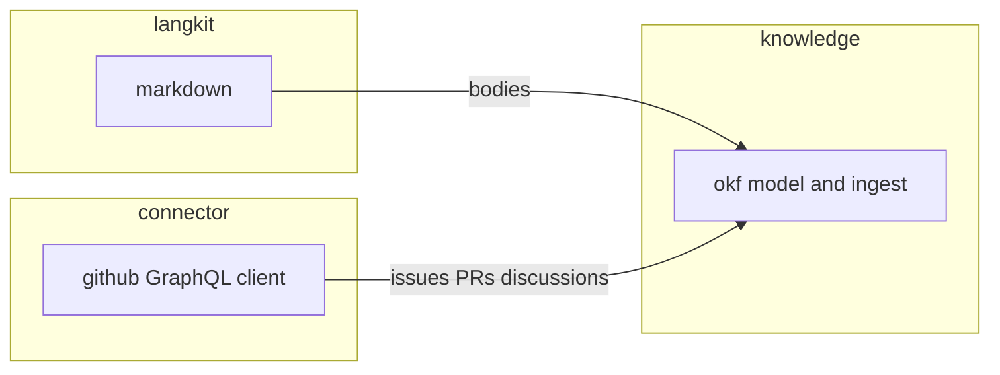

# Published library families

The capability this note tracks: Morphir publishes general-purpose libraries beside its IR tooling, in five families whose mill paths and artifacts a reader can predict. The taxonomy is settled in
[decision 0013](/decisions/0013-published-library-families.md). This note is the narrative home for delivering the first three modules and for the questions that still move: markdown parsing on Native, and live HTTP on Scala Native.

**Figure 1:** proposed first skeletons and the two dependency edges. Appkit publishes `SecretStore` at `morphir/appkit`.

## Why this is in flight

Kit already exists and means one thing: a bridge to a Scala library Morphir builds on, with no Morphir types, on JVM, JS, and Native. GitHub, markdown, Electron, and Codeium were going to land somewhere. Putting them in kit would empty that rule. Putting them in `contrib/` would hide first-class work in a parking lot. The families in decision 0013 are the place.

The first skeletons exist so GitHub, markdown, and OKF work can proceed in parallel. They compile, test, and mix `MorphirPublishModule`. Tests do not call `api.github.com`. The markdown stub is not CommonMark. OKF does not yet round-trip a real `kb/` bundle.

## Constraints that stay

New code is Kyo. Existing ZIO modules are left untouched. No ZIO-to-Kyo adapter.
See [decision 0005](/decisions/0005-bridge-nothing-between-zio-and-kyo.md).

Root `morphir`, `runtime.classic`, `interop/zio`, and `testing/zio` do not grow this work. `contrib/` is not a destination. `morphir/toolkit` is not a namespace to revive.

Public APIs in the new modules use `kyo.Maybe` and typed failure. Pure decode uses `kyo.Result`. Effectful listing uses `Abort` and `Async`. Types that must not exist are `Option` and `Either` in those signatures. Tests use kyo-test. Case classes are `final`.

## First skeletons

### `morphir/connector/github`

Artifact `org.finos.morphir::morphir-connector-github`. Package `morphir.connector.github`. JVM, JS, and Native.

The module holds GitHub-shaped types (issue, pull request, discussion), a redacted token class, a typed error ADT, and a client that can list those objects for a repository. Live calls take `Env[TokenProvider]`. Named providers (const, flags, GitHub Actions `GITHUB_TOKEN`, `gh`, vault) install via Kyo `Layer`. Vault read lives in appkit as `SecretStore`. See [GitHub token providers and appkit secrets](/design/github-token-providers-and-appkit-secrets.md). It holds no OKF types and no Morphir IR types.

Each listed issue, pull request, and discussion carries author, createdAt, updatedAt, labels, and comments. createdAt and updatedAt are `Maybe[java.time.Instant]`. GitHub DateTime is an ISO-8601 UTC string; decode uses `Instant.parse`. Discussions also carry upvoteCount, an accepted answer, and nested comment replies. `listDiscussions` takes a `ReplyDepth` (default one level). `listDiscussionReplies` pages further replies for a comment id from the connection cursor. `getIssue`, `getPullRequest`, and `getDiscussion` look up one object by repository number and return `Maybe` (`Absent` when GitHub returns null). Issue and pull request comments have no upvoteCount. GitHub's IssueComment is not Votable.

Listing methods return `Chunk[A] < (Abort[GithubError] & Async)`. Recorded JSON decode is pure `Result` lifted into that row. Live HTTP cannot be a bare `Result`.

`kyo-caliban` is a GraphQL server and is out of scope. The client path is still `caliban-client` plus an HTTP backend, against a **subset** of GitHub's schema. REST is used only for endpoints GraphQL lacks. The `gh` CLI is a later sibling module, `morphir/connector/github-cli`, and may be JVM-only.

**Codegen (settled).** Generated client Scala is checked in, produced by the Mill script
`morphir/connector/github/schema/gen-client.scala`, not by a module task. Caliban's codegen plugin is sbt-shaped;
the script is the documented command (`./mill morphir/connector/github/schema/gen-client.scala`). GitHub's subset
schema will change slowly enough that a checked-in file is reviewable. A Mill codegen task can be added later if
regeneration becomes frequent. The subset schema itself is vendored in the module. Caliban's generator API is ZIO;
that stays inside the script. The published module uses `caliban-client` (no ZIO compile dependency) plus `kyo-http`.

**HTTP stack (checked, split).** `kyo-http` 1.0.0-RC6 Scala sources compile on JVM, JS, and Native.

Live POST is wired on the JVM and on Node.js. The github JS module mixes `MorphirJSNodeModule`, which sets
`ModuleKind.CommonJSModule`. Without that, Scala.js `NoModule` cannot import `node:fs` / `node:net` / `node:tls`.
kyo-http's JS backend is Node-only. A browser consumer whose link reaches `GithubClient.live` inherits that
requirement.

**Browsers (settled).** There is no `fetch` floor in kyo-http 1.0.0-RC6, and this module will not add one. A Scala.js
`fetch` transport could POST JSON, but authenticated calls to `api.github.com/graphql` from a page origin fail CORS.
GitHub does not make that a supported client-side pattern. The token would also sit in the page. A web app that needs
live GitHub data goes through a same-origin proxy, not `GithubClient.live`. Electron ([0025](../../../intent/0025-electron-appkit.md))
is a browser-shaped host with Node, so it uses the Node backend already wired. Recorded fixtures and decode stay
usable without posting. Splitting a Node-free JS artifact is later work, only if a page must load this module without
Node.

Scala Native does not take `kyo-http`. The published `kyo-net_native0.5_3-1.0.0-RC6` artifact was generated on a Linux
host. `KqueueBindingsImpl` is a throwing stub (`sys/event.h` unavailable). `EpollBindingsImpl` still references Linux
`epoll` / `eventfd` / `io_uring` symbols. OpenSSL link flags would not fix that. `GithubClient.live` exists on Native
and listing fails with `GithubError.Transport`.

Recorded GraphQL fixtures run on all three. Tests do not call `api.github.com`. Live listing builds GraphQL
documents from the generated `caliban-client` helpers.

### `morphir/langkit/markdown`

Artifact `org.finos.morphir::morphir-langkit-markdown`. Package `morphir.langkit.markdown`. JVM, JS, and Native. Depends on `langkit.core` for `Span`. A `QueryableTree` instance is later work and depends on `langkit.trees`.

`langkit.core` mixes `MorphirPublishModule` so a published markdown module can depend on it. Mill's `PublishModule` will not take an unpublished `moduleDep`.

**Parser (open).** `commonmark-java` is JVM-only and must not enter this module. A cross-platform parser, or a shared AST with per-platform engines, has to be named before the module grows past the stub. The stub parses ATX headings and paragraphs into a CST so tests run on all three platforms with no third-party parser.

### `morphir/knowledge/okf`

Artifact `org.finos.morphir::morphir-knowledge-okf`. Package `morphir.knowledge.okf`. JVM, JS, and Native.

The shared sources hold the OKF model (bundle, concept, frontmatter) and depend on `langkit.markdown` for bodies. GitHub ingest depends on `connector.github` and also lives in shared sources, so it follows the connector onto JS and Native. JVM-only pieces, if any appear, go in `jvm/src`.

The kb skill (`KbModel.scala` and friends) does not move in this pass. The published library is a new API. Switching the skill onto it is a later intent.

`morphir/contrib/knowledge` (microkanren) stays where it is.

### `morphir/appkit`

Artifact `org.finos.morphir::morphir-appkit`. Package `morphir.appkit`. First surface is `SecretStore` plus macOS Keychain and JVM java-keychain backends. `javaKeychain` pins `com.github.javakeyring:java-keyring:1.0.4` as an implementation detail. `macOsKeychain` runs `security find-generic-password`. This is host capability, not a vault kit and not Electron. GitHub's vault `TokenProvider` depends on it. Detail: [GitHub token providers and appkit secrets](/design/github-token-providers-and-appkit-secrets.md). `electron` and `codeium` children wait on [0025](../../../intent/0025-electron-appkit.md) and [0026](../../../intent/0026-codeium-appkit.md).

## Delivery intents

The intent bundle records the work. This note is the narrative they serve.

| Intent | Role |
| --- | --- |
| [0020 GitHub GraphQL connector](../../../intent/0020-github-graphql-connector.md) | The published GitHub client |
| [0021 Markdown langkit](../../../intent/0021-markdown-langkit.md) | Cross-platform markdown CST |
| [0022 OKF knowledge library](../../../intent/0022-okf-knowledge-library.md) | OKF model on top of markdown |
| [0023 Import GitHub sources into OKF](../../../intent/0023-import-github-sources-into-okf.md) | Ingest, after 0020 and 0022 exist |
| [0024 GitHub CLI connector](../../../intent/0024-github-cli-connector.md) | `gh` wrapper, may be JVM-only |
| [0025 Electron appkit](../../../intent/0025-electron-appkit.md) | Host-app integration, later |
| [0026 Codeium appkit](../../../intent/0026-codeium-appkit.md) | Host-app integration, later |
| [0027 Stop using contrib for first-class work](../../../intent/0027-stop-using-contrib-for-first-class-work.md) | Deprecation of the parking lot |
| [0028 Remove or absorb morphir/toolkit](../../../intent/0028-remove-or-absorb-morphir-toolkit.md) | Removal of the unwired directory |

Intent 0004 (project intent outward as GitHub issues) stays Cancelled. GitHub in this story is a source, not an output.

## Unresolved

1. **Live HTTP on Native.** `kyo-http` 1.0.0-RC6 live POST is wired on the JVM and on Node.js. Scala Native stays stubbed because the published kyo-net Native artifact at that version does not link kqueue on macOS. Linux Native is untested. A later kyo RC that ships Darwin codegen would reopen this.
2. **Markdown parser.** Which library, or which per-platform engines, produce a shared CST on all three platforms. Unverified. The stub is not that parser.
3. **Caliban subset workflow.** How the GitHub schema is cut down before codegen (hand-edited SDL, a documents file, or an external subset tool). The first subset is small enough to edit by hand. A tool is not required until the operation set grows.
4. **OKF fidelity.** How closely `morphir.knowledge.okf` matches the kb skill's current model, and when the skill switches. Out of scope for the skeleton.

A finding that Native HTTP is impossible would reopen the platform half of [decision 0013](/decisions/0013-published-library-families.md), as that record already says.
