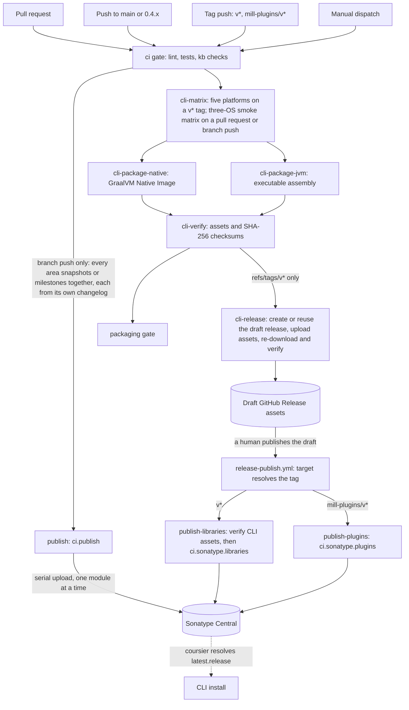

# Packaging and Release

This page maps everything CI publishes from this repository: where each artifact lands, what triggers
the publish, and the exact steps each path runs. Read it before touching a release job, or before asking
why something did not show up where you expected it.

## What ships where

| What | Where | Coordinates / assets |
| --- | --- | --- |
| Scala libraries | Sonatype Central | `org.finos.morphir:*` |
| Mill Morphir plugins | Sonatype Central | `org.finos.morphir.mill:*` |
| Native CLI packages and checksums | GitHub Releases | `morphir-cli-<os>-<arch>-<version>.tar.gz` or `.zip` |
| Executable JVM CLI and checksum | GitHub Releases | `morphir-cli-jvm-<version>.jar` |
| CLI library | Sonatype Central and Coursier channel | `org.finos.morphir:morphir-main_3` |

Two aggregate gates stand between a trigger and anything leaving the repository: `ci` for lint, tests
and knowledge base checks, and `packaging` for the CLI build. Packaging runs on ordinary
pushes and pull requests as well as release tags. A release itself runs in two phases across two
workflows: a tag push *stages* a draft GitHub release through `ci.yml`, and publishing that draft
*promotes* it to Maven Central through `release-publish.yml`. Figure 1 shows every path, end to end.



**Figure 1:** Two gates stand in the staging flow, and every path into `Sonatype` except the branch
snapshot runs through the published-release promotion in `release-publish.yml`. Everything above
`packaging` runs on ordinary pull requests and pushes, so broken CLI packaging surfaces
where it was introduced. The two promotion jobs are each guarded on their own tag namespace. See
[Release routing](#release-routing) for why a single tag can never satisfy both of them. A third area
and a third promotion job, `publish-desktop`, existed for the Electron desktop application; it retired
along with the app when the Electron desktop UI moved to
[finos/morphir-ui](https://github.com/finos/morphir-ui) — see
[intent 0039](../../intent/0039-remove-the-electron-desktop-ui-in-favor-of-finos-morphir-ui.md).

## Triggers

| Event | GitHub Actions trigger | Condition | What runs |
| --- | --- | --- | --- |
| Pull request | `pull_request` | into `main`, `0.4.x` | `ci` gate; nothing publishes. CLI packaging runs one runner per operating system, unless its switch turns it off |
| Branch push | `push` | to `main`, `0.4.x` | `ci` gate, then `publish` (`ci.publish`, every area) once it passes. CLI packaging runs its three-OS smoke matrix, unless its switch turns it off |
| Tag push | `push` | tags `v*`, `mill-plugins/v*` | phase one of a release: `ci` gate, then full packaging and verification, then a **draft** GitHub release is created (or reused) with the assets attached. No Maven Central upload happens on a tag push |
| Release published | `release`, `types: [published]` on `release-publish.yml` | any published release | phase two: the tag namespace routes to one promotion job, which re-verifies the staged assets and uploads to Sonatype — unless the Maven Central switches stand it down |
| Manual dispatch of CI | `workflow_dispatch` on `ci.yml` | whichever ref is chosen | the same jobs that ref would otherwise trigger. Choosing a release tag re-runs that tag's staging phase (the retry path for a failed build or upload) |
| Manual dispatch of promotion | `workflow_dispatch` on `release-publish.yml` | `tag` input | re-runs phase two for that tag: the retry path for a failed Sonatype upload, or late promotion of a release published while the switches were off |

A release runs in two phases. **Phase one — staging** — is the tag push: tests, packaging,
verification, and a draft GitHub release holding the verified assets. Nothing irreversible happens;
a bad draft is deleted, the tag moved or removed, and nothing shipped. **Phase two — promotion** —
is a human publishing that draft: the `release: published` event fires `release-publish.yml`, a slim
workflow that re-verifies the staged assets and uploads to Maven Central. Splitting the phases
across two workflows is what keeps the publish button from re-running the whole test and packaging
pipeline, and what keeps the irrevocable Sonatype upload behind a human gate.

Creating a GitHub release with a **new** tag through the UI fires the tag-push event, so staging
still runs — but it also fires the release event immediately, and promotion will fail its
verification until staging finishes; re-run promotion through its dispatch afterwards. The routine
path is: push the tag, wait for staging to go green, review the draft, publish it.

### Skipping Maven Central

Two switches make a release target GitHub Releases only:

- The repository variable `MORPHIR_RELEASE_MAVEN_CENTRAL` — unset or anything other than `false`
  means enabled, matching the `MORPHIR_CI_PACKAGE_*` switches. Set to `false` it stands down every
  Sonatype upload — the three promotion jobs in `release-publish.yml` and the snapshot `publish`
  job in `ci.yml` — from repository settings without a commit.
- The `maven_central` input on a manual dispatch of `release-publish.yml` — uncheck it and the
  promotion run verifies without uploading. (The same input on `ci.yml` stands down the snapshot
  publish for one run.)

With either switch off, publishing the draft still publishes the GitHub release — assets were
staged in phase one — and Maven Central simply receives nothing until someone re-runs promotion
with the switches on.

### Release routing

Two independently versioned areas exist: the libraries and the Mill plugin family. Each releases
through its own tag namespace, and the tag's shape is what routes a tag push to the right
destination; nothing else about the event distinguishes them, since `github.ref` is the only thing
that differs.

| Tag shape | Stages (tag push, `ci.yml`) | Promotes (release published, `release-publish.yml`) |
| --- | --- | --- |
| `v0.6.0-M01` | CLI packages and checksums on a draft release, via `cli-release` → `ci.cli.githubRelease` | `publish-libraries`: verify the CLI assets, then `ci.sonatype.libraries` |
| `mill-plugins/v0.1.0` | Nothing beyond the `ci` gate — plugins carry no GitHub release assets | `publish-plugins`: `ci.sonatype.plugins` |
| Anything else | Nothing, visibly: no job matches | Nothing: no promotion job matches |

Staging guards use `startsWith(github.ref, 'refs/tags/<namespace>/v')`; promotion guards apply the
same prefixes to the tag the `target` job resolved. Both are mutually exclusive by construction: a
single tag can only ever start one of `v` or `mill-plugins/v`, so a release never
routes to two paths at once. Snapshot and milestone publishing from a branch push is unaffected by
this table: `publish` still runs `ci.publish` on `main` and `0.4.x`, publishing every area
together, each stamped from its own changelog. Only the release path routes by tag.

### Desktop application packaging (retired)

A third area, the Electron desktop application, released through a `desktop/v*` tag namespace,
staged via `desktop-matrix`/`desktop-package`/`desktop-verify`/`desktop-release` (the last also
running in ordinary CI, gated by a `MORPHIR_CI_PACKAGE_DESKTOP` repository-variable switch that a
release tag ignored) and promoted via `publish-desktop` (`ci.desktop.sonatype`). All of it retired
with the app when the Electron desktop UI moved to
[finos/morphir-ui](https://github.com/finos/morphir-ui) — see
[intent 0039](../../intent/0039-remove-the-electron-desktop-ui-in-favor-of-finos-morphir-ui.md).

## Publishing libraries and plugins

| Step | Task | What happens |
| --- | --- | --- |
| 1 | `ci` gate (snapshots) or the staged, published release (promotion) | a snapshot publishes only after lint, cross-platform tests and knowledge base checks pass; a release publishes only after its tag-push run went green and a human published the draft |
| 2 | `ci.publish` (branch push) or `ci.sonatype.libraries` / `ci.sonatype.plugins` (promotion, routed by tag; see [Release routing](#release-routing)) | resolves `__.publishSonatypeCentral`, dropping modules whose path matches `excludedModuleSubstrings` |
| 3 | Upload | one module at a time (`uploadJobs: 1`); parallel upload hits an SLF4J failure (morphir-scala#957) |
| 4 | Version | each area's `streamVersion` stamps its own coordinate; see [Versions](#versions) |

`excludedModuleSubstrings` in `ci/package.mill.yaml` drops `.integration.` (test-only). It also
dropped `.desktop.dist.` before the Electron desktop UI retired: the desktop archives published
through a separate `ci.desktop` destination, because there was no archive to publish on an ordinary
snapshot run. Snapshots publish from
`main`; milestones and releases publish by promoting a tag's draft release. Promotion checks out the
tag itself, so `streamVersion` resolves the released version: HEAD sits at distance zero on the
stream's tag and the tag agrees with the changelog's release line. See
[Continuous Integration](/continuous-integration.md) for the exact coordinate formats, which this page
reuses rather than restating.

## Publishing the CLI

The root library version stream also versions the CLI. A root `v*` tag stages six CLI packages on
its draft release:

| Token | Runner | Package |
| --- | --- | --- |
| `mac-aarch64` | `macos-14` | `morphir-cli-mac-aarch64-<version>.tar.gz` |
| `mac-amd64` | `macos-15-intel` | `morphir-cli-mac-amd64-<version>.tar.gz` |
| `linux-amd64` | `ubuntu-24.04` | `morphir-cli-linux-amd64-<version>.tar.gz` |
| `linux-aarch64` | `ubuntu-24.04-arm` | `morphir-cli-linux-aarch64-<version>.tar.gz` |
| `win-amd64` | `windows-latest` | `morphir-cli-win-amd64-<version>.zip` |
| JVM, platform independent | `ubuntu-latest` | `morphir-cli-jvm-<version>.jar` |

Each native runner uses GraalVM Native Image with `--no-fallback` and `-march=compatibility`. The Native
Image classpath is the CLI assembly rather than its expanded dependency graph. This avoids the Windows
command-line limit and ensures the native compiler sees the same application bytes as the JVM package.
The Windows archive retains the DLLs emitted next to the executable. Unix archives mark `morphir` as
executable.

The JVM package is Mill's assembly output. Mill adds a shell and batch launcher to the JAR, in the same
style as Mill's own executable distribution, while it remains valid input to `java -jar`.

Every package command smoke-tests `version`, the top-level command list, and `server --help` before it
writes an archive. `cli-verify` then checks the complete platform set, rejects missing, empty, unexpected,
or corrupted assets, and writes `checksums.txt` from the per-asset SHA-256 sidecars. A root `v*` tag runs
the verifier again before `ci.cli.githubRelease` creates the GitHub release as a **draft** when none
exists yet (with generated notes, against the pushed tag) and uploads with `--clobber`, making a failed
upload safe to retry by dispatching the workflow on the same tag. After the upload, `ci.cli.verifyRelease`
downloads every asset fresh from the release and verifies it against the staged `checksums.txt`, so a
truncated or mislabeled upload fails the staging run rather than a user's install; the same task runs
again in `release-publish.yml` before the Maven Central upload, so promotion re-proves what staging
proved. The workflow does not create or upload to a GitHub Release from a pull request or branch push.
Only a root `v*` tag ref — pushed, or chosen for a manual dispatch — receives the job's
`contents: write` token.

GraalVM does not provide Native Image for Windows ARM64. That platform uses the JVM package with a native
ARM64 Java 25 runtime. An x64 Windows package can also run through Windows emulation, but it is not an
ARM64 native image. `CliRelease.Platform.fromHost` rejects a claimed `win-aarch64` build so an emulated
toolchain cannot be mislabeled.

Ordinary CI uses `MORPHIR_CI_PACKAGE_CLI` as its switch. Unset, or any value other than `false`, enables
the jobs. Pull requests and branch pushes exercise the three-OS smoke matrix — `linux-amd64`,
`win-amd64`, and `mac-aarch64` — each leg covering toolchain machinery the others do not, while five
GraalVM builds per ordinary merge would be paid for assets nothing publishes. A root `v*` tag always
exercises all five and ignores the switch.

## Publishing the desktop app (retired)

The Electron desktop application packaged five platform tokens (mac-aarch64, mac-amd64,
linux-amd64, linux-aarch64, win-amd64), each as a zip or tar.gz archive with a platform installer
(dmg, AppImage/deb, or exe), canonicalized, signed, verified against seven named checks, and staged
on a `desktop/v*` tag's draft GitHub release before a `publish-desktop` promotion job uploaded all
five as one Sonatype Central deployment bundle. All of it retired with the app when the Electron
desktop UI moved to [finos/morphir-ui](https://github.com/finos/morphir-ui) — see
[intent 0039](../../intent/0039-remove-the-electron-desktop-ui-in-favor-of-finos-morphir-ui.md).

## Versions

Two areas version independently, each through the same `MorphirVersionedModule` trait
(`build.mill`) configured with its own namespace and changelog, and (for the plugin family) a floor
below which the release line may not regress:

| Area | Namespace | Changelog | Tag pattern | Coordinates |
| --- | --- | --- | --- | --- |
| Libraries | `None` (the root stream) | `/CHANGELOG.md` | `v*` | `org.finos.morphir:*` |
| Mill plugin family | `mill-plugins` | `mill-plugins/morphir/CHANGELOG.md` | `mill-plugins/v*` | `org.finos.morphir.mill:*` |

A third area, the Electron desktop application (namespace `desktop`, tag pattern `desktop/v*`),
retired along with the app — see [intent 0039](../../intent/0039-remove-the-electron-desktop-ui-in-favor-of-finos-morphir-ui.md).

Each area's own `streamVersion` task composes its coordinate from two sources. The changelog supplies
the **release line**, whose topmost *undated* heading is the number a build is heading toward. Git
supplies everything after it: commit distance from the area's nearest matching tag, branch, revision,
dirty state. `MORPHIR_PUBLISH_MODE` and `MORPHIR_PUBLISH_BRANCH` still drive the choice between a
release and a snapshot, the same as before; what changed is where the release line comes from. See
[Continuous Integration](/continuous-integration.md) for the exact coordinate formats.

Git tag resolution had to change to make this possible. Mill's own `VcsVersion` runs `git describe
--abbrev=0 --tags` with no `--match`, returning the nearest tag of any shape. That works only while the
whole repository shares one tag stream. The moment a second namespace exists, that stops being safe: an
unfiltered lookup would let the first `mill-plugins/v0.1.0` tag become the "nearest tag" for a library
build too, and reject it outright as not a semantic version. So every stream, including the original
library one, now resolves its nearest tag with `git describe --match '<pattern>'` (`GitStream` /
`TagStream`). The library stream needed that fix as much as the plugin stream did, simply to keep
working once a second namespace could exist.

**Library snapshot coordinates changed meaning.** Under the previous scheme the number after the base
version counted commits *past* the last release: `0.5.0-M04-12-SNAPSHOT` meant twelve commits past the
`0.5.0-M04` tag that had already shipped. Under this scheme it counts commits *into* the release the
changelog names next: `0.6.0-M01-12-SNAPSHOT` means twelve commits toward `0.6.0-M01`, which has not
shipped yet. Anyone explaining an old coordinate needs this distinction: both the starting point and
the direction of the count changed.

The Mill plugin family's own numbering **starts its floor at `0.5.0-M04`** rather than `0.1.0`. No
plugin release ever shipped at that number; it is the last version tagged in the repository's
previously shared stream. The plugin family has never been published on its own:
`mill-plugins/` did not exist at that tag, and `org.finos.morphir.mill` carries no artifacts on Maven
Central. The floor exists so the family's eventual first release cannot read as a regression against
that shared history, even though the plugins now version independently of the libraries.

Squire operationalizes the convention with four commands, all calling the same code the build calls:
`squire changelog check` (validated in the `squire-policy` CI job), `squire changelog show`, `squire
release prepare --area <name>`, and `squire release status`. Tagging itself stays a human act: these
commands print the `git tag` command or stage the release, and never run it.

See [intent 0032](../../intent/0032-independent-version-streams.md) for why this replaced the single
shared stream.

## Signing keys

| Role | Secrets | Used by | Populated today |
| --- | --- | --- | --- |
| PGP artifact signing | `ORG_MORPHIR_CI_GPG_PRIVATE_KEY`, `ORG_MORPHIR_CI_GPG_PASSPHRASE` | library and plugin publish (snapshot and promotion) | yes |

The PGP key is the same key across every publish path. A second role, platform code signing
(`ORG_MORPHIR_CSC_LINK`, `ORG_MORPHIR_CSC_KEY_PASSWORD`, `ORG_MORPHIR_APPLE_ID`,
`ORG_MORPHIR_APPLE_APP_SPECIFIC_PASSWORD`, `ORG_MORPHIR_APPLE_TEAM_ID`), signed `electron-builder`
output for the Electron desktop application and retired with it — see
[intent 0039](../../intent/0039-remove-the-electron-desktop-ui-in-favor-of-finos-morphir-ui.md).

## Retriability

A failed release run is safe to re-run. `githubRelease` uploads with `--clobber`, so a re-run
overwrites rather than duplicating. `sonatype` uploads one atomic bundle per area, so a failed
attempt publishes nothing and a retry starts from a clean slate.

## Installing the CLI

For a native install, download the archive matching the operating system and architecture from the
root GitHub Release, verify it against `checksums.txt`, extract it, and place `morphir` or `morphir.exe`
on `PATH`.

The JVM package is the fallback for every supported operating system and the primary package for Windows
ARM64. With Java 25 or newer installed, run:

```text
java -jar morphir-cli-jvm-<version>.jar version
java -jar morphir-cli-jvm-<version>.jar server --help
```

On macOS or Linux, the same file can be made executable with `chmod +x` and invoked directly.

The existing [Coursier](https://get-coursier.io/) channel remains available. `morphir-cli` resolves
`org.finos.morphir:morphir-main_3:latest.release`, while `morphir-insiders-cli` also admits snapshots.
`morphir-cli-install.sh` bootstraps that coordinate into the Coursier bin directory. This route consumes
the Maven-published library; the GitHub Release packages are a separate distribution of the same CLI.

Unverified: whether the `sonatype:releases` and `typesafe:ivy-releases` aliases in `coursier-channel.json`
still resolve anything now that publishing targets Sonatype Central's portal directly rather than the
legacy OSSRH staging repository `sonatype:releases` names. The `central` alias is enough on its own once
an artifact reaches Maven Central.

## Where to go next

[Continuous Integration](/continuous-integration.md) covers every CI job, including `publish`,
`publish-plugins`, `cli-release` and their siblings, alongside the jobs that are not about
releasing at all. [Build System](/build-system.md) covers Mill and mise mechanics this page assumes.
The Electron desktop app's own story — built by [intent 0030](../../intent/0030-morphir-desktop-electron-app.md)
and published by [intent 0031](../../intent/0031-publish-the-morphir-desktop-application.md), both
superseded by [intent 0039](../../intent/0039-remove-the-electron-desktop-ui-in-favor-of-finos-morphir-ui.md)
— retired in favor of [finos/morphir-ui](https://github.com/finos/morphir-ui). The two-stream
versioning convention itself is [intent 0032](../../intent/0032-independent-version-streams.md).
