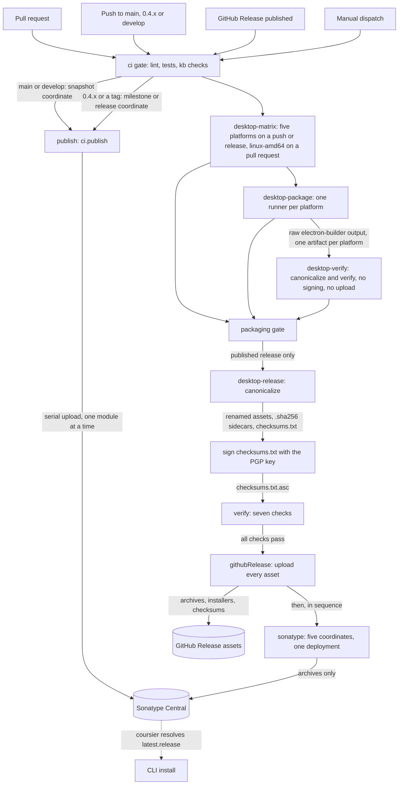

# Packaging and Release

This page maps everything CI publishes from this repository: where each artifact lands, what triggers
the publish, and the exact steps each path runs. Read it before touching a release job, or before asking
why something did not show up where you expected it.

## What ships where

| What | Where | Coordinates / assets |
| --- | --- | --- |
| Scala libraries | Sonatype Central | `org.finos.morphir:*` |
| Mill Morphir plugins | Sonatype Central | `org.finos.morphir.mill:*` |
| Desktop application archives | Sonatype Central | `org.finos.morphir:morphir-desktop-<os>-<arch>` |
| Desktop archives, installers and checksums | GitHub Releases | `morphir-desktop-<os>-<arch>-<version>.<ext>` |
| CLI | Coursier channel | `org.finos.morphir:morphir-main_3`, resolved as `latest.release` |

Two aggregate gates stand between a trigger and anything leaving the repository: `ci` for lint, tests
and knowledge base checks, and `packaging` for the desktop build. Packaging runs on ordinary pushes and
pull requests as well as releases, but only a published release reaches a publishing step. Figure 1
shows every path, end to end.

**Figure 1:** Notice where the two gates sit. Everything above `packaging` runs on ordinary pull
requests and pushes, so a broken desktop build surfaces where it was introduced; everything below it
runs only for a published release, and signing comes before verification, which comes before either
upload.

## Triggers

| Event | GitHub Actions trigger | Condition | What runs |
| --- | --- | --- | --- |
| Pull request | `pull_request` | into `main`, `0.4.x`, `develop` | `ci` gate; nothing publishes. Desktop packaging also runs, `linux-amd64` alone, unless the switch below turns it off |
| Push | `push` | to `main`, `0.4.x`, `develop` | `ci` gate, then `publish` once it passes. Desktop packaging also runs, all five platforms, unless the switch below turns it off |
| Release published | `release`, `types: [published]` | not scoped to a branch | `ci` gate, then `publish`; desktop packaging (all five platforms) and `desktop-release` — the switch below never applies here |
| Manual dispatch | `workflow_dispatch` | whichever ref is chosen | the same jobs that ref would otherwise trigger |

The workflow has no `push: tags:` trigger. A bare `git push --tags` never runs anything on its own.
Publishing a release, not pushing a tag, is what starts the flow: that is the routine path for both the
library releases and the desktop release.

### Desktop packaging in ordinary CI

Desktop packaging is no longer release-only. It also runs from a pull request and from a push, so a change
that breaks `electron-builder`, the Scala.js link, or canonicalization is caught where it was introduced
rather than at release time. Four jobs carry this:

| Job | Does |
| --- | --- |
| `desktop-matrix` | Computes the platform set: all five tokens on a tag, a published release, or a push to `main`, `develop` or `0.4.x`; `linux-amd64` alone everywhere else (a pull request). Outputs both the matrix JSON and the same set as a comma-separated token list. |
| `desktop-package` | The same packaging matrix described below, now sized from `desktop-matrix`'s output instead of always covering all five. |
| `desktop-verify` | Downloads the packaged artifacts, normalizes staging the way `desktop-release` does, then runs `ci.desktop.canonicalize` and `ci.desktop.verify` over exactly that subset — signature check relaxed, since nothing signs `checksums.txt` here and a pull request carries no GPG secret. No signing and no upload happen in this job, or anywhere in ordinary CI. |
| `packaging` | Aggregates the three above, the way `ci` aggregates lint and the test jobs. It reads `desktop-matrix` first, because a skip on its own is ambiguous: `desktop-package` also skips when `ci` fails upstream. If `desktop-matrix` was skipped the switch is off and every member must be skipped together; if it ran, packaging was expected to run and only success will do. |

The repository variable `MORPHIR_CI_PACKAGE_DESKTOP` is the switch: unset, or set to anything other than
`false`, packaging runs; set to `false`, it does not. It is a repository variable, not a workflow `env:`,
because GitHub Actions does not expose the `env` context inside a job's `if:` condition — an `env`-based
switch would evaluate empty there and the gated jobs would never run. A maintainer flips it from repository
settings, no commit required. Tags and published releases ignore it entirely: turning off ordinary-CI
packaging must never weaken a real release. `desktop-release` depends on `packaging` rather than on
`desktop-package` directly, exactly as `publish` depends on the whole `ci` gate rather than one test job.

## Publishing libraries and plugins

| Step | Task | What happens |
| --- | --- | --- |
| 1 | `ci` gate | lint, cross-platform tests and knowledge base checks all pass |
| 2 | `ci.publish` | resolves `__.publishSonatypeCentral`, dropping modules whose path matches `excludedModuleSubstrings` |
| 3 | Upload | one module at a time (`uploadJobs: 1`); parallel upload hits an SLF4J failure (morphir-scala#957) |
| 4 | Version | `SnapshotVersion.select` stamps the coordinate from `MORPHIR_PUBLISH_MODE` and `MORPHIR_PUBLISH_BRANCH` |

`excludedModuleSubstrings` in `ci/package.mill.yaml` drops `.integration.` (test-only) and
`.desktop.dist.`: the desktop archives publish through the separate `ci.desktop` destination described
below, because there is no archive to publish on an ordinary snapshot run. Snapshots publish from `main`
and `develop`; milestones and releases publish from `0.4.x` and tags. See
[Continuous Integration](/continuous-integration.md) for the exact coordinate formats, which this page
reuses rather than restating.

## Publishing the desktop app

Five platform tokens cover the desktop application, each packaged on a runner that matches its target:

| Token | Runner | Archive | Installers |
| --- | --- | --- | --- |
| `mac-aarch64` | `macos-14` | zip | dmg |
| `mac-amd64` | `macos-15-intel` | zip | dmg |
| `linux-amd64` | `ubuntu-24.04` | tar.gz | AppImage, deb |
| `linux-aarch64` | `ubuntu-24.04-arm` | tar.gz | AppImage, deb |
| `win-amd64` | `windows-latest` | zip | exe |

On a tag or a published release, all five package and the release then runs as one ordered sequence:

| # | Step | Runs on | What it does |
| --- | --- | --- | --- |
| 1 | `desktop-package` (matrix) | each of the five runners above | links Scala.js with `fullLinkJS`, runs `electron-builder` through `morphir/desktop/scripts/package.sh`, uploads the raw output as a workflow artifact |
| 2 | `canonicalize` | `desktop-release`, one Linux runner | renames staged output to canonical names, writes a `.sha256` sidecar per asset and one `checksums.txt` |
| 3 | Sign `checksums.txt` | same runner | GPG detached signature over `checksums.txt`, producing `checksums.txt.asc` |
| 4 | `verify` | same runner | runs seven named checks against the release directory |
| 5 | `githubRelease --tag` | same runner | uploads every file in the release directory to that tag's release |
| 6 | `sonatype` | same runner | uploads all five archives to Sonatype Central in one deployment |

Outside a release, [desktop packaging in ordinary CI](#desktop-packaging-in-ordinary-ci) runs steps 1, 2 and
4 only, restricted to whatever subset `desktop-matrix` computed, with step 4's signature check relaxed and
no step 3, 5 or 6 — see that section for the job breakdown.

`canonicalize` and `verify` both take a `--platforms` option: a comma-separated list of the tokens above,
defaulting to all five. `DesktopRelease.canonicalize` fails, naming every missing platform, if any requested
token has no staged directory — correct for a release, where every platform must be present, and why a
subset option exists at all: a pull request stages only the one platform `desktop-matrix` chose for it. An
unrecognized or blank token in the list is also rejected, naming the valid tokens.

`canonicalize` and `verify` are pure preparation: they read and write files, and make no network call.
`verify` exists because the digests are computed once, during canonicalization, on the runner that staged
the assets, and the assets then cross a job boundary (uploaded as workflow artifacts, downloaded again)
before anything publishes them. Recomputing each digest from the bytes on disk after that crossing is what
catches corruption in transit.

`verify` reports every problem it finds rather than stopping at the first:

| Check | Confirms |
| --- | --- |
| `expected-assets-present` | every platform's archive and each of its installers exists under its canonical name |
| `no-empty-assets` | no asset is a zero-byte file |
| `archive-magic-numbers` | zip and tar.gz assets start with the right magic bytes, not a truncated download or an HTML error page |
| `version-in-asset-names` | every asset name embeds the version being published |
| `sidecar-digests-match` | each asset's recomputed sha256 matches its `.sha256` sidecar, and the sidecar's own filename matches |
| `checksums-covers-assets` | `checksums.txt` lists every asset exactly once, and nothing that is not an asset |
| `signature-present` | `checksums.txt.asc` exists, is non-empty, and begins with the PGP signature header |

`githubRelease` uploads with `--clobber`. If no release exists yet for the tag, it creates one as a
**draft** first and uploads into that. Publishing the release itself stays a human action, not something
this step does automatically.

Maven Central receives archives only; the native installers (dmg, NSIS `.exe`, AppImage, `.deb`) go to the
GitHub Release only, because an automated consumer can act on a portable archive but not on an installer.
The Maven layout is the archive plus a POM, with no sources jar and no javadoc jar, mirroring
`com.lihaoyi:mill-dist-native-mac-aarch64`.

`sonatype` uploads all five archives as **one** deployment under a single bundle name
(`morphir-desktop-<version>`), so nothing releases unless all five validate together. Sonatype Central's
`AUTOMATIC` publishing type releases a deployment irrevocably on success; five separate deployments could
leave a partial release with no way to re-run it if, say, the third of five failed after the first two had
already gone public. One deployment is what makes this step safely retriable.

The word bundle describes the upload, not the artifacts. Maven Central still receives five separate
coordinates, each with its own POM, archive and signatures, and a consumer resolves
`org.finos.morphir:morphir-desktop-mac-aarch64` exactly as it would any other artifact. A Sonatype
deployment bundle is simply the unit Central validates and releases: one zip in Maven repository layout
that can carry many coordinates at once.

## Versions

Every artifact's version, including the desktop app's, comes from
`SnapshotVersion.select(VcsVersion.vcsState(), env)`, driven by `MORPHIR_PUBLISH_MODE` and
`MORPHIR_PUBLISH_BRANCH`. See [Continuous Integration](/continuous-integration.md) for the exact
coordinate formats. One version stream covers the whole repository today: the desktop app moves
in lockstep with the libraries. Independent version streams for the desktop app are recorded as future
intent, not built yet.

## Signing keys

Two roles stay apart, on purpose:

| Role | Secrets | Used by | Populated today |
| --- | --- | --- | --- |
| PGP artifact signing | `ORG_MORPHIR_CI_GPG_PRIVATE_KEY`, `ORG_MORPHIR_CI_GPG_PASSPHRASE` | library publish, desktop `checksums.txt` signing, desktop Sonatype upload | yes |
| Platform code signing | `ORG_MORPHIR_CSC_LINK`, `ORG_MORPHIR_CSC_KEY_PASSWORD`, `ORG_MORPHIR_APPLE_ID`, `ORG_MORPHIR_APPLE_APP_SPECIFIC_PASSWORD`, `ORG_MORPHIR_APPLE_TEAM_ID` | `desktop-package` only | no |

The PGP key is deliberately reused: it is the same key that already signs the Maven artifacts, so a
desktop release needs no new key material. Platform code signing is a separate concern with its own
secrets, read only by the packaging runners. electron-builder signs a binary when it finds those
certificates and produces an unsigned build when it does not, so desktop binaries ship unsigned today.

## Retriability

A failed release run is safe to re-run. Packaging is idempotent: running `desktop-package` again for the
same version produces the same files. `canonicalize` and `verify` are pure preparation with no side
effect beyond writing files. `githubRelease` uploads with `--clobber`, so a re-run overwrites rather than
duplicating. `sonatype` uploads one atomic bundle, so a failed attempt publishes nothing and a retry starts
from a clean slate. Nothing in the desktop path can leave a release half-published.

## Installing the CLI

The CLI is an ordinary Scala library, `org.finos.morphir:morphir-main_3`, published through the library
and plugin path above. It has no separate publish job. Consumers install it with
[Coursier](https://get-coursier.io/), pointed at the channel declared in `coursier-channel.json` at the
repository root: `morphir-cli` resolves `org.finos.morphir:morphir-main_3:latest.release` from three
repository aliases (`central`, `sonatype:releases`, `typesafe:ivy-releases`), and `morphir-insiders-cli`
adds `sonatype:snapshots` for pre-release builds. `morphir-cli-install.sh` runs `cs bootstrap` against
that coordinate and drops the launcher into the Coursier bin directory.

Unverified: whether the `sonatype:releases` and `typesafe:ivy-releases` aliases in `coursier-channel.json`
still resolve anything now that publishing targets Sonatype Central's portal directly rather than the
legacy OSSRH staging repository `sonatype:releases` names. The `central` alias is enough on its own once
an artifact reaches Maven Central.

## Where to go next

[Continuous Integration](/continuous-integration.md) covers every CI job, including `publish`,
`desktop-package` and `desktop-release`, alongside the jobs that are not about releasing at all.
[Build System](/build-system.md) covers Mill and mise mechanics this page assumes. The desktop app's own
story, still in progress, lives in [intent 0030](../../intent/0030-morphir-desktop-electron-app.md) and
[intent 0031](../../intent/0031-publish-the-morphir-desktop-application.md).
