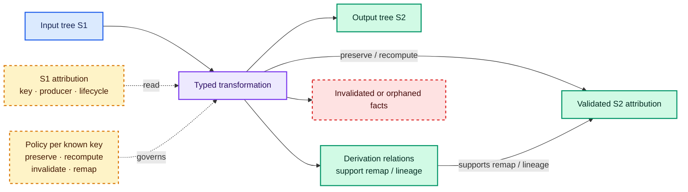

# Attribution of typed trees

Attribution is any information associated with a tree node beyond its immediate child structure: source provenance,
inferred types, diagnostics, transformation lineage, semantic classification, user metadata or decorations, and
analysis results. The first design question is whether a fact is **intrinsic semantic data required to interpret the
node** or **extensible attribution whose vocabulary, producer, and lifecycle vary**. Only then should storage shape
be chosen.

## Intrinsic meaning and extensible facts

An intrinsic field participates in the node's validity or meaning. Removing an integer literal's value or a resolved
call's target changes what the node says. Extensible attribution is interpreted by a particular producer or
consumer: a lint result, source correspondence, user tag, or lineage edge may be essential to a workflow without
being necessary to interpret the underlying expression.

The boundary is domain-specific, not synonymous with "serialized" versus "in memory." MLIR makes a comparable
semantic distinction: inherent attributes belong to an operation's definition and are verified by the operation;
discardable attributes have externally defined semantics, use a dialect-qualified name, and are verified by that
dialect. With MLIR properties, inherent attributes move into operation property storage while the top-level
dictionary retains discardable attributes.[^mlir-langref] This is evidence that semantic ownership matters; it does
not imply that every typed tree needs MLIR's operation model.

## Strategy comparison

| Strategy | Type safety | Core coupling | Local lookup | Rewrite behavior | Serialization | Extension ownership |
| --- | --- | --- | --- | --- | --- | --- |
| Intrinsic typed fields | Strong and direct | High: changing facts changes core node types | Immediate | Rewriter must construct valid new fields | Natural when part of the node schema | Core language or IR owner |
| Recursive generic payloads | Strong for one chosen payload type | Payload parameter propagates through recursive APIs | Immediate | Mapping or rebuilding recursively changes payload type | Codec must know the payload type | Tree instantiator |
| Typed wrappers | Strong at wrapper boundary | Low in the core, but wrapper types can proliferate | Immediate after unwrapping | Wrapper must be rebuilt or deliberately retained | Separate envelope or wrapper codec | Wrapper owner |
| Typed side tables or indexes | Strong at caller boundary with typed keys | Low, but nodes need scoped references | Fast indexed lookup | Requires preserve, recompute, invalidate, or remap policy | Separate section, artifact, or recomputation | Key and producer owner |
| External overlays or decorators | Depends on overlay schema | Very low | Often indexed after loading | Can outlive, orphan, or conflict with rewritten nodes | Independently versioned artifact | External tool or user |
| Relation graphs | Strong if predicates and endpoints are typed or validated | Low | Efficient with graph indexes | Naturally records one/many lineage; zero-result lineage requires an explicit deletion/tombstone or a closed, complete transformation record in which absence has that meaning | Graph formats fit exchange | Predicate vocabulary owner |
| RDF-native storage | Open-world vocabulary; application typing needs schemas or validation | Lowest for new predicates | Depends on triple-store indexes | New entity IRIs and explicit relations model change | RDF is the storage/interchange model | Distributed vocabulary owners |

No row dominates. Intrinsic fields make invariants visible but make extension a core-schema change. External
attribution removes the recursive type-parameter burden but introduces identity, validation, indexing,
conflict/merge, orphaning, and preservation obligations.

## What existing systems establish

**Morphir v3 generic attributes.** The version 3 schema places an `Attributes` value in encoded type nodes, including
variables and references.[^morphir-v3-schema] Morphir-Elm's corresponding `Value ta va` model is recursively
parameterized by type and value attribute types; each value constructor carries `va`, embedded types carry `ta`, and
the API provides recursive mapping and erasure operations.[^morphir-elm-value] This gives whole-tree payload type
safety and immediate access, but consumers that are generic over tree shape must also carry those parameters. That
trade-off is an observed API property, not evidence that generic payloads are always wrong.

**MLIR attributes.** MLIR distinguishes operation-owned inherent attributes from dialect-owned discardable
attributes and assigns verification accordingly.[^mlir-langref] "Discardable" does not mean "unvalidated" or
"meaningless"; it means the semantics are external to the operation definition.

**LLVM metadata.** LLVM permits metadata attachments on instructions and global objects, but requires a
transformation to drop an attachment that it does not recognize or cannot preserve, subject to documented exceptions
for certain global and module metadata.[^llvm-langref] Its loop metadata documentation additionally warns that loop
metadata nodes are neither persistent identifiers through transformations nor necessarily unique.[^llvm-langref]
This is a concrete preservation rule, not a general license to copy arbitrary annotations.

**Roslyn annotations.** Roslyn syntax is immutable. Adding a `SyntaxAnnotation` creates a new syntax element with the
annotation attached, and the annotation uses a value identity that can survive serialization.[^roslyn-syntax-annotation]
The mechanism is useful for correspondence through controlled immutable transformations, but it does not turn source
positions or syntax contents into universal IDs.

## An illustrative typed side table

The following Scala 3 design is a teaching contract, not a settled Morphir API or a heterogeneous-map
implementation. A stable, namespaced, versioned key identifies an exact value schema. Callers use a typed,
cast-free API; implementations must decode packed data through the schema registered for that key and report
registry or payload mismatches at the dynamic boundary.

```scala
sealed trait NodeKind
sealed trait Expr extends NodeKind
sealed trait Decl extends NodeKind

final case class NodeRef[+Kind <: NodeKind](
    snapshot: String,
    local: Long
)

final case class KeyId(namespace: String, name: String, version: Int)

trait ValueSchema[A]:
  def schemaId: String
  def encode(value: A): Either[String, String]
  def decode(encoded: String): Either[String, A]

trait AttrKey[-Kind <: NodeKind, A]:
  def id: KeyId
  def schema: ValueSchema[A]

enum AttrError:
  case SnapshotMismatch(expected: String, actual: String)
  case UnknownNode(snapshot: String, local: Long)
  case UnknownKey(id: KeyId)
  case InvalidStoredValue(id: KeyId, details: String)

trait AttrStore:
  def put[Kind <: NodeKind, A](
      node: NodeRef[Kind],
      key: AttrKey[Kind, A],
      value: A
  ): Either[AttrError, AttrStore]

  def values[Kind <: NodeKind, A](
      node: NodeRef[Kind],
      key: AttrKey[Kind, A]
  ): Either[AttrError, Vector[A]]

  def get[Kind <: NodeKind, A](
      node: NodeRef[Kind],
      key: AttrKey[Kind, A]
  ): Either[AttrError, Option[A]]

final case class TypeInfo(rendered: String)

object TypeInfoSchema extends ValueSchema[TypeInfo]:
  val schemaId = "org.finos.morphir.type-info/v1"
  def encode(value: TypeInfo): Either[String, String] =
    if value.rendered.nonEmpty then Right(value.rendered)
    else Left("type must be non-empty")
  def decode(encoded: String): Either[String, TypeInfo] =
    if encoded.nonEmpty then Right(TypeInfo(encoded))
    else Left("type must be non-empty")

object StringSchema extends ValueSchema[String]:
  val schemaId = "org.finos.morphir.string/v1"
  def encode(value: String): Either[String, String] = Right(value)
  def decode(encoded: String): Either[String, String] = Right(encoded)

object InferredType extends AttrKey[Expr, TypeInfo]:
  val id = KeyId("org.finos.morphir.analysis", "inferred-type", 1)
  val schema = TypeInfoSchema

object Tags extends AttrKey[Decl, String]:
  val id = KeyId("org.finos.morphir.user", "tags", 1)
  val schema = StringSchema

enum Preservation:
  case Preserve, Recompute, Invalidate, Remap

val exprRef: NodeRef[Expr] = NodeRef("typed-7", 12)
val declRef: NodeRef[Decl] = NodeRef("typed-7", 3)

def read(attrs: AttrStore): (
    Either[AttrError, Option[TypeInfo]],
    Either[AttrError, Vector[String]]
) =
  (attrs.get(exprRef, InferredType), attrs.values(declRef, Tags))

val policy: Map[KeyId, Preservation] =
  Map(
    InferredType.id -> Preservation.Recompute,
    Tags.id -> Preservation.Remap
  )
```

This abbreviated contract does not claim that erased storage is compile-time safe, and it intentionally omits the
registry, runtime applicability witnesses, and snapshot-membership implementation. The complete illustrative API in
[typed attribution guidance for morphir-scala](/typed-attribution-guidance-for-morphir-scala.md) makes those
boundaries explicit. There, registration rejects two independently defined keys that reuse a `KeyId` with a
different schema, cardinality, or applicability, and reads reject missing or inapplicable nodes. If an implementation
uses packed storage, only the exact registered `ValueSchema[A]` (or a closed registry carrying an equality proof) may
construct or decode an `A`; malformed external or stored values are runtime errors. The public caller boundary
remains typed and contains no cast.

The closed `Preservation` enum makes transformation intent reviewable:

- `Preserve` means the producer guarantees the fact is still valid on a corresponding output node.
- `Recompute` runs the fact's producer on the output snapshot.
- `Invalidate` explicitly removes a fact whose preconditions no longer hold.
- `Remap` moves or reshapes a fact using an asserted input-to-output correspondence.

A transformation chooses a policy per known key and does not silently copy unknown facts. An implementation can
reject an incomplete policy, default unknown keys to `Invalidate`, or retain them only in a quarantined overlay; the
choice must be explicit in the transformation contract.

## Transformation lifecycle



In prose: a typed transformation reads an S1 tree and its amber attribution context. An amber policy governs what
happens for every known key. The transformation emits the S2 tree and directly preserves or recomputes validated S2
attribution. Green derivation relations support remapping and lineage when correspondence is needed; preserved or
recomputed attribution does not depend on those relations. Facts that are no longer valid become an explicit red
invalidated/orphaned result. Node and edge labels preserve the lifecycle when color is unavailable.

| Fact family | Usually intrinsic or extensible? | Typical policy after a semantic rewrite | Validation obligation |
| --- | --- | --- | --- |
| Intrinsic semantic facts | Intrinsic | Construct or recompute as part of the output node | Output node invariants and type correctness |
| Source correspondence | Extensible but often durable | Preserve for unchanged nodes; remap or invalidate for generated/split nodes | Source snapshot, coordinate unit, and zero/one/many correspondence |
| Analysis results | Extensible | Recompute unless the producer proves preservation | Producer version and analysis preconditions |
| User decorations | Extensible | Remap when explicit lineage exists; otherwise retain as orphaned or invalidate | Ownership, merge policy, and target existence |
| Provenance and lineage | Extensible relation data | Append new derivation relations; do not overwrite history | Endpoint identity, activity, and relation vocabulary |
| Diagnostics and telemetry | Extensible, usually run-scoped | Recompute or archive against the original snapshot | Snapshot scope, severity vocabulary, and retention policy |

## Ownership, serialization, and merging

Every extensible key needs a stable owner-qualified name, value schema, producer identity and version, applicability
rules, cardinality, lifecycle, and serialization policy. A side table optimized for one process may serialize as a
separate indexed section; an external overlay may use an independently versioned document; lineage may use a relation
graph. Serialization does not remove the need to validate that referenced snapshots and nodes exist.

Merging overlays also needs a declared algebra. Single-valued inferred types might reject conflicting producers;
user tags might use set union; ordered diagnostics might preserve producer and source order; provenance normally
adds relations rather than overwriting them. A generic last-writer-wins map hides these domain decisions.

The required node scopes and derivation edges are developed in
[node identity and addressability](/node-identity-and-addressability.md). See
[RDF, linked data, and provenance](/rdf-linked-data-and-provenance.md) for open relation vocabularies,
[transformation pipelines](/transformation-pipelines.md) for producer and run lifecycles, and
[structural interoperability](/structural-tree-interoperability.md) for what a generic projection retains. The
Morphir-specific evidence and its chronology are developed in
[Morphir attribution evolution](/morphir-attribution-evolution.md), while
[typed attribution guidance for morphir-scala](/typed-attribution-guidance-for-morphir-scala.md) ranks the available
strategies; this concept does not settle that design.

[^mlir-langref]: MLIR Language Reference.
[^llvm-langref]: LLVM Language Reference Manual.
[^roslyn-syntax-annotation]: Roslyn SyntaxAnnotation.
[^morphir-elm-value]: Morphir-Elm IR Value.
[^morphir-v3-schema]: Morphir IR Schema Version 3.
