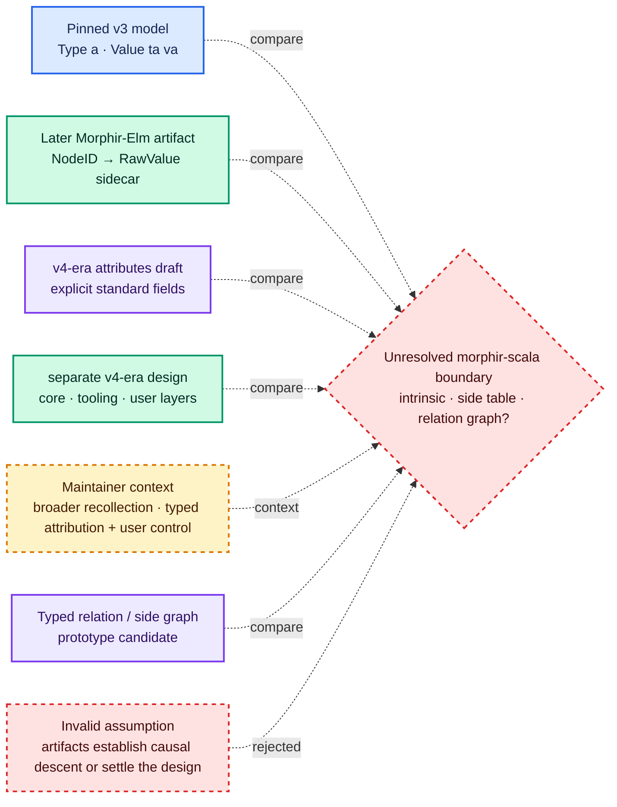

# Morphir attribution evolution

**Observed fact.** The pinned Morphir artifacts show a shift in the explored design space: a v3 recursively
parameterized per-node payload model, a later Morphir-Elm external decorator artifact, and v4-era explicit standard
attributes plus a separate layered-decoration design. Each approach preserves different guarantees: recursive
payloads make one payload type uniform across a tree family, explicit attributes standardize core fields, and
external decorations give independently owned data a separate lifecycle. The evidence establishes these
observations, not a causal lineage among them, and no cited artifact settles the final morphir-scala design.

The labels in this case study are deliberate. **Observed fact** reports what the pinned public artifacts contain.
**Maintainer context** records a design-session account that is useful but not established by those artifacts.
**Engineering inference** draws a consequence from the evidence. **Guidance** states an action or decision criterion.

## v3: recursive generic payloads

**Observed fact (pinned v3 evidence).** The v3 specification describes type and value attributes on IR nodes and
uses unit when no additional information is needed.[^morphir-v3-spec] The corresponding Morphir-Elm model makes a
type expression `Type a` and a value expression `Value ta va`. `Type` recursively propagates `a`; `Value`
recursively propagates `ta` through embedded types and `va` through values, patterns, definition inputs, and
bodies.[^morphir-elm-type][^morphir-elm-value] The cited sources establish this v3 shape directly; they do not prove
that every v1 or v2 release used the same representation.

These are complete declarations from the pinned implementation:

```elm
type Type a
    = Variable a Name
    | Reference a FQName (List (Type a))
    | Tuple a (List (Type a))
    | Record a (List (Field a))
    | ExtensibleRecord a Name (List (Field a))
    | Function a (Type a) (Type a)
    | Unit a
```

```elm
type Value ta va
    = Literal va Literal
    | Constructor va FQName
    | Tuple va (List (Value ta va))
    | List va (List (Value ta va))
    | Record va (Dict Name (Value ta va))
    | Variable va Name
    | Reference va FQName
    | Field va (Value ta va) Name
    | FieldFunction va Name
    | Apply va (Value ta va) (Value ta va)
    | Lambda va (Pattern va) (Value ta va)
    | LetDefinition va Name (Definition ta va) (Value ta va)
    | LetRecursion va (Dict Name (Definition ta va)) (Value ta va)
    | Destructure va (Pattern va) (Value ta va) (Value ta va)
    | IfThenElse va (Value ta va) (Value ta va) (Value ta va)
    | PatternMatch va (Value ta va) (List ( Pattern va, Value ta va ))
    | UpdateRecord va (Value ta va) (Dict Name (Value ta va))
    | Unit va
```

Patterns have their own recursively propagated payload, and definitions connect value payloads with attributed
types and bodies:

```elm
type Pattern a
    = WildcardPattern a
    | AsPattern a (Pattern a) Name
    | TuplePattern a (List (Pattern a))
    | ConstructorPattern a FQName (List (Pattern a))
    | EmptyListPattern a
    | HeadTailPattern a (Pattern a) (Pattern a)
    | LiteralPattern a Literal
    | UnitPattern a
```

```elm
type alias Definition ta va =
    { inputTypes : List ( Name, va, Type ta )
    , outputType : Type ta
    , body : Value ta va
    }
```

**Observed fact.** Morphir-Elm names the un-attributed form `RawValue` and the form whose value attributes are
inferred types `TypedValue`.[^morphir-elm-value]

```elm
type alias RawValue =
    Value () ()
```

```elm
type alias TypedValue =
    Value () (Type ())
```

The absence of extra data is therefore represented by a present unit payload, not by removing the constructor
position. The implementation also supplies `mapTypeAttributes`, `mapValueAttributes`, pattern and definition
mappers, attribute collectors, indexed mappers, `toRawValue` and type-definition `eraseAttributes`. `NodeId.elm`
adds path-aware type, value, and pattern mapping and path-based attribute lookup.[^morphir-elm-type][^morphir-elm-value][^morphir-elm-node-id]
These utilities show operationally that payload propagation is part of constructing, traversing, changing, and
erasing the tree rather than merely a notation in the type declaration.

**Engineering inference.** The strength is a statically typed, uniform payload for each recursive family. A
`Value ta va` cannot quietly contain some value nodes attributed with a different `va`. The observable cost is
coupling: payload parameters occur in constructors, public signatures, recursive transformations, and the codecs or
utilities that consume those trees. Unit is the no-data representation, and changing `va` from source ranges to
inferred types changes the tree type from, for example, `Value ta SourceRange` to `Value ta InferredType`. That is an
ergonomic and API consequence, not an argument that generics themselves are bad.

**Guidance.** Retain this shape when whole-tree uniformity and compile-time payload selection are the intended
contract. Do not select it merely because every fact can technically be placed in a product payload; first ask
whether those facts share ownership, lifecycle, preservation, and interchange rules.

## Morphir-Elm: external decorators

**Observed fact.** Morphir-Elm also implements an external address-and-sidecar design. A `NodeID` distinguishes type,
value, and module targets; type and value targets pair an `FQName` with a structural `NodePath`.[^morphir-elm-node-id]

```elm
type NodeID
    = TypeID FQName NodePath
    | ValueID FQName NodePath
    | ModuleID ( Path, Path )
```

`NodePath` is a list of `ChildByName Name` or `ChildByIndex Int` steps. The decorator data is a dictionary from
those node identifiers to raw Morphir values. Its configuration carries a display name, an entry-point FQName, a
Morphir IR distribution, and the data.[^morphir-elm-decoration]

```elm
type alias DecorationData =
    SDKDict.Dict NodeID RawValue
```

```elm
type alias DecorationConfigAndData =
    { displayName : String
    , entryPoint : FQName
    , iR : Morphir.IR.Distribution.Distribution
    , data : DecorationData
    }
```

**Observed fact.** The concrete decoder reads JSON fields named `displayName`, `entryPoint`, `iR`, and `data`. It
decodes `iR` as a versioned `Distribution`, parses `entryPoint` as an FQName, constructs
`Type.Reference () entryPoint []`, and asks Morphir `Type.DataCodec` to decode each data value. Encoding uses the
module's `encodeDecorationData` function: it uses the same distribution and entry-point type for each `RawValue`,
and node keys use the `NodeID` string codec. If `DataCodec.encodeData` cannot produce or apply an encoder,
`encodeDecorationData` emits JSON `null` for that node rather than rejecting the whole result. The pinned module has
a top-level decoder—a dictionary of decoration IDs to configuration-and-data records—but no corresponding
top-level encoder.[^morphir-elm-decoration-codec]

The following complete JSON is **conceptual and illustrative; it is not the JSON shape shipped by the Morphir-Elm
codec**:

```json
{
  "decorationId": "com.example/model-owner",
  "displayName": "Model owner",
  "schema": {
    "distribution": "urn:morphir:distribution:com.example:governance",
    "entryPoint": "Com.Example:Governance:owner"
  },
  "data": {
    "Com.Example:Orders:total.value#0:1": {
      "team": "pricing"
    },
    "Com.Example:Orders:order.type#customer": {
      "team": "sales"
    }
  }
}
```

Unlike this conceptual envelope, the concrete Elm codec does not read `decorationId` or a nested `schema` object.
The decoration ID is an outer dictionary key; `entryPoint` is a direct field; and `iR` contains the versioned
Morphir `Distribution` used by `DataCodec`, rather than a distribution URN string.

**Engineering inference.** A sidecar lets a user or tool own and revise attribution without rebuilding the core IR.
That advantage shifts obligations to identity and synchronization. Because type and value targets include structural
paths, a tree rewrite may change the address even when a human regards the resulting expression as related.
Consumers therefore need explicit orphan detection and a preserve, invalidate, or remap policy. This is an
inference from the key design, not a claim that the pinned implementation supplies a general remapping algorithm.

**Guidance.** Externalize attribution when independent ownership and lifecycle matter, but treat target existence,
address scope, schema validation, orphan reporting, and rewrite behavior as required parts of the design rather than
cleanup work.

## v4 draft: explicit attributes and a separate layered design

**Observed fact.** The current v4 attributes draft removes the generic parameter and specifies explicit
`TypeAttributes` and `ValueAttributes` attached to every corresponding node. `TypeAttributes` has optional `source`,
optional `constraints`, and `extensions`; `ValueAttributes` has optional `source`, optional `inferredType`, and
`extensions`. Both extension dictionaries use FQName keys and arbitrary extension values.[^morphir-v4-attributes]
The standard fields give consumers a common location for source, constraints, and inferred type, while the
FQName-keyed extension space preserves namespaced extensibility.

**Observed fact — source divergence.** Layered decorations are **not present in the current v4 spec draft**. A
separate design document explores decorations outside the core IR, organized into `core`, `tooling`, and `user`
layers with priorities 0, 50, and 100. It specifies higher-priority precedence, deep merge, and Morphir-defined
schemas for decoration values.[^morphir-v4-layered-decorations] This is a design exploration alongside the spec, not
part of the cited v4 attributes schema.

**Engineering inference.** Explicit attributes trade compile-time choice of an arbitrary whole-tree payload for a
stable core vocabulary plus a namespaced escape hatch. Layered decorations trade direct in-node access for
independent ownership, provenance by layer, precedence, and merge behavior. They solve different problems and can
coexist, but coexistence needs a rule for facts that could appear in both places.

**Guidance.** Treat the v4 standard fields as candidates for intrinsic, broadly interoperable facts. Evaluate
layered decoration separately as an external attribution protocol, and record duplication, precedence, validation,
and rewrite rules before allowing the same predicate in both stores.

## Maintainer context from the design session

**Maintainer context.** Early Morphir used generic parameters to solve per-node attribution while retaining type
safety. Over time, maintainers considered RDF or linked-data relationship models and external decorators because
attribution relationships need not all be embedded in recursive node parameters. The continuing desire is to
preserve type safety while reducing ergonomic burden and improving user control.

This paragraph is a design-session account. It is intentionally not footnoted to the public code or specifications,
and it should not be read as a published project decision or a complete release history.

## Engineering comparison

**Engineering inference.** The alternatives move the static boundary and the resulting obligations; none removes
them.

| Approach | Static type boundary | Core coupling | Identity requirement | User control | Transformation obligations | Interchange |
| --- | --- | --- | --- | --- | --- | --- |
| v3 generic payloads | One payload type per recursive type/value family | High: parameters propagate through nodes and APIs | None for attached lookup; needed for cross-tree relations | Chosen by tree producer | Recursively preserve, map, replace, or erase payloads | Tree codec must select an encoding for the payload |
| v4 explicit attributes | Standard `TypeAttributes` / `ValueAttributes` schema | Medium to high for standard fields; lower for extensions | None for attached lookup | Extension keys permit producer namespaces, but data remains in the IR | Preserve or deliberately update standard and extension fields | Direct in v4 IR when the extension value encoding is agreed |
| External decorators | Decoder checks data against the entry-point Morphir type; `encodeDecorationData` falls back to JSON `null` on encoding error | Low in the core | Required; targets must be scoped and validated | High: sidecars can be independently authored | Preserve, invalidate, remap, or report orphans | Independently versioned artifact plus target and schema contract; pinned codec has full decoding but only data encoding |
| Layered decorations | Values validated against registered Morphir schemas | Low in the core; protocol carries layer rules | Required across every layer | High, including a user layer and overrides | External target maintenance plus precedence and deep-merge rules | Proposed VFS files, manifests, schemas, and layer priorities |
| Typed relation or side graph | Typed keys, predicates, endpoints, and values in the host API | Low if graph types remain outside core nodes | Required, including snapshot and endpoint kinds | Potentially high with explicit vocabulary ownership | Record derivation, invalidation, remap, and one-to-many relations | Requires an explicit graph projection and import validation |

The typed relation or side graph row is a comparison point, not a settled design. The later
[typed attribution guide](/typed-attribution-guidance-for-morphir-scala.md) ranks it for prototyping rather than
declaring it the final architecture.

## Observed design evolution and unresolved boundary

**Observed fact.** The diagram arranges the pinned observations for comparison. Its dotted comparison edges do not
assert that one artifact caused, implemented, or directly descended from another.



Blue marks the pinned v3 source model, purple marks semantically typed structures, green marks external or
user-controlled attribution, amber dashed marks maintainer context, and red dashed marks unresolved or rejected
claims. The labels and dotted `compare` edges carry the same distinctions without color and explicitly avoid a
causal sequence.

## Open questions

**Guidance.** A morphir-scala prototype should answer these questions with executable types, rewrite tests, and
round-trip fixtures:

- Which facts are intrinsic to interpreting an IR node, and which belong to a producer- or user-owned attribution
  vocabulary?
- What is the scope of a node identifier, and how are anonymous nodes, structural edits, deletions, splits, and
  merges addressed?
- Which keys need compile-time value types, runtime schema validation, or both?
- When the core and an external layer express the same fact, which one is authoritative and how is divergence
  reported?
- Which transformations preserve, recompute, invalidate, remap, or orphan each attribution class?
- Which producer, activity, schema version, priority, and trust facts survive interchange?
- Can local typed lookup project to an open relation format and import it again without claiming a lossless
  round-trip?

Continue with [node identity and addressability](/node-identity-and-addressability.md) for target scope,
[attribution of typed trees](/attribution-of-typed-trees.md) for the general strategy space,
[RDF, linked data, and provenance](/rdf-linked-data-and-provenance.md) for relation interchange, and the
[typed attribution guide](/typed-attribution-guidance-for-morphir-scala.md) for the prototype ranking. The Morphir
source concepts are [v3 attributes and wrappers](https://github.com/finos/morphir-scala/blob/main/kb/bundles/morphir/morphir-ir-v3/attributes-and-wrappers.md),
[v4 draft attributes](https://github.com/finos/morphir-scala/blob/main/kb/bundles/morphir/morphir-ir-v4-draft/attributes.md),
and the [separate layered decorations design](https://github.com/finos/morphir-scala/blob/main/kb/bundles/morphir/morphir-ir-v4-draft/design/decorations.md).

[^morphir-v3-spec]: Morphir IR Specification.
[^morphir-elm-type]: Morphir-Elm IR Type.
[^morphir-elm-value]: Morphir-Elm IR Value.
[^morphir-elm-node-id]: Morphir-Elm IR NodeId.
[^morphir-elm-decoration]: Morphir-Elm IR Decoration.
[^morphir-elm-decoration-codec]: Morphir-Elm IR Decoration Codec.
[^morphir-v4-attributes]: Attributes (Morphir IR v4 draft).
[^morphir-v4-layered-decorations]: Decorations (layered design).
