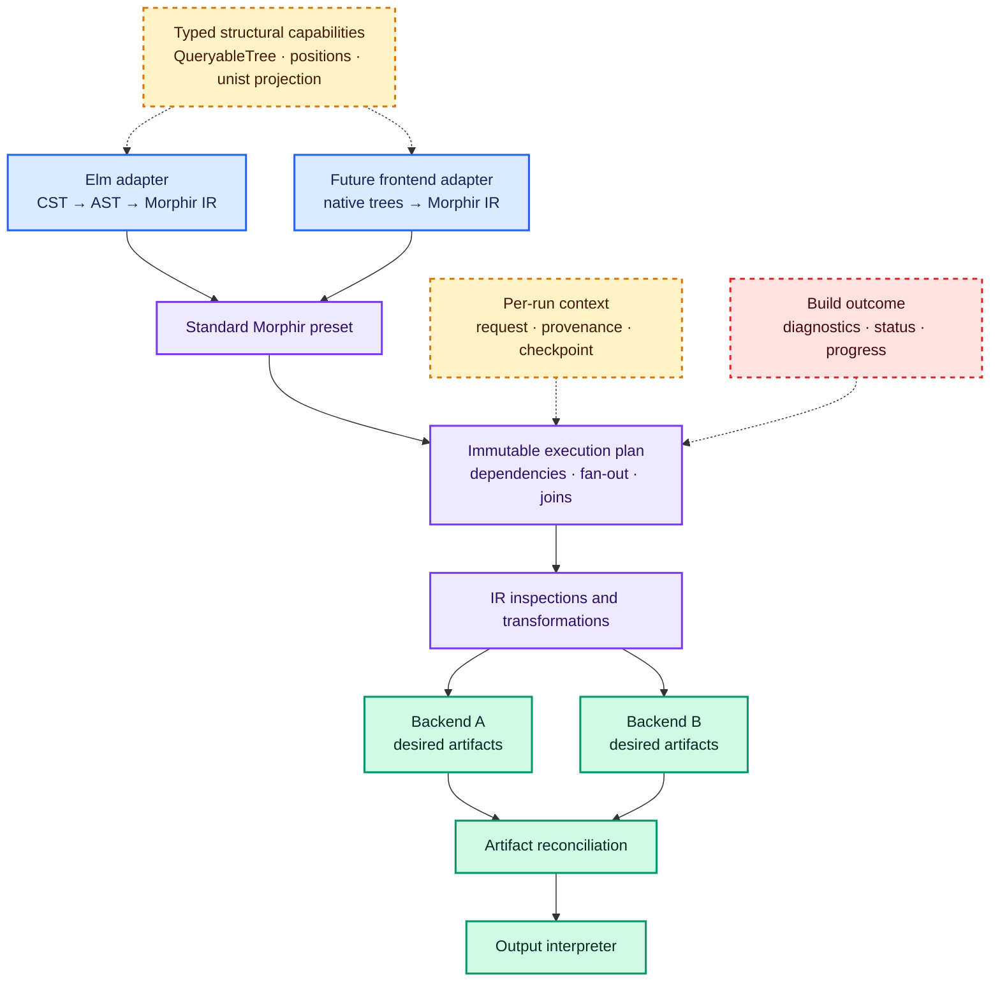

# Guidance for a Morphir toolchain

An effective Morphir toolchain needs several typed representations, generic inspection without a universal AST, and
an execution graph capable of frontend-to-IR transformation, IR processing, backend fan-out, and deterministic
artifact reconciliation. This is contextual guidance derived from the cited implementations and the accompanying
general concepts, not a claim that every compiler should use the same architecture.

## How to read this guide

Every recommendation is separated into:

- **Observed fact:** directly supported by cited code or specifications.
- **Engineering inference:** the consequence relevant to Morphir, with its reasoning stated.
- **Guidance:** a proposed design choice for morphir-scala.

The supporting foundations are:

1. [Syntax trees and intermediate representations](/syntax-trees-and-intermediate-representations.md)
2. [Tree traversal, visitors, cursors, and rewriting](/tree-traversal-visitors-cursors-and-rewriting.md)
3. [Structural tree interoperability](/structural-tree-interoperability.md)
4. [Transformation pipelines](/transformation-pipelines.md)

## Preserve representation boundaries

**Observed fact.** Morphir-scala's Elm langkit exposes a token- and comment-preserving CST and a trivia-free AST
lowered from it.[^morphir-scala-elm] Morphir-elm then performs frontend work that produces Morphir IR distributions
consumed by analysis and backend modules.[^morphir-elm]

**Engineering inference.** CST, AST, and Morphir IR answer different questions. Collapsing them into one node family
would either discard source fidelity early or mix source-language constructs into a language-neutral semantic model.

**Guidance.** Keep frontend-native CST and AST types in their language modules. Define an explicit frontend boundary
whose successful semantic output is Morphir IR. Preserve source provenance across lowering without requiring every
generated IR node to claim one exact source range.

## Offer several traversal mechanisms

**Observed fact.** Morphir-scala provides exhaustive CST/AST visitors, immutable zipper-style cursors, generic
`QueryableTree` instances, and Kyo-effectful traversal variants.[^morphir-scala-elm] The tree query module depends
only on `QueryableTree[T]`, allowing third-party tree types to participate.[^morphir-scala-trees]

**Engineering inference.** Full-tree validation, query matching, and local refactoring do not require the same
navigation context. One traversal API would either omit useful cursor context or burden simple analyses with it.

**Guidance.** Retain typed visitors or folds for exhaustive domain processing, cursors for local navigation and
editing, and structural capabilities for generic inspection. Specify traversal order for every shared operation.

## Project typed trees instead of replacing them

**Observed fact.** The repository projects Elm CST and AST values to unist while retaining their native tree types
for compiler operations.[^morphir-scala-elm]

**Engineering inference.** Generic tooling needs a stable structural view, but source and IR algorithms benefit from
closed typed node alternatives and domain invariants.

**Guidance.** Treat `QueryableTree` and position capabilities as adapters. Use unist projection at an interoperability
boundary. Do not make a JSON-shaped universal node the internal representation of Elm CST, Elm AST, or Morphir IR.

## Separate the value pipeline from its executor

**Observed fact.** Morphir-scala's current `Stage` composes typed transformations linearly. Morphir-elm also requires
dependency-aware ordering, incremental frontend paths, backend selection, multi-file generation, and file maps.[^morphir-elm]

**Engineering inference.** A linear stage abstraction represents `A -> B -> C`, but cannot alone state runtime
fan-out, joins, blocked dependents, checkpoints, or potential parallelism.

**Guidance.** Put Morphir-agnostic immutable graph definition and execution in `morphir/buildkit/core`. Put the
standard Morphir phase assembly in `morphir/buildkit`. Keep frontend implementations—including Elm—dependent on the
root buildkit contract, not the reverse. This is the direction recorded by
[intent 0007](https://github.com/finos/morphir-scala/blob/main/kb/bundles/intent/0007-multi-frontend-morphir-transformation-pipeline.md)
and its child intents.

## Use immutable presets and per-run state

**Observed fact.** Unified demonstrates reusable configured processors, derivation from an ancestor, independent
parse/run/stringify phases, and per-document metadata and messages. See
[transformation pipelines](/transformation-pipelines.md).

**Engineering inference.** Morphir needs similar reuse, but concurrent builds and cross-platform library consumers
benefit from configuration values that cannot be mutated by a run.

**Guidance.** Assemble typed plugins into an immutable pipeline definition, validate and seal it into an execution
plan, and keep request data, diagnostics, progress, checkpoints, and outputs in per-run state. Publish the standard
Morphir pipeline as a preset that library users may derive and extend explicitly.

## Make parallelism an executor property

**Observed fact.** Morphir-elm's dependency DAG assigns levels usable for topological ordering or for parallel
processing as dependencies allow.[^morphir-elm]

**Engineering inference.** The same dependency graph can be executed sequentially or concurrently. If result
ordering depends on completion timing, changing executors changes externally visible behavior.

**Guidance.** Represent dependencies, fan-out, and joins in the graph from the first version. Ship a sequential
executor if that reduces initial scope, but define deterministic diagnostic and result ordering independently of
completion order so a later parallel executor does not change pipeline definitions.

## Treat backends as desired-artifact producers

**Observed fact.** Several morphir-elm backends consume a Morphir distribution and return an in-memory file map; the
consumer is responsible for persisting those files.[^morphir-elm]

**Engineering inference.** Generation and filesystem mutation have different test and platform requirements.
Returning desired artifacts permits in-memory tests, browser hosts, dry runs, and deterministic comparison before
I/O.

**Guidance.** Define a backend as Morphir IR plus typed target options to a desired artifact set. Join backend results,
detect path conflicts, then pass one reconciled set to an output interpreter.

## Preserve diagnostics and causal status

**Observed fact.** The Elm langkit exposes parse outcomes containing ordered diagnostics and an optional surviving
tree, while its compiler facade returns structured compile errors.[^morphir-scala-elm]

**Engineering inference.** A graph must distinguish a node that failed from a dependent node that never ran. Printing
or throwing at the point of discovery loses this causal structure.

**Guidance.** Return a structured build outcome containing node status, typed diagnostics, values, progress, timing,
checkpoint data, and `blockedBy` relationships. Allow independent valid branches to continue. Reserve interpreter
defects for an explicit failure channel and translate them at the public boundary.

## Recommended topology

Blue nodes are source-language adapters. Purple nodes are Morphir semantic and orchestration layers. Green nodes
produce or persist artifacts. Amber dashed nodes supply structural or run context. The red dashed node is the
observable diagnostic/status outcome; labels retain the meaning when color is unavailable.

## Decision summary

| Toolchain need | Recommended mechanism |
| --- | --- |
| Exact source tooling | Frontend-native lossless CST |
| Language analysis | Frontend-native AST and semantic phases |
| Generic tree queries | Typed structural capability |
| Ecosystem interchange | Explicit unist projection |
| Exhaustive node processing | Typed visitor or fold |
| Local navigation or editing | Cursor or editing zipper |
| Linear representation change | Typed stage |
| Workspace build orchestration | Immutable task graph and execution plan |
| Multiple targets | Backend fan-out to desired artifact sets |
| Reproducible incremental work | Explicit snapshots and checkpoints |
| CLI, BDD, browser, and library use | Shared plan with different interpreters |

> **Implementation note:** Scala 3 and Kyo can express several of these boundaries compactly, but they are
> implementation tools rather than the architecture's justification. See the versioned
> [Scala 3 and Kyo implementation notes](/scala-3-and-kyo-implementation-notes.md).

[^morphir-scala-elm]: morphir-scala Elm langkit.
[^morphir-scala-trees]: morphir-scala tree tooling.
[^morphir-elm]: finos/morphir-elm at commit `1956c36d`.
