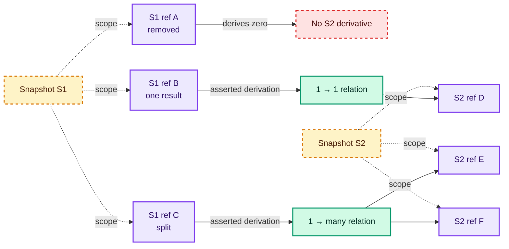

# Node identity and addressability

There is no universal node identifier: identity is stable only within a declared scope. A semantic name, a local
integer, a path, a range, a hash, and a derivation edge answer different questions. Treating any one of them as
unconditionally stable creates collisions or false continuity as soon as trees are copied, generated, or rewritten.

## Choose the mechanism by its scope

| Mechanism | Good for | Declared scope | What it does not establish |
| --- | --- | --- | --- |
| Semantic name or FQName | Named declarations and references | A language-defined namespace or package version | Identity for anonymous expressions, patterns, or generated helper nodes |
| Snapshot-scoped `NodeRef` | Fast local maps, indexes, joins, and typed side tables | Exactly one immutable tree snapshot | Continuity through a rewrite or serialization unless the snapshot and local-ID contract are serialized too |
| Structural path | Navigation, reproducible inspection, and human-readable selectors | One root shape and child-order contract | Stability after sibling insertion, reordering, desugaring, or shape changes |
| Source range | Diagnostics and source correspondence | One identified source snapshot plus a stated coordinate system | Uniqueness; generated nodes may have no range, and several nodes may share one |
| Content hash | Equality checks, caching, and deduplication | One canonical encoding and hash algorithm/version | Distinguishing equal subtrees or preserving identity after an edit |
| Explicit derivation relation | Zero-, one-, or many-result lineage across snapshots | The transformation record that asserts the relation | Identity: it relates distinct input and output entities |

A compound address can combine mechanisms—for example, a semantic declaration name plus a structural path—but its
stability is no greater than its weakest stated assumption. Morphir-Elm demonstrates one such concrete design:
`NodeID` distinguishes modules, types, and values, while type and value identifiers pair an FQName with a path of
named or indexed child steps.[^morphir-elm-node-id] This is an observable mechanism in that implementation, not a
requirement that another Morphir implementation copy it.

## Identity and address are different

**Observable facts.** Unist positions are optional, and its specification says that a generated node must not have
positional information.[^unist-spec] Roslyn's `SyntaxAnnotation` attaches additional information by creating a new
immutable syntax element; the annotation has its own value identity so a serialized annotation can compare with its
original.[^roslyn-syntax-annotation] W3C PROV treats an entity's described attributes as fixed during that entity's
lifetime and recommends distinct, related entities when relevant state changes.[^w3c-prov-constraints]

**Engineering inference.** These systems do not supply a universal identity algorithm. Together they show why
location, immutable-instance annotation, and provenance relation should remain distinct concepts. A location says
where a node corresponds to source; an address says how to find it in a representation; an identity says which
entity a table key denotes; a derivation says how entities are related through change.

The resulting identity categories are:

- **Semantic identity** follows language naming and resolution rules. It naturally names declarations and imported
  symbols, but local binders need scope-sensitive identity and anonymous nodes have no semantic name.
- **Structural identity** is really addressability relative to a root, field vocabulary, and child order. Duplicate
  subtrees at different paths are distinct addresses even when their contents are equal.
- **Source identity** combines a source artifact or source snapshot with coordinates. Ranges can overlap, coincide,
  or be absent, so collision handling must allow zero, one, or many candidate nodes.
- **Generated identity** must be allocated or derived within an explicit generation scope. Inventing a zero-length
  source range for a generated node falsely claims source correspondence.

Names can collide under incomplete qualification; paths can become ambiguous when an interchange projection loses
named fields; and ranges collide when nested nodes cover the same text. Equal canonical content intentionally shares
a content hash. A true algorithmic hash collision is different: distinct canonical inputs produce the same digest.
Consumers therefore need result types that can express absence and multiplicity instead of silently choosing the
first match.

## Snapshot-local references

The following is an illustrative Scala 3 API, not a settled Morphir API. `SnapshotId` prevents a local node number
from being mistaken for a globally reusable identifier, while `NodeKind` is a phantom type: it adds no runtime data.

```scala
object TreeIdentity:
  opaque type SnapshotId = String
  object SnapshotId:
    def apply(value: String): SnapshotId =
      require(value.nonEmpty, "snapshot id must be non-empty")
      value
    extension (id: SnapshotId) def value: String = id

  opaque type LocalNodeId = Long
  object LocalNodeId:
    def apply(value: Long): LocalNodeId =
      require(value >= 0, "local node id must be non-negative")
      value
    extension (id: LocalNodeId) def value: Long = id

  sealed trait NodeKind
  sealed trait Expression extends NodeKind
  sealed trait Declaration extends NodeKind

  final case class NodeRef[+Kind <: NodeKind](
      snapshot: SnapshotId,
      local: LocalNodeId
  )

  final case class Derivation(
      input: NodeRef[? <: NodeKind],
      output: NodeRef[? <: NodeKind]
  )

  def eraseKind(ref: NodeRef[? <: NodeKind]): NodeRef[NodeKind] = ref

  val before = SnapshotId("parse-17")
  val after = SnapshotId("normalize-18")
  val expression: NodeRef[Expression] =
    NodeRef(before, LocalNodeId(41))
  val declaration: NodeRef[Declaration] =
    NodeRef(after, LocalNodeId(7))
  val lineage = Derivation(expression, declaration)
```

Phantom kinds help where an API must reject, for example, attaching an expression-only analysis to a declaration.
Generic traversal, logging, and provenance code should accept `NodeRef[? <: NodeKind]` or erase to
`NodeRef[NodeKind]`; forcing every utility to carry a highly specific kind makes ordinary use needlessly awkward.

Snapshot identifiers are part of equality. A local allocator may reuse `LocalNodeId(41)` in every snapshot without
collision because `(snapshot, local)` is the key. If references cross a process boundary, the serialized format must
state how snapshot IDs are minted, whether they remain meaningful after reload, the local-ID numeric domain, and the
schema version. If those guarantees are absent, deserialize them as import-local addresses, not durable identity.

## Continuity is an asserted relation



In prose: input A is removed and has zero output derivatives; input B has one explicitly recorded derivative D; input
C is split and has two explicitly recorded derivatives E and F. Amber dashed snapshot nodes delimit scope, purple
nodes are snapshot-scoped node references, green nodes are derivation relations, and the red dashed node records
the blocked continuation. Labels and arrows carry the same meaning without color.

Cross-snapshot continuity is explicit derivation, not something inferred from equal paths, ranges, or hashes.
Content equality can be useful evidence for a transformation that emits a derivation record, but it is not itself
that record. The same rule accommodates many-to-one folding by recording several input-to-output edges.

## Design obligations

Before exposing an identifier, document:

| Obligation | Required answer |
| --- | --- |
| Allocation | Who creates local IDs, and can they be reused? |
| Snapshot boundary | Which immutable root or artifact makes the namespace? |
| Kind checking | Which distinctions prevent mistakes without burdening generic consumers? |
| Lookup result | Can a query return zero, one, or many nodes? |
| Rewrite behavior | Which transformation records derivation, deletion, splitting, or merging? |
| Serialization | Are references durable, import-local, or deliberately not serialized? |
| Validation | How are missing snapshots, dangling locals, and kind mismatches reported? |

Source-coordinate rules belong with [syntax trees and source positions](/syntax-trees-and-intermediate-representations.md).
[Structural interoperability](/structural-tree-interoperability.md) explains how projections can preserve or lose
paths and positions, while [tree traversal and cursors](/tree-traversal-visitors-cursors-and-rewriting.md) explains
how path-like navigation arises. Use [RDF, linked data, and provenance](/rdf-linked-data-and-provenance.md) when
derivation must be exchanged as a relation graph, and continue with
[attribution of typed trees](/attribution-of-typed-trees.md) for the side tables and overlays that depend on scoped
node references.

[^morphir-elm-node-id]: Morphir-Elm IR NodeId.
[^unist-spec]: Universal Syntax Tree specification.
[^roslyn-syntax-annotation]: Roslyn SyntaxAnnotation.
[^w3c-prov-constraints]: Constraints of the PROV Data Model.
