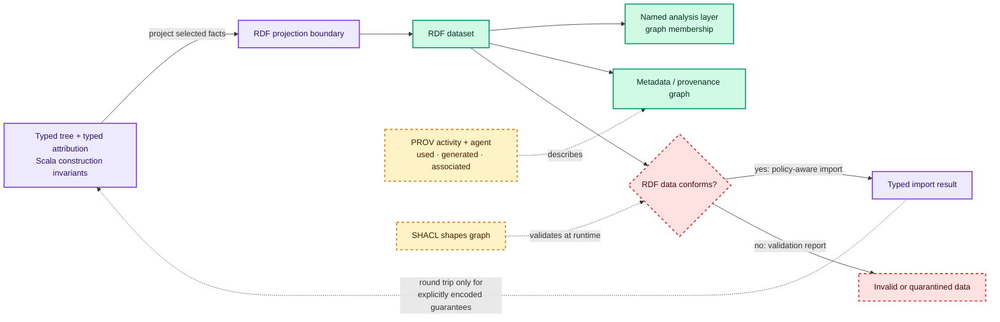

# RDF, linked data, and provenance

RDF is a graph and dataset model that can make Morphir attribution addressable, joinable, queryable, and
interchangeable. It does not replace the typed Scala representation that makes illegal compiler states hard to
construct, and RDF data does not become provenance merely because it is placed in a named graph. A practical design
can retain a typed local attribution store and project selected facts to an RDF dataset at an explicit boundary.

This is a reference, not the bundle's settled recommendation. It separates standards facts from engineering
inferences and leaves the final ranking to
[typed attribution guidance for morphir-scala](/typed-attribution-guidance-for-morphir-scala.md). RDF 1.2 Concepts
is a Candidate Recommendation Snapshot dated 7 April 2026, while the cited RDF 1.2 N-Quads publication is a Working
Draft dated 28 May 2026; neither is described here as a W3C Recommendation.[^rdf12-concepts][^rdf12-n-quads]

## Standards facts

### Graphs, terms, and datasets

An **RDF graph** is a set of subject-predicate-object triples. In normative RDF 1.2, a subject is an IRI or blank
node, a predicate is an IRI, and an object is an IRI, blank node, literal, or another triple used as a triple term.
An IRI is a globally scoped name; a blank node identifies something without giving it a global IRI; and a literal
carries a lexical value with datatype and, for relevant strings, language or direction information.[^rdf12-concepts]

An **RDF dataset** contains exactly one possibly empty, unnamed default graph plus zero or more named graphs. Each
named graph is a pair of a unique graph name—an IRI or blank node—and an RDF graph. The dataset can be viewed as a set
of quads `(subject, predicate, object, optional graph name)`: no fourth term means membership in the default graph,
and a fourth term groups the triple into the correspondingly named graph.[^rdf12-concepts] N-Quads is a line-oriented
concrete syntax for such datasets; its fourth term is the optional graph name.[^rdf12-n-quads]

### Linked identity and vocabulary

IRIs in subject position let independent producers make statements about what they intend to be the same resource;
IRIs in predicate position let them use a shared relation vocabulary. RDF defines repeated appearances of an IRI to
denote the same resource, so compatible IRI and vocabulary policies make independently produced graphs joinable by
RDF-term equality.[^rdf12-concepts]

That mechanism is necessary but not sufficient for stable Morphir node identity. Minting
`https://example.org/morphir/snapshot/typed-7/node/12` does not prove that `12` survives a rewrite, identify the
snapshot policy, or establish semantic continuity with another IRI. Those are application guarantees described in
[node identity and addressability](/node-identity-and-addressability.md). Blank-node labels are especially unsuitable
as durable external keys because their identifiers are serialization-local rather than identifiers in the RDF
abstract model.[^rdf12-concepts]

### Named graphs are grouping, not provenance

The RDF dataset model pairs a graph name syntactically with a graph, but does not formally require the name to denote
that graph or constrain what relationship holds between the named resource and the graph.[^rdf12-concepts] Therefore
a graph named `https://example.org/morphir/layer/typecheck/run-42` does not, by RDF semantics alone, say that run 42
produced, asserted, owns, or trusts its triples. A Morphir layer vocabulary must define that interpretation and
encode producer, activity, time, scope, and lifecycle when consumers require them.

### Qualification and reification in the current RDF 1.2 model

In the cited RDF 1.2 Concepts Candidate Recommendation, a **triple term** is an RDF triple used in the object position
of another triple. It denotes a proposition, but merely appearing as a triple term does not assert that proposition.
A reifying triple has predicate `rdf:reifies`, its object is the triple term, and its subject is a **reifier** that can
be described by further triples. The reifier may denote a claim, belief, situation, event, or another thing related
to the proposition; the deliberately generic relation does not choose among them.[^rdf12-concepts]

This distinction matters for attribution. The proposition “node 12 has inferred type Decimal” is not the same thing
as “typechecker run 42 recorded that proposition.” Several runs or producers can create distinct occurrence or
attribution records for the same proposition. A Morphir vocabulary can model each record as a distinct reifier and
attach producer, time, confidence, or lifecycle to that reifier. Conversely, when only the proposition matters, a
direct asserted triple is simpler. The examples below use the RDF reification vocabulary supported by existing RDF
1.1 serializations to identify an assertion record and attach provenance to it. Reification describes a statement;
it does not itself assert the described triple, so each example also includes the direct
assertion.[^rdf11-schema][^rdf12-concepts]

### PROV-O starting terms

PROV-O's starting classes are `prov:Entity`, `prov:Activity`, and `prov:Agent`. Its starting properties include
`prov:used`, `prov:wasGeneratedBy`, `prov:wasDerivedFrom`, `prov:wasAttributedTo`, and
`prov:wasAssociatedWith`.[^prov-o] PROV-O defines attribution as ascribing an entity to an agent and derivation as a
transformation, update, or construction of an entity based on another entity.[^prov-o]

A cautious Morphir mapping is:

| PROV-O term | Possible Morphir use | Modeling caution |
| --- | --- | --- |
| `prov:Entity` | Immutable tree snapshot, input package, attribution artifact, or generated file | A live mutable store and one of its snapshots should not accidentally share an identity |
| `prov:Activity` | A parser, type-inference, rewrite, projection, or backend run | The activity is the occurrence of a run, not merely the reusable stage definition |
| `prov:Agent` | Human, organization, service, or software producer | Decide whether a binary/version, deployment, or owning organization is the accountable agent |
| `prov:used` | Connect a run to an input snapshot or configuration entity | “Used” does not itself identify which nodes influenced which output fact |
| `prov:wasGeneratedBy` | Connect an output snapshot or attribution artifact to its run | Generation is about the entity, not automatic authorship of every triple in a graph |
| `prov:wasDerivedFrom` | Connect an output entity to an input entity | Node-level correspondence and zero-result lineage still need explicit relations |
| `prov:wasAttributedTo` | Ascribe an artifact or snapshot to a producer | Do not substitute graph membership for this relation |
| `prov:wasAssociatedWith` | Connect a run to its responsible producer | A producer's role or plan needs additional modeling when relevant |

These are application modeling choices built with PROV-O, not mappings mandated by PROV-O. They complement the
preservation and lineage concerns in [attribution of typed trees](/attribution-of-typed-trees.md) and the run model in
[transformation pipelines](/transformation-pipelines.md).

### SHACL validates graphs at runtime

SHACL validates a **data graph** against shapes in a **shapes graph** and produces validation results. A data graph
may be an in-memory graph, a named graph from a dataset, or another RDF graph; the shapes graph contains the shapes
and constraints used for validation.[^shacl] This is runtime graph conformance. A shape can require an
`m:inferredType` value to be an IRI or impose a cardinality, but it does not make a Scala constructor reject the wrong
payload type at compile time. Projection code and import code therefore need distinct obligations: typed Scala APIs
protect local construction, while SHACL checks the RDF boundary and data received from less constrained producers.

## Complete serialization examples

The `m:` vocabulary in all examples is **illustrative**, not an existing Morphir standard.

### Turtle graph

This complete Turtle graph records a node's inferred type and a type-inference activity using the illustrative
Morphir vocabulary plus standard PROV-O terms:

```turtle
@prefix ex: <https://example.org/morphir/> .
@prefix m: <https://example.org/morphir/vocab#> .
@prefix prov: <http://www.w3.org/ns/prov#> .
@prefix rdf: <http://www.w3.org/1999/02/22-rdf-syntax-ns#> .

ex:snapshot-typed-7
    a prov:Entity, m:TreeSnapshot .

<https://example.org/morphir/snapshot/typed-7/node/12>
    a m:ExpressionNode ;
    m:inSnapshot ex:snapshot-typed-7 ;
    m:inferredType <https://example.org/morphir/type/Decimal> .

<https://example.org/morphir/type/Decimal>
    a m:Type .

ex:inferred-type-assertion-42
    a rdf:Statement, prov:Entity, m:AttributionAssertion ;
    rdf:subject <https://example.org/morphir/snapshot/typed-7/node/12> ;
    rdf:predicate m:inferredType ;
    rdf:object <https://example.org/morphir/type/Decimal> ;
    prov:wasGeneratedBy ex:typecheck-run-42 ;
    prov:wasAttributedTo ex:typechecker-2-4 .

ex:typecheck-run-42
    a prov:Activity, m:TypeInferenceRun ;
    prov:used ex:snapshot-typed-7 ;
    prov:wasAssociatedWith ex:typechecker-2-4 .

ex:typechecker-2-4
    a prov:SoftwareAgent .

ex:analysis-artifact-42
    a prov:Entity, m:AttributionArtifact ;
    m:recordsAssertion ex:inferred-type-assertion-42 ;
    prov:wasGeneratedBy ex:typecheck-run-42 ;
    prov:wasDerivedFrom ex:snapshot-typed-7 ;
    prov:wasAttributedTo ex:typechecker-2-4 .
```

The direct `m:inferredType` triple asserts the relation. `ex:inferred-type-assertion-42` identifies an assertion
record that reifies that same statement and links it to the generating activity and agent; the artifact explicitly
records that assertion resource. RDF reification alone would not assert the relation. PROV-O supplies the standard
provenance relations; it does not define the illustrative Morphir node, type, assertion-record, or artifact
vocabulary.[^rdf12-concepts][^prov-o]

### N-Quads dataset with a named analysis layer

This complete N-Quads document puts the inferred-type fact in one named graph and describes that layer, activity,
and producer in a separate metadata graph:

```nquads
<https://example.org/morphir/snapshot/typed-7/node/12> <https://example.org/morphir/vocab#inferredType> <https://example.org/morphir/type/Decimal> <https://example.org/morphir/layer/typecheck/run-42> .
<https://example.org/morphir/assertion/inferred-type-42> <http://www.w3.org/1999/02/22-rdf-syntax-ns#type> <http://www.w3.org/1999/02/22-rdf-syntax-ns#Statement> <https://example.org/morphir/graph/dataset-metadata> .
<https://example.org/morphir/assertion/inferred-type-42> <http://www.w3.org/1999/02/22-rdf-syntax-ns#type> <http://www.w3.org/ns/prov#Entity> <https://example.org/morphir/graph/dataset-metadata> .
<https://example.org/morphir/assertion/inferred-type-42> <http://www.w3.org/1999/02/22-rdf-syntax-ns#subject> <https://example.org/morphir/snapshot/typed-7/node/12> <https://example.org/morphir/graph/dataset-metadata> .
<https://example.org/morphir/assertion/inferred-type-42> <http://www.w3.org/1999/02/22-rdf-syntax-ns#predicate> <https://example.org/morphir/vocab#inferredType> <https://example.org/morphir/graph/dataset-metadata> .
<https://example.org/morphir/assertion/inferred-type-42> <http://www.w3.org/1999/02/22-rdf-syntax-ns#object> <https://example.org/morphir/type/Decimal> <https://example.org/morphir/graph/dataset-metadata> .
<https://example.org/morphir/assertion/inferred-type-42> <http://www.w3.org/ns/prov#wasGeneratedBy> <https://example.org/morphir/activity/typecheck-run-42> <https://example.org/morphir/graph/dataset-metadata> .
<https://example.org/morphir/layer/typecheck/run-42> <http://www.w3.org/1999/02/22-rdf-syntax-ns#type> <http://www.w3.org/ns/prov#Entity> <https://example.org/morphir/graph/dataset-metadata> .
<https://example.org/morphir/layer/typecheck/run-42> <http://www.w3.org/ns/prov#wasGeneratedBy> <https://example.org/morphir/activity/typecheck-run-42> <https://example.org/morphir/graph/dataset-metadata> .
<https://example.org/morphir/layer/typecheck/run-42> <https://example.org/morphir/vocab#recordsAssertion> <https://example.org/morphir/assertion/inferred-type-42> <https://example.org/morphir/graph/dataset-metadata> .
<https://example.org/morphir/activity/typecheck-run-42> <http://www.w3.org/1999/02/22-rdf-syntax-ns#type> <http://www.w3.org/ns/prov#Activity> <https://example.org/morphir/graph/dataset-metadata> .
<https://example.org/morphir/activity/typecheck-run-42> <http://www.w3.org/ns/prov#used> <https://example.org/morphir/snapshot/typed-7> <https://example.org/morphir/graph/dataset-metadata> .
<https://example.org/morphir/activity/typecheck-run-42> <http://www.w3.org/ns/prov#wasAssociatedWith> <https://example.org/morphir/agent/typechecker-2-4> <https://example.org/morphir/graph/dataset-metadata> .
<https://example.org/morphir/agent/typechecker-2-4> <http://www.w3.org/1999/02/22-rdf-syntax-ns#type> <http://www.w3.org/ns/prov#SoftwareAgent> <https://example.org/morphir/graph/dataset-metadata> .
```

The fourth term records graph membership only. The metadata graph separately reifies the inferred-type statement,
links that assertion record to its generating activity, and says that the layer entity records it. Even then, the
application must define whether the layer entity denotes the named graph, a serialized artifact, or a logical
analysis result.[^rdf12-concepts][^rdf12-n-quads]

### JSON-LD relation

This complete JSON-LD document asserts the inferred-type relation and describes the corresponding assertion record,
activity, and artifact with an explicit context:

```json
{
  "@context": {
    "m": "https://example.org/morphir/vocab#",
    "ExpressionNode": "m:ExpressionNode",
    "AttributionAssertion": "m:AttributionAssertion",
    "inferredType": {
      "@id": "m:inferredType",
      "@type": "@id"
    },
    "recordsAssertion": {
      "@id": "m:recordsAssertion",
      "@type": "@id"
    },
    "rdf": "http://www.w3.org/1999/02/22-rdf-syntax-ns#",
    "prov": "http://www.w3.org/ns/prov#",
    "subject": {
      "@id": "rdf:subject",
      "@type": "@id"
    },
    "predicate": {
      "@id": "rdf:predicate",
      "@type": "@id"
    },
    "object": {
      "@id": "rdf:object",
      "@type": "@id"
    },
    "wasGeneratedBy": {
      "@id": "prov:wasGeneratedBy",
      "@type": "@id"
    }
  },
  "@graph": [
    {
      "@id": "https://example.org/morphir/snapshot/typed-7/node/12",
      "@type": "ExpressionNode",
      "inferredType": "https://example.org/morphir/type/Decimal"
    },
    {
      "@id": "https://example.org/morphir/assertion/inferred-type-42",
      "@type": ["rdf:Statement", "prov:Entity", "AttributionAssertion"],
      "subject": "https://example.org/morphir/snapshot/typed-7/node/12",
      "predicate": "m:inferredType",
      "object": "https://example.org/morphir/type/Decimal",
      "wasGeneratedBy": "https://example.org/morphir/activity/typecheck-run-42"
    },
    {
      "@id": "https://example.org/morphir/artifact/analysis-42",
      "@type": "prov:Entity",
      "recordsAssertion": "https://example.org/morphir/assertion/inferred-type-42",
      "wasGeneratedBy": "https://example.org/morphir/activity/typecheck-run-42"
    },
    {
      "@id": "https://example.org/morphir/activity/typecheck-run-42",
      "@type": "prov:Activity"
    }
  ]
}
```

JSON-LD is a JSON serialization of linked data and RDF datasets; its context maps JSON terms to linked-data
identifiers.[^json-ld11] As in Turtle, the direct relation asserts the proposition, while the reified statement gives
the activity and artifact a resource to refer to; reification alone would not assert it. JSON-LD is not an IR type
system. The `@type` entries emit RDF type relations, but they neither define the Scala node alternatives nor prove
that the inferred type is valid for the node.

## Open-world and lifecycle implications

RDF graphs are sets of asserted triples, and RDF entailment establishes what must be true in every interpretation
that makes the source graph true.[^rdf12-concepts] The engineering consequence is open-world treatment of missing
facts: absence of `m:inferredType` is not by itself a claim that the node has no inferred type; absence of a lineage
edge is not a deletion, tombstone, proof of falsehood, or proof that the producer returned no results.

A Morphir interchange contract must encode negative or complete outcomes explicitly when they matter. For example,
it can emit an analysis-run entity with `m:completed true`, a declared input scope, and `m:resultCount 0`; use an
explicit invalidation or tombstone relation; or declare a particular layer closed and complete under a versioned
application policy. Conflict policy is also external to RDF: two layers can assert different inferred types without
the dataset selecting a winner. Consumers need layer precedence, producer trust, time, merge, and invalidation rules.
This is the graph form of the preservation obligations in
[attribution of typed trees](/attribution-of-typed-trees.md).

## Mapping typed attribution to RDF

| Typed local component | RDF projection | Information that requires explicit encoding |
| --- | --- | --- |
| `NodeRef[Kind](snapshot, local)` subject | Subject IRI | Snapshot scope, node kind, IRI minting/version policy, and rewrite continuity |
| `AttrKey[A]` | Predicate IRI | Vocabulary owner, expected value type, cardinality, and key version |
| Typed value `A` | IRI, blank node, literal, or structured resource in object position | Codec, datatype, units, language, precision, and loss behavior |
| Attribution context | Named graph, qualified/reified record, or separate context resource | Producer, activity, time, confidence, applicability, lifecycle, and trust |
| Store entry occurrence | Direct triple when only the proposition matters; distinct record when occurrences matter | Record identity and whether the underlying proposition is asserted |
| Side-table snapshot | RDF graph or dataset artifact, possibly a `prov:Entity` | Completeness, default/named-graph policy, ordering if relevant, and artifact identity |
| Preservation result | New triples plus derivation, invalidation, or remap relations | Zero-result lineage, one-to-many correspondence, conflicts, and orphan policy |

Projection is intentionally not assumed to be lossless. The typed store may distinguish Scala subtypes, key
capabilities, insertion order, duplicate occurrences, or snapshot membership that RDF set semantics and the selected
vocabulary do not preserve. Import must reject, quarantine, or represent facts that cannot be reconstructed safely.
This round-trip boundary is related to
[structural tree interoperability](/structural-tree-interoperability.md): both designs use an explicit projection
without replacing the typed source model.



In prose: the purple typed tree and attribution store project selected facts through a purple boundary into a green
RDF dataset. Green named layers group analysis and metadata. Amber PROV resources state the intended activity and
agent relationships, while an amber SHACL shapes graph checks the dataset at runtime. A conforming graph can cross a
policy-aware purple import boundary, but the dashed return edge is deliberately conditional: only explicitly encoded
guarantees can round-trip. Nonconforming data follows the labeled red path to a validation report or quarantine.
Colors reinforce roles; labels and dashed edges carry the same distinctions without color.

## Engineering options and tradeoffs

The following comparison is engineering inference from the boundaries above, not a standards requirement and not
the later Morphir recommendation.

| Option | Scala type safety | Local traversal ergonomics | Query and interchange | Validation | Operational cost |
| --- | --- | --- | --- | --- | --- |
| Typed indexed local store with RDF projection | Strong at construction and lookup; projection can be typed | Direct node/key indexes; natural fit for compiler passes | Excellent for selected exported facts; projection may be lossy | Scala invariants locally, SHACL at export/import | Codec, IRI, and synchronization policy; no mandatory RDF engine |
| RDF dataset as persisted sidecar/interchange | Core IR remains typed; sidecar facts are dynamic until decoded | Requires loading/indexing or joining back to node refs | Strong standards-based exchange and cross-producer joins | SHACL can gate ingestion and publication | Artifact versioning, graph storage, identity, staleness, and conflict handling |
| Embedded or in-memory RDF store queried locally | Typed wrappers can protect query results, but store contents remain RDF terms | Convenient for relation-heavy queries; less direct than typed field access for hot compiler paths | Strong local graph query and easy serialization | SHACL plus application decoding | RDF library, indexes, query planning, memory, startup, and cross-platform support |
| RDF-native primary compiler representation | Static guarantees move into constructors, schemas, query wrappers, and validation | Flexible graph traversal, but algebraic pattern matching and exhaustivity are weaker | Maximum graph-native query and interchange | Predominantly runtime; SHACL does not recreate Scala exhaustivity | Highest: pervasive vocabulary, validation, performance, debugging, and toolchain commitments |

A hybrid can use more than one row: a typed indexed store during compilation, an in-memory RDF view for specialist
queries, and a persisted dataset sidecar for exchange. That choice should be tested against representative hot-path
lookups, graph queries, round trips, Scala.js/Native constraints, and failure reporting before the project commits to
an RDF engine.

## Morphir-oriented questions

These remain design questions rather than conclusions:

- Which node references are snapshot-local, and which semantic declarations deserve durable IRIs?
- Which attribution keys are intrinsic typed semantics, which are extensible facts, and which are relations?
- Is an analysis layer a graph, a graph-bearing artifact, a run result, or all three with distinct IRIs?
- Which layers are complete, and how are zero-result lineage, deletion, invalidation, conflict, and precedence encoded?
- Which PROV entities and activities are useful at snapshot, transformation-run, artifact, and node granularity?
- What subset must round-trip into Scala types without loss, and what happens when SHACL-valid RDF still violates a
  Morphir semantic invariant?
- Can the chosen RDF library meet platform, memory, query-latency, and deterministic-build requirements?

[Morphir attribution evolution](/morphir-attribution-evolution.md) supplies the project-history context for these
questions. [Typed attribution guidance for morphir-scala](/typed-attribution-guidance-for-morphir-scala.md) is the
place to rank the choices, while this reference supplies the RDF/PROV/SHACL model and its limits.

[^rdf12-concepts]: RDF 1.2 Concepts and Abstract Data Model, W3C Candidate Recommendation Snapshot, 7 April 2026.
[^rdf12-n-quads]: RDF 1.2 N-Quads, W3C Working Draft, 28 May 2026.
[^rdf11-schema]: RDF Schema 1.1, W3C Recommendation, 25 February 2014.
[^prov-o]: PROV-O: The PROV Ontology, W3C Recommendation, 30 April 2013.
[^shacl]: Shapes Constraint Language (SHACL), W3C Recommendation, 20 July 2017.
[^json-ld11]: JSON-LD 1.1, W3C Recommendation, 16 July 2020.
