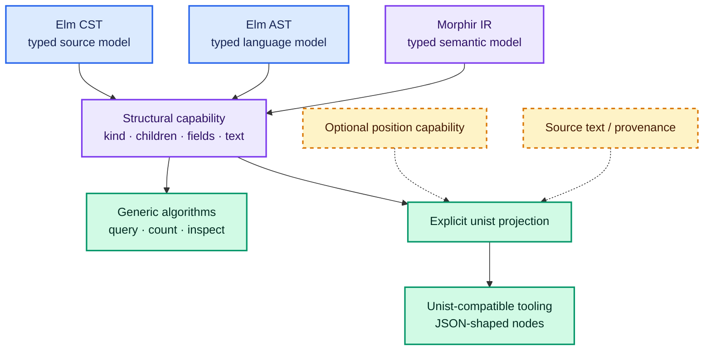

# Structural tree interoperability

A structural tree protocol lets generic tools ask a small set of navigation questions without requiring every
language to store its tree in the same node hierarchy. The protocol is an interoperability boundary; concrete CST,
AST, semantic, and IR models can remain strongly typed.

## The minimum depends on the tool

A pre-order node counter needs only `children`. A query language may also need node kind, named fields, and leaf text.
A source-aware diagnostic renderer needs positions and a source identity. Combining every possible need into one
universal node makes the common contract larger and shifts ecosystem-specific facts into dynamic metadata.

Morphir-scala's `QueryableTree[T]` makes four operations available for any represented `T`: node type, children in
stable traversal order, named child fields, and optional leaf text.[^queryable-tree] A small equivalent teaching
interface is:

```scala
trait TreeView[T]:
  def kind(node: T): String
  def children(node: T): IndexedSeq[T]
  def fields(node: T): Map[String, IndexedSeq[T]]
  def text(node: T): Option[String]

def count[T](root: T)(using tree: TreeView[T]): Int =
  1 + tree.children(root).map(count(_)).sum
```

The algorithm is generic, but `root` and every child remain values of `T`. There is no dynamic cast from a universal
node back into a language node.

## unist as a structural interchange model

The unist specification defines a small JSON-expressible node protocol:

- every node has a non-empty string `type`;
- `data` and `position` are optional;
- a parent has an ordered `children` list;
- a literal has a `value`;
- a position has `start` and `end` points;
- a generated node has no positional information.[^unist-spec]

Unist's `end` point is the first character after the represented source region, making its positions half-open. Its
line and column numbers are one-based, while offset is zero-based and counts UTF-16 code units.[^unist-spec] An
adapter must therefore know the coordinate unit of its source representation; converting byte offsets or Unicode
code-point offsets without that knowledge is incorrect.

```scala
final case class Point(line: Int, column: Int, offset: Option[Int])
final case class Position(start: Point, end: Point)

final case class InteropNode(
    kind: String,
    children: Vector[InteropNode],
    value: Option[String],
    position: Option[Position]
)
```

This illustrative Scala value is an interchange shape, not a recommended internal AST.

Here is a compact illustrative JSON projection of `price + 2`. In this example, offsets are zero-based Unicode code
points and each `position` is a half-open range `[start, end)`:

```json
{
  "kind": "Add",
  "children": [
    {
      "kind": "Ref",
      "children": [],
      "value": "price",
      "position": {
        "start": 0,
        "end": 5
      }
    },
    {
      "kind": "IntLiteral",
      "children": [],
      "value": "2",
      "position": {
        "start": 8,
        "end": 9
      }
    }
  ],
  "position": {
    "start": 0,
    "end": 9
  }
}
```

The same illustrative projection can be serialized as YAML:

```yaml
kind: Add
children:
  - kind: Ref
    children: []
    value: price
    position:
      start: 0
      end: 5
  - kind: IntLiteral
    children: []
    value: "2"
    position:
      start: 8
      end: 9
position:
  start: 0
  end: 9
```

These blocks are neither a universal internal AST nor an official unist serialization: in particular, they use
`kind` and simple offsets rather than unist's `type` and point shape. JSON and YAML can serialize the same projection,
but neither encoding determines the tree's semantics or restores guarantees omitted by the projection.

## Projection, not replacement



The three typed models implement or receive a structural capability. Generic algorithms operate through that
capability. Projection creates a separate unist-shaped value only when an external consumer needs it. The diagram
does not imply that all three models expose identical node kinds or semantic fields.

Morphir-scala follows this separation: `UnistProjection.project` requires both `QueryableTree[T]` and a position
projection, recursively projects children, maps named fields to child indexes, and only computes a position when both
source text and a span are present.[^unist-projection]

## What projection can lose

| Typed source property | Minimal structural projection |
| --- | --- |
| Closed node alternatives | Usually a string node kind |
| Field-specific Scala types | Flattened to structural relationships unless carried explicitly |
| Coordinate-unit guarantees | Lost unless the unit is carried explicitly by the protocol or its surrounding contract |
| Semantic invariants | Not automatically represented |
| Object identity or stable IDs | Lost unless explicitly projected |
| Multiple source ranges | Requires an extension |
| Typed annotations | Requires domain-specific data or a parallel capability |

A projected tree is therefore suitable for generic inspection, serialization, and ecosystem interoperability only
to the extent its target protocol represents the required facts. It is not evidence that the projected form can
replace the source model.

## Stable child order and named fields

Traversal algorithms observe child order. Changing it can alter match ordering, diagnostics, and deterministic
output even if the parent contains the same set of children. A structural capability should document that order.
Stable child order can support structural paths, but positions and paths are addresses rather than automatically
stable identities; [node identity and addressability](/node-identity-and-addressability.md) explains the guarantees
an adapter must choose among.

Named fields should refer to children rather than create a second hidden traversal graph unless the protocol says
otherwise. Morphir-scala's contract requires field values to be a subset of `children`, which lets queries address
roles such as `name` or `body` without changing traversal membership.[^queryable-tree]

## Metadata belongs at a deliberate boundary

Unist deliberately reserves `data` for ecosystem information and does not define its fields.[^unist-spec] That is
appropriate for an interchange ecosystem designed around JSON. A typed Scala toolchain can instead keep domain
metadata in its node model, expose a separate typed capability, or carry run-scoped data beside the tree. Choosing an
untyped map internally is a separate decision, not a requirement imposed by unist compatibility.

> **Scala 3 implementation note:** givens can supply `TreeView[T]` without modifying `T`; extension methods can expose
> generic operations; separate typeclasses keep positions optional. See
> [Scala 3 and Kyo implementation notes](/scala-3-and-kyo-implementation-notes.md).

See [transformation pipelines](/transformation-pipelines.md) for how typed representations and explicit projections
flow between processing phases.

[^unist-spec]: Universal Syntax Tree specification.
[^queryable-tree]: morphir-scala QueryableTree.
[^unist-projection]: morphir-scala UnistProjection.
