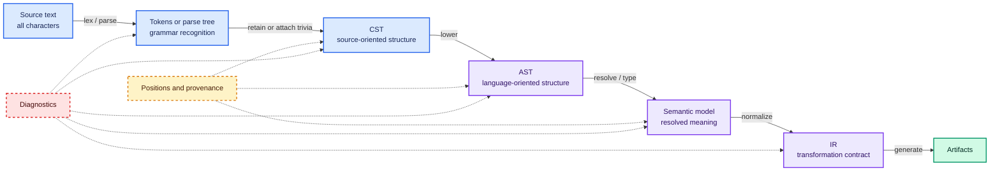

# Syntax trees and intermediate representations

The useful distinction between syntax and intermediate trees is not the label attached to a data type; it is the
information that representation preserves and the invariants its producer guarantees. A toolchain commonly moves
from source-oriented representations toward semantic and target-oriented ones, losing irrelevant syntax while
adding resolved meaning.

## Vocabulary is local to a toolchain

The terms *parse tree*, *concrete syntax tree* (CST), and *abstract syntax tree* (AST) are widely used but do not name
one universal schema. Tree-sitter calls its output a concrete syntax tree because it contains nodes for individual
tokens, including punctuation, while named-node traversal can provide an AST-like view over the same stored tree.[^tree-sitter-basic]
Morphir-scala instead exposes two different Elm values: a CST that retains tokens and attached comments, and an AST
lowered from that CST with trivia removed.[^morphir-scala-elm]

Consequently, consumers should ask which properties are guaranteed:

| Property | Question to ask |
| --- | --- |
| Text fidelity | Can the original bytes or characters be reproduced exactly? |
| Grammar fidelity | Are grammar productions and punctuation represented? |
| Trivia | Are comments and whitespace stored, attached, or discarded? |
| Source identity | Does each node retain a file, range, or stable identity? |
| Recovery | Can malformed input still produce a partial tree? |
| Semantic facts | Are names resolved and types inferred or checked? |
| Serialization | Is the form intended to cross process or version boundaries? |

## A representation ladder



The arrows describe changes of contract, not mandatory data types. A tool may combine adjacent levels, keep several
views over shared storage, or introduce more than one IR. The important boundary is which facts are valid before and
after each arrow.

## Worked example

Consider:

```text
total = price + tax * 2 -- gross amount
```

An illustrative Scala model can make the preservation choices explicit:

```scala
final case class Span(start: Int, end: Int)

enum TokenKind:
  case Name, Equals, Plus, Star, Integer, Comment, Whitespace

final case class Token(kind: TokenKind, text: String, span: Span)

enum Expr:
  case Ref(name: String, span: Span)
  case IntLiteral(value: Int, spelling: String, span: Span)
  case Apply(operator: String, left: Expr, right: Expr, span: Span)

final case class ValueDecl(
    name: String,
    body: Expr,
    span: Span
)
```

The expression shape `price + (tax * 2)` can be projected into an intentionally lossy S-expression that omits the
Scala model's spans and integer spelling:

```lisp
(Apply "+"
  (Ref "price")
  (Apply "*"
    (Ref "tax")
    (IntLiteral 2)))
```

The same intentionally lossy structural projection can be encoded as complete JSON:

```json
{
  "kind": "Apply",
  "operator": "+",
  "left": {
    "kind": "Ref",
    "name": "price"
  },
  "right": {
    "kind": "Apply",
    "operator": "*",
    "left": {
      "kind": "Ref",
      "name": "tax"
    },
    "right": {
      "kind": "IntLiteral",
      "value": 2
    }
  }
}
```

The structurally equivalent YAML encoding of that projection is:

```yaml
kind: Apply
operator: "+"
left:
  kind: Ref
  name: price
right:
  kind: Apply
  operator: "*"
  left:
    kind: Ref
    name: tax
  right:
    kind: IntLiteral
    value: 2
```

The S-expression foregrounds nesting, but it does not define source positions, trivia, or name resolution. None of
these projections is equivalent to a complete value of the Scala model: all omit `Span`, and the integer projection
also omits `spelling`. The JSON and YAML blocks are structurally equivalent serializations of one chosen lossy
projection; they are illustrative rather than official Morphir encodings. Their equivalent data does not prove
semantic invariants, and the choice between JSON and YAML does not create distinct tree semantics.

The token sequence can retain every lexeme, including whitespace and the comment. The `Expr` tree records the
operator grouping—`price + (tax * 2)`—but the model above does not retain whitespace or the comment. A later semantic
representation could replace `Ref("tax", ...)` with a resolved symbol identifier and attach a checked type.

The model is intentionally illustrative. A real lossless CST needs a documented relationship between source text and
stored tokens or nodes; the name `CST` alone does not prove round-tripping.

## What each level is suited to

| Representation | Information emphasized | Typical consumers |
| --- | --- | --- |
| Tokens / parse tree | Lexemes, grammar recognition, recovery state | Parser diagnostics, syntax highlighting |
| Lossless CST | Source form, punctuation, trivia, source ranges | Formatters, refactoring editors, code actions |
| AST | Language constructs and evaluation structure | Lints, interpreters, frontend lowering |
| Semantic model | Resolved symbols, scopes, checked or inferred types | IDE navigation, validation, source-to-IR compilation |
| IR | Stable transformation and interchange semantics | Optimizers, analyzers, generators, runtimes |
| Target AST / document | Valid target-language structure before rendering | Backends and pretty-printers |

LLVM demonstrates that an IR can have equivalent in-memory, serialized bitcode, and human-readable forms; it also
defines well-formedness rules that are stricter than merely being parseable.[^llvm-ir] This separates three concerns
that are often conflated: representation, encoding, and validation.

## Source positions and generated nodes

A half-open range `[start, end)` composes naturally: its length is `end - start`, adjacent ranges share a boundary,
and an empty range has `start == end`. The choice still needs a stated unit—bytes, Unicode code points, UTF-16 code
units, or another coordinate system. Tree-sitter, for example, exposes byte offsets and row/column points, with its
column defined in bytes.[^tree-sitter-basic]

Not every later node has a unique source range. Desugaring may create nodes that correspond to an entire construct,
several ranges, or no direct source fragment. A representation should make absence or multiplicity explicit rather
than inventing a misleading location. Positions help locate nodes, but do not alone identify them across edits,
projections, or generated structure; see [node identity and addressability](/node-identity-and-addressability.md) for
the relationship between ranges, structural paths, and stable identity.

> **Scala 3 implementation note:** enums and sealed hierarchies express closed node families; case classes express
> immutable product nodes; opaque types can distinguish coordinate units without changing their runtime
> representation. See [Scala 3 and Kyo implementation notes](/scala-3-and-kyo-implementation-notes.md).

## Common confusions

- **CST does not automatically mean lossless.** Losslessness is a producer guarantee about text and trivia.
- **AST does not automatically mean typed.** Name resolution and type checking may produce a separate semantic tree
  or annotations over an AST.
- **IR does not mean low-level machine code.** Morphir IR is a domain-oriented semantic representation; LLVM IR is a
  lower-level compiler representation. Both are intermediate relative to their pipelines.
- **One tree need not serve every consumer.** A source editor and a backend generator optimize for different facts.

Continue with [tree traversal, visitors, cursors, and rewriting](/tree-traversal-visitors-cursors-and-rewriting.md)
to compare how tools consume these representations.

[^tree-sitter-basic]: Tree-sitter — Basic Parsing.
[^morphir-scala-elm]: morphir-scala Elm langkit.
[^llvm-ir]: LLVM Language Reference Manual.
