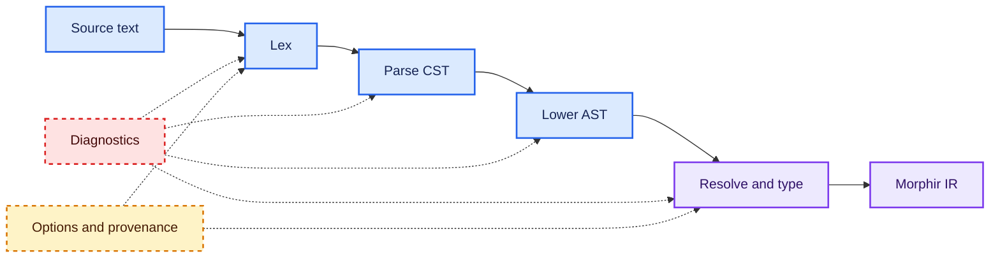
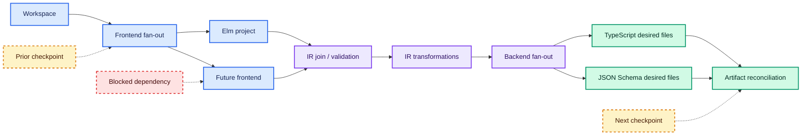

# Transformation pipelines

A transformation pipeline names the representations that enter and leave each phase and the policy for executing
those phases. A linear typed pipeline is sufficient for a fixed sequence. A task graph is needed when work can branch,
join, be skipped, be discovered at runtime, or be scheduled according to dependencies.

## Typed phases

A stage can be modeled as a typed function with an explicit effect or capability parameter:

```scala
import kyo.<

trait Stage[-Input, +Output, Effect]:
  def run(input: Input): Output < Effect

  def andThen[Next, NextEffect](
      next: Stage[Output, Next, NextEffect]
  ): Stage[Input, Next, Effect & NextEffect]
```

Morphir-scala's current `Stage[I, O, S]` uses this shape: `run` returns `O < S`, and composing with `>>>` produces a
stage whose effect row is `S & S2`.[^morphir-scala-stage] The teaching signature renames the type parameters and
composition operation but preserves those types. The input/output types prevent, for example, placing an IR backend
directly after a tokenizer.



The diagram is linear because each represented phase consumes one prior value. Diagnostics and context flow beside
the values rather than becoming syntax nodes.

## Configuration and execution are different lifetimes

Unified separates processor configuration from document processing. A processor is configured with plugins and
data, can run `parse`, `run`, and `stringify` independently, and performs all three through `process`. Processing
freezes the processor; calling a processor creates a descendant with the ancestor's configuration without later
changes affecting the ancestor.[^unified] Unified also uses VFile to carry per-document data, metadata, and
messages.[^unified]

Those are observable properties of unified, not requirements that another implementation copy its mutable API.
Equivalent design goals can be expressed through immutable definitions and execution plans:

```scala
final case class PipelineDefinition[In, Out](stages: Vector[String])
final case class ExecutionPlan[In, Out](orderedStages: Vector[String])

def seal[In, Out](
    definition: PipelineDefinition[In, Out]
): Either[Vector[String], ExecutionPlan[In, Out]] =
  ???
```

Here configuration produces a definition, validation produces a plan, and each run owns its request, diagnostics,
progress, and outputs. The snippet sketches a lifecycle; it is not a complete type-safe graph encoding.

## When a graph is required



The graph records potential concurrency without requiring the first executor to run nodes in parallel. A sequential
executor can repeatedly choose a ready node. A later parallel executor can choose several ready nodes, provided both
preserve the specified result and diagnostic ordering.

Graph semantics that must be explicit include:

| Concern | Required decision |
| --- | --- |
| Node identity | How stages, cache entries, and diagnostics refer to work |
| Readiness | Which dependencies must finish before a node runs |
| Fan-out | Whether branches are declared or discovered from runtime collections |
| Join | Whether all branches are required or successful subsets are accepted |
| Failure | Whether independent branches continue |
| Skip | How blocked dependents record their cause |
| Ordering | Which observable order diagnostics, progress, and outputs use |
| Cancellation | Which running work may be interrupted and how that is reported |

## Attribution policy and execution provenance

When a stage consumes an attributed tree, its contract should declare whether each relevant attribution is
preserved, recomputed, remapped to output nodes, or invalidated. This makes attribution behavior reviewable across
rewrites instead of leaving callers to infer it from unchanged node shapes. The available policies and the
identity evidence needed for remapping are described in
[attribution of typed trees](/attribution-of-typed-trees.md) and
[node identity and addressability](/node-identity-and-addressability.md).

A pipeline execution may also describe its activities, inputs, outputs, and responsible producer as provenance.
That run-level record is distinct from node attribution, even when it explains how an attribution was produced.
RDF datasets and PROV provide one possible interchange model; they do not require every local execution to persist
an RDF graph or any provenance artifact. See
[RDF, linked data, and provenance](/rdf-linked-data-and-provenance.md).

## Diagnostics are data

A pipeline needs to distinguish a domain diagnostic from an executor defect. A parser may report several source
errors while retaining a best-effort CST; a validation phase may reject a value; a filesystem interpreter may fail
unexpectedly. Flattening all three into thrown exceptions discards useful policy choices.

One possible outcome algebra is:

```scala
enum NodeStatus:
  case Succeeded, SucceededWithDiagnostics, Failed, Skipped, Cancelled

final case class NodeOutcome[A](
    status: NodeStatus,
    value: Option[A],
    diagnostics: Vector[String],
    blockedBy: Option[String]
)
```

The precise diagnostic type should be domain-specific. The important property is that callers can inspect status,
value, diagnostics, and causal blocking without parsing console output.

## Incremental work and checkpoints

Incrementality requires more than rerunning a shorter list:

1. identify the input snapshot and prior result;
2. detect changes using a defined equivalence or fingerprint;
3. map changes to invalidated graph nodes;
4. include downstream dependents;
5. reuse only values whose dependencies and relevant configuration still match;
6. emit a checkpoint describing the new state.

A checkpoint is part of execution context, shown in amber in the graph. It should not be hidden inside a frontend if
workspace and backend work also depend on it.

## What the reference systems demonstrate

| System | Observed capability | Boundary |
| --- | --- | --- |
| unified | Configurable plugins and presets; separate parse, transform run, stringify, and full process; descendant processors; per-file messages | Content-processing processor over unist ecosystems[^unified] |
| morphir-elm | Elm frontend processing, dependency DAGs, full and incremental frontend modules, Morphir IR distributions, several backends | Concrete Morphir implementation, not a reusable general task-graph library[^morphir-elm] |
| morphir-scala `Stage` | Typed input/output composition with Kyo effect-row accumulation | Linear stage composition currently located in the Elm compiler API[^morphir-scala-stage] |

Morphir-elm's dependency DAG assigns levels that can support topological ordering or parallel processing as
dependencies allow.[^morphir-elm-dag] Its TypeScript backend accepts a Morphir distribution and returns an in-memory
file map rather than writing files directly.[^morphir-elm-typescript] Together these facts demonstrate capabilities a
general Morphir pipeline must be able to represent: dependency-aware work and desired artifact production.

> **Scala 3 and Kyo implementation note:** intersection types can accumulate stage capability types. At the pinned
> Kyo baseline, `A < S` and handlers can keep failure, state, emission, and asynchronous work explicit while leaving
> stage values immutable. See [Scala 3 and Kyo implementation notes](/scala-3-and-kyo-implementation-notes.md).

See [guidance for a Morphir toolchain](/morphir-toolchain-guidance.md) for the fact-to-guidance synthesis.

[^unified]: unified processor documentation.
[^morphir-elm]: finos/morphir-elm at commit `1956c36d`.
[^morphir-elm-dag]: morphir-elm dependency DAG.
[^morphir-elm-typescript]: morphir-elm TypeScript backend.
[^morphir-scala-stage]: morphir-scala Stage.
