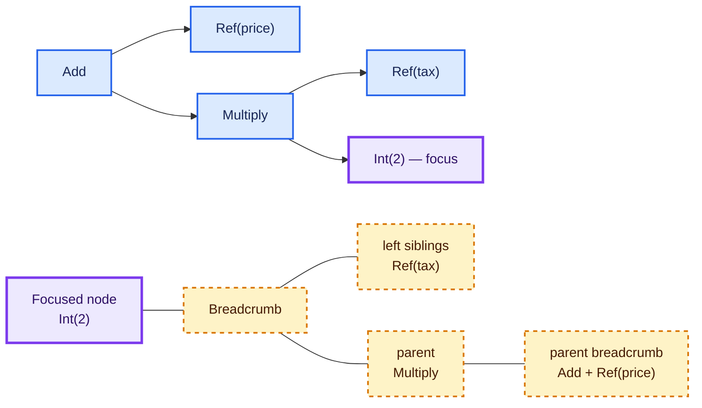

# Tree traversal, visitors, cursors, and rewriting

Traversal determines which nodes are visited and in what order. Dispatch determines what operation runs for each
node kind. A cursor or zipper additionally retains a focus and its surrounding context. These are orthogonal
capabilities, and a toolchain can expose more than one over the same tree.

## Four questions define a traversal API

1. **Order:** pre-order, post-order, breadth-first, dependency order, or caller-controlled?
2. **Dispatch:** one generic callback, pattern matching, or a method per concrete node kind?
3. **Context:** does the callback receive ancestors, siblings, a path, scope, or an accumulator?
4. **Result:** observation, accumulated value, emitted events, replacement tree, or an effectful computation?

Naming an API “visitor” does not answer all four. ANTLR's `ParseTreeVisitor<T>`, for example, defines visit operations
that return a caller-chosen result, including separate operations for children, terminals, and error nodes.[^antlr-visitor]

## Recursive traversal and folds

For a closed expression tree:

```scala
enum Expr:
  case Ref(name: String)
  case IntLiteral(value: Int)
  case Add(left: Expr, right: Expr)
  case Multiply(left: Expr, right: Expr)
```

A recursive query states both order and accumulation directly:

```scala
def references(expr: Expr): Set[String] =
  expr match
    case Expr.Ref(name)          => Set(name)
    case Expr.IntLiteral(_)      => Set.empty
    case Expr.Add(left, right)   => references(left) ++ references(right)
    case Expr.Multiply(left, right) =>
      references(left) ++ references(right)
```

A fold factors the repeated recursion into one operation. It is useful when many analyses share the same traversal:

```scala
def fold[A](expr: Expr)(onRef: String => A, onInt: Int => A)(
    combine: (String, A, A) => A
): A =
  expr match
    case Expr.Ref(name)       => onRef(name)
    case Expr.IntLiteral(n)   => onInt(n)
    case Expr.Add(l, r)       => combine("+", fold(l)(onRef, onInt)(combine), fold(r)(onRef, onInt)(combine))
    case Expr.Multiply(l, r)  => combine("*", fold(l)(onRef, onInt)(combine), fold(r)(onRef, onInt)(combine))
```

For a complete traversal of `n` nodes, both forms invoke their node logic `n` times. Their practical differences are
API reuse, stack strategy, allocation, and which context is threaded—not a different asymptotic node count.

## Typed visitors

A typed visitor centralizes dispatch:

```scala
trait ExprVisitor[A]:
  def visitRef(name: String): A
  def visitInt(value: Int): A
  def visitAdd(left: Expr, right: Expr): A
  def visitMultiply(left: Expr, right: Expr): A

def visit[A](expr: Expr, visitor: ExprVisitor[A]): A =
  expr match
    case Expr.Ref(name)          => visitor.visitRef(name)
    case Expr.IntLiteral(value)  => visitor.visitInt(value)
    case Expr.Add(left, right)   => visitor.visitAdd(left, right)
    case Expr.Multiply(left, right) => visitor.visitMultiply(left, right)
```

The visitor controls node-specific behavior, while a separate traversal helper can control whether children are
visited before or after that behavior. Morphir-scala's `CstVisitor` uses exhaustive type dispatch and also provides
`children`, `foldLeft`, `count`, and `collect`; those helpers make its order part of the library rather than every
caller.[^morphir-scala-visitor]

Visitor methods are not inherently mutable or read-only. Their result type and traversal policy determine whether
they accumulate, emit, fail, or construct replacements.

## Cursors and zippers

Huet's zipper represents a focused subtree together with context sufficient to move through and reconstruct the
surrounding tree.[^huet-zipper] A cursor is the operational interface; its implementation may be a functional zipper,
a mutable parser cursor, or another context-bearing structure.



The upper tree shows the focus spatially. The lower structure shows the data needed to navigate back: the parent and
sibling context at each level. Color reinforces the distinction; the focus label and dashed breadcrumb nodes carry
the same meaning without color.

Tree-sitter exposes a stateful cursor with first-child, next-sibling, and parent movement, and recommends it when
walking many nodes.[^tree-sitter-cursor] Morphir-scala's `CstCursor` is an immutable case class whose crumbs retain a
parent plus left and right siblings; its operations return `Option[CstCursor]`, and it provides deterministic
pre-order traversal.[^morphir-scala-cursor] These APIs share navigation vocabulary but not mutability or ownership.

## Immutable rewriting

Pattern matching is often enough for whole-tree rewriting:

```scala
def replaceTax(expr: Expr): Expr =
  expr match
    case Expr.Ref("tax")          => Expr.Ref("salesTax")
    case ref: Expr.Ref            => ref
    case lit: Expr.IntLiteral     => lit
    case Expr.Add(left, right)    => Expr.Add(replaceTax(left), replaceTax(right))
    case Expr.Multiply(left, right) =>
      Expr.Multiply(replaceTax(left), replaceTax(right))
```

A zipper becomes more useful when an algorithm navigates locally, makes a focused edit, and then reconstructs the
root. The reconstruction operation is a required part of an editing zipper; a read-only cursor that can only move
does not provide that capability merely because it tracks parents.

## Observable comparison

| Mechanism | Traversal order | Node-kind dispatch | Parent/sibling context | Natural result |
| --- | --- | --- | --- | --- |
| Direct recursion | Written by caller | Pattern match or generic | Thread explicitly | Any |
| Fold | Fixed by fold definition | Algebra callbacks | Accumulator only unless enriched | Summary value |
| Typed visitor | Separate or built in | Method per node family | Thread explicitly unless API supplies it | Caller-chosen |
| Cursor | Caller-controlled movement | Inspect focused node | Retained by cursor | Focus/path |
| Editing zipper | Caller-controlled movement | Inspect focused node | Retained and reconstructable | Updated root |

No row is universally superior. A full-tree analysis often benefits from a fold or visitor; a refactoring that needs
neighbors and local replacement benefits from a cursor or zipper; a dependency graph may require neither tree order
nor parent context.

> **Scala 3 and Kyo implementation note:** sealed hierarchies make dispatch changes compiler-visible. Kyo can retain
> traversal requirements such as `Emit`, `Var`, or `Abort` in an effect row without putting them into every node
> type. See [Scala 3 and Kyo implementation notes](/scala-3-and-kyo-implementation-notes.md).

Next, [structural tree interoperability](/structural-tree-interoperability.md) explains how one traversal vocabulary
can work across several typed tree families.

[^huet-zipper]: Gérard Huet, “The Zipper,” Journal of Functional Programming 7(5), 1997.
[^antlr-visitor]: ANTLR ParseTreeVisitor API.
[^tree-sitter-cursor]: Tree-sitter — Walking Trees with Tree Cursors.
[^morphir-scala-cursor]: morphir-scala CstCursor.
[^morphir-scala-visitor]: morphir-scala CstVisitor.
