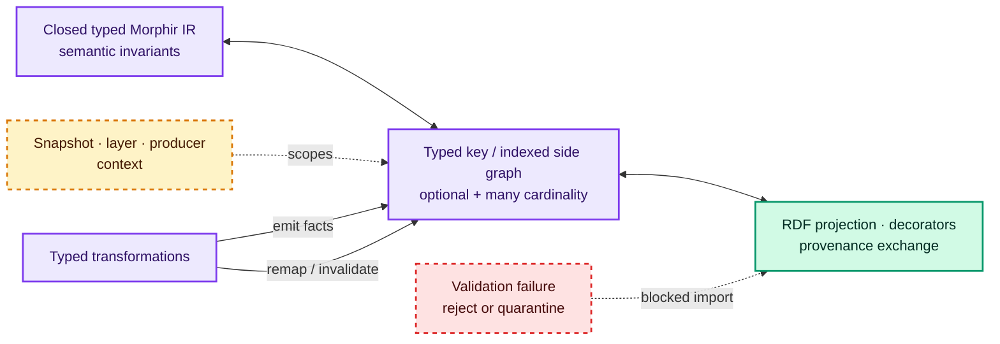

# Typed attribution guidance for morphir-scala

**Non-negotiable boundary:** Morphir semantic invariants remain in closed, strongly typed IR nodes. Attribution
flexibility must not replace node alternatives, required semantic fields, resolved names, or Morphir types with
strings, untyped maps, RDF terms, or validation that happens only at runtime. A valid attribution design starts
after that boundary, not instead of it.

The leading prototype candidate is a **typed indexed side graph with an explicit RDF projection**. It keeps
intrinsic meaning in the IR, gives variable facts a typed extension boundary, supports efficient local lookup, and
allows selected facts to participate in linked-data interchange. This is a prototype recommendation to test, not a
settled morphir-scala IR design.

## Two different responsibilities

**Intrinsic semantics** are required to interpret or validate a Morphir node. They belong inside the closed typed
IR. **Variable attribution** includes facts whose producer, vocabulary, cardinality, lifecycle, or ownership can
vary—analysis results, source correspondence, user decorations, diagnostics, and lineage. Those facts belong behind
a typed extension boundary.

RDF can be a storage, interchange, and relation-query option for selected variable attribution. It is not the static
type system of the compiler. SHACL or import validation can reject malformed external graphs, but it cannot recreate
Scala exhaustivity or make an invalid IR node unconstructable; the standards boundary is detailed in
[RDF, linked data, and provenance](/rdf-linked-data-and-provenance.md).

This division follows the broader distinction in
[attribution of typed trees](/attribution-of-typed-trees.md). Morphir's own evidence spans recursively typed v3
payloads, Morphir-Elm node-addressed decorators, and v4-era explicit attributes plus a separate layered-decoration
design.[^morphir-v3-spec][^morphir-elm-type][^morphir-elm-value][^morphir-elm-node-id][^morphir-elm-decoration][^morphir-elm-decoration-codec][^morphir-v4-attributes][^morphir-v4-layered-decorations]
The sources establish those designs, not which one morphir-scala must adopt; see
[Morphir attribution evolution](/morphir-attribution-evolution.md).

## Ranked strategies

The ranking applies the priorities in this order: (1) uncompromised Morphir semantic type safety, (2) a simple,
stable core IR, (3) efficient local traversal, transformation, and lookup, (4) ergonomic typed access, then
(5) user control, provenance, linked-data interoperability, and open extension.

1. **Typed indexed side graph plus RDF projection.** Keep semantic fields in closed IR nodes; use snapshot-scoped
   typed references and keys for local attribution; project a declared vocabulary to RDF. Prototype this first
   because it can combine direct typed lookup with open interchange without making RDF or an effect library part of
   the IR.
2. **Fixed intrinsic attributes plus typed extensions.** Standardize a small set of stable, broadly required fields
   in the IR and place variable facts behind typed extension keys. This has excellent local ergonomics, but every
   intrinsic addition changes the core schema and the extension/IR duplication rule must be explicit.
3. **External decorators alone.** Independent artifacts maximize user ownership and lifecycle control. They rank
   lower because every compiler consumer must load, validate, index, synchronize, and preserve an external address
   space before ordinary local access is ergonomic.
4. **RDF-native compiler storage.** Graph-native relations and open vocabularies are powerful for interchange and
   specialist queries. As primary compiler storage, however, RDF shifts too much semantic typing, cardinality, and
   failure detection to wrappers and runtime validation. It is included for comparison but is rejected wherever it
   replaces the closed typed semantic IR required by the boundary above.
5. **Recursive generic attribute parameters.** This strategy has strong payload typing: Morphir-Elm's `Type a` and
   `Value ta va` make the selected payload type uniform through each recursive family.[^morphir-elm-type][^morphir-elm-value]
   Its position reflects whole-system simplicity and ergonomics, not a lack of type safety. Payload parameters and
   mapping obligations propagate through constructors, visitors, transformations, utilities, and codecs. Type
   safety must not impose enough caller burden to recreate that practical cost under a more elaborate API. Generics
   remain appropriate when one whole-tree payload family is genuinely the desired contract.

## Comparative scorecard

Scores are relative for the priorities above: **5** is strongest and **1** is weakest. “IR type safety” asks whether
closed semantic nodes remain statically safe—not whether arbitrary external data is magically compile-time-safe.

| Rank and strategy | IR type safety | Core stability | Local ergonomics | Traversal / lookup cost | Rewrite / preservation policy | User control | Linked-data interchange |
| --- | ---: | ---: | ---: | ---: | ---: | ---: | ---: |
| 1. Typed indexed side graph + RDF projection | 5 | 5 | 5 | 5 | 4 | 4 | 5 |
| 2. Fixed intrinsic attributes + typed extensions | 5 | 3 | 5 | 5 | 4 | 3 | 3 |
| 3. External decorators alone | 5 | 5 | 2 | 2 | 2 | 5 | 4 |
| 4. RDF-native compiler storage | 1 | 4 | 2 | 2 | 3 | 5 | 5 |
| 5. Recursive generic attribute parameters | 5 | 2 | 2 | 4 | 3 | 2 | 2 |

The underlying **evidence** is the pinned Morphir shapes and codecs cited above, plus the identity, attribution, and
RDF mechanisms established in this bundle. The numeric scores, priority ordering, and prototype recommendation are
**engineering judgement**. In particular, no cited source measures morphir-scala lookup latency, memory use, or
cross-platform RDF cost; the prototype must measure them.

## Illustrative typed indexed API

This self-contained Scala 3 teaching API is illustrative, not settled. Opaque identifiers keep snapshot, node,
layer, and producer domains distinct.[^scala-reference] Separate optional and many-valued key types put cardinality
in the method selected by the caller:

```scala
object TypedAttribution:
  opaque type SnapshotId = String
  object SnapshotId:
    def apply(value: String): SnapshotId =
      require(value.nonEmpty, "snapshot id must be non-empty")
      value

  opaque type LocalNodeId = Long
  object LocalNodeId:
    def apply(value: Long): LocalNodeId =
      require(value >= 0, "local node id must be non-negative")
      value

  opaque type LayerId = String
  object LayerId:
    def apply(value: String): LayerId =
      require(value.nonEmpty, "layer id must be non-empty")
      value

  opaque type ProducerId = String
  object ProducerId:
    def apply(value: String): ProducerId =
      require(value.nonEmpty, "producer id must be non-empty")
      value

  sealed trait NodeKind
  sealed trait Expression extends NodeKind
  sealed trait Declaration extends NodeKind

  enum RuntimeNodeKind:
    case Expression, Declaration

  final case class NodeRef[+S <: NodeKind](
      snapshot: SnapshotId,
      local: LocalNodeId
  )

  final case class AttributionContext(
      snapshot: SnapshotId,
      layer: LayerId,
      producer: ProducerId
  )

  final case class KeyId(
      namespace: String,
      name: String,
      version: Int
  ):
    require(namespace.nonEmpty, "key namespace must be non-empty")
    require(name.nonEmpty, "key name must be non-empty")
    require(version > 0, "key version must be positive")

  trait ValueSchema[A]:
    def schemaId: String
    def encode(value: A): Either[String, String]
    def decode(encoded: String): Either[String, A]

  trait Applicability[-S <: NodeKind]:
    def applicabilityId: String
    def accepts(actual: RuntimeNodeKind): Boolean

  trait OptionalKey[-S <: NodeKind, A]:
    def id: KeyId
    def schema: ValueSchema[A]
    def applicability: Applicability[S]

  trait ManyKey[-S <: NodeKind, A]:
    def id: KeyId
    def schema: ValueSchema[A]
    def applicability: Applicability[S]

  final case class Type(name: String)
  final case class Tag(value: String)

  object TypeSchema extends ValueSchema[Type]:
    val schemaId = "morphir.type-name/v1"
    def encode(value: Type): Either[String, String] =
      if value.name.nonEmpty then Right(value.name)
      else Left("type name must be non-empty")
    def decode(encoded: String): Either[String, Type] =
      if encoded.nonEmpty then Right(Type(encoded))
      else Left("type name must be non-empty")

  object TagSchema extends ValueSchema[Tag]:
    val schemaId = "morphir.user-tag/v1"
    def encode(value: Tag): Either[String, String] =
      if value.value.nonEmpty then Right(value.value)
      else Left("tag must be non-empty")
    def decode(encoded: String): Either[String, Tag] =
      if encoded.nonEmpty then Right(Tag(encoded))
      else Left("tag must be non-empty")

  object ExpressionApplicability extends Applicability[Expression]:
    val applicabilityId = "morphir.node-kind/expression/v1"
    def accepts(actual: RuntimeNodeKind): Boolean =
      actual == RuntimeNodeKind.Expression

  object DeclarationApplicability extends Applicability[Declaration]:
    val applicabilityId = "morphir.node-kind/declaration/v1"
    def accepts(actual: RuntimeNodeKind): Boolean =
      actual == RuntimeNodeKind.Declaration

  object InferredType extends OptionalKey[Expression, Type]:
    val id = KeyId("org.finos.morphir.analysis", "inferred-type", 1)
    val schema = TypeSchema
    val applicability = ExpressionApplicability

  object Tags extends ManyKey[Declaration, Tag]:
    val id = KeyId("org.finos.morphir.user", "tags", 1)
    val schema = TagSchema
    val applicability = DeclarationApplicability

  enum LookupError:
    case SnapshotMismatch(
        expected: SnapshotId,
        actual: SnapshotId
    )
    case UnknownNode(snapshot: SnapshotId, local: LocalNodeId)
    case InapplicableKey(id: KeyId, actual: RuntimeNodeKind)
    case UnknownKey(id: KeyId)
    case InvalidStoredValue(id: KeyId, details: String)

  enum RegistrationError:
    case KeyCollision(id: KeyId)
    case SchemaCollision(id: KeyId, registered: String, proposed: String)
    case ApplicabilityCollision(
        id: KeyId,
        registered: String,
        proposed: String
    )

  trait SnapshotMembership:
    def snapshot: SnapshotId
    def kindOf[S <: NodeKind](
        node: NodeRef[S]
    ): Either[LookupError, RuntimeNodeKind]

  trait AttributionView:
    def context: AttributionContext
    def membership: SnapshotMembership

    def get[S <: NodeKind, A](
        node: NodeRef[S],
        key: OptionalKey[S, A]
    ): Either[LookupError, Option[A]]

    def values[S <: NodeKind, A](
        node: NodeRef[S],
        key: ManyKey[S, A]
    ): Either[LookupError, Vector[A]]

  trait AttributionStore:
    def register[S <: NodeKind, A](
        key: OptionalKey[S, A]
    ): Either[RegistrationError, AttributionStore]

    def register[S <: NodeKind, A](
        key: ManyKey[S, A]
    ): Either[RegistrationError, AttributionStore]

    def view(context: AttributionContext): AttributionView

  val snapshot = SnapshotId("typecheck-17")
  val context = AttributionContext(
    snapshot,
    LayerId("analysis"),
    ProducerId("typechecker-2.4")
  )
  val exprRef: NodeRef[Expression] =
    NodeRef(snapshot, LocalNodeId(12))
  val declRef: NodeRef[Declaration] =
    NodeRef(snapshot, LocalNodeId(3))

  def read(
      store: AttributionStore
  ): (
      Either[LookupError, Option[Type]],
      Either[LookupError, Vector[Tag]]
  ) =
    val attrs = store.view(context)
    val inferred = attrs.get(exprRef, InferredType)
    val tags = attrs.values(declRef, Tags)
    (inferred, tags)
```

The public caller API is cast-free: after `val attrs = store.view(context)`, typed cardinality gives
`attrs.get(exprRef, InferredType): Either[LookupError, Option[Type]]` and
`attrs.values(declRef, Tags): Either[LookupError, Vector[Tag]]`. `LookupError.SnapshotMismatch` must be returned when
a node reference does not belong to the view's snapshot. `SnapshotMembership.kindOf` must return `UnknownNode` for a
snapshot-local reference that is not present. Before storage access, `get` and `values` must obtain that runtime kind
and return `InapplicableKey` when the registered key's applicability rejects it. Contravariant node scopes still
allow a key defined for a broader node family to serve a narrower reference without weakening the result type; the
runtime check defends imported, forged, or stale references at the dynamic boundary.

The open key traits let downstream producers add keys. `KeyId` is stable, namespaced, and versioned; registration
must reject reuse with a different cardinality, `applicabilityId`, or `schemaId`; `ApplicabilityCollision` makes the
scope failure explicit. This interface deliberately does not show a heterogeneous map implementation: after
erasure, an implementation cannot recover `A` from `ClassTag` alone.
Packed entries must be created or decoded through the exact registered `ValueSchema[A]`, or through a closed
registry carrying an equality proof between the registered and requested types. External data gains runtime
validation only, never compile-time safety. Corrupt data, unknown keys, and registry collisions remain typed errors.

`view(context)` selects exactly one snapshot/layer/producer address space; it is not an implicit merge across
layers. Implementations must include all three context identifiers in the logical lookup address, even if a physical
index partitions or interns them. A separate resolved-view operation may merge layers only under a deterministic,
named conflict policy.
Evidence and activity links can live in a layer manifest or provenance graph keyed by the same context identifiers;
they need not bloat every hot-path entry or every IR node.

## Transformation contract

A transformation must choose a named outcome for every fact family it understands. **Preserve** asserts continuing
validity, **Recompute** runs the producer again, **Invalidate** explicitly removes a fact, and **Remap** applies
asserted zero-to-many input/output correspondence. Unknown facts must follow a declared default; silent copying is
not a policy.

| Fact family | Default outcome | Required check |
| --- | --- | --- |
| Intrinsic semantic | Recompute | Construct a valid output IR node; never outsource the invariant |
| Source correspondence | Preserve for unchanged nodes; otherwise Remap or Invalidate | Source snapshot, coordinate units, generated/split-node multiplicity |
| Analysis results | Recompute | Producer version and analysis preconditions |
| User decorations | Remap; otherwise Invalidate or retain as an explicit orphan | Ownership, target existence, merge/conflict policy |
| Provenance / lineage | Remap by appending derivation facts | Endpoint snapshots, activity, producer, relation vocabulary |
| Diagnostics / telemetry | Recompute or Preserve only against the original snapshot | Run scope, severity vocabulary, retention policy |

The identity and zero-to-many semantics behind `Remap` are specified in
[node identity and addressability](/node-identity-and-addressability.md). Pipeline stages must publish these outcomes
alongside their value transformations; see [transformation pipelines](/transformation-pipelines.md) and the
toolchain-level integration guidance in [guidance for a Morphir toolchain](/morphir-toolchain-guidance.md).

## Recommended prototype topology



In prose: the closed typed IR and typed index cooperate without either replacing the other. The index exchanges
selected facts with RDF, decorators, and provenance formats. Transformations emit, remap, or invalidate facts.
Snapshot/layer/producer context is separate, and failed validation follows the labeled reject-or-quarantine path.
Purple denotes typed semantic machinery, green denotes external exchange, amber dashed denotes context, and red
dashed denotes failure; labels preserve the meaning without color.

## Prototype evaluation

The prototype must answer these questions with measurements, compile-time examples, rewrite fixtures, and round-trip
tests:

- Are the common call sites as direct as `get` and `values`, with no casts, schema plumbing, or recursive payload
  parameters imposed on callers?
- What are traversal, lookup, allocation, and memory costs on representative IR snapshots?
- Can snapshot identities, local references, key schemas, contexts, and stores serialize deterministically?
- Can zero-to-many and many-to-one rewrites remap facts without pretending that derivation is identity?
- Are dangling targets and orphaned external decorations detected and reported?
- Are layer merge and conflict results deterministic across producer order and concurrent execution?
- Which typed facts round-trip through the RDF vocabulary, and are lossy or unknown facts rejected or quarantined?
- Can one implementation and serialization contract work on JVM, Scala.js, and Scala Native without a mandatory RDF
  engine?

### Acceptance and rejection criteria

The following are **provisional engineering budgets**, not measured facts. Record the fixture corpus, hardware,
runtime, warm-up, sample count, and plain-map comparator with every result. The comparator is an equivalent set of
typed `Map[NodeRef[S], A]` values queried with the same node/key distribution and containing the same logical facts.

| Gate | Prototype acceptance threshold |
| --- | --- |
| Registered-fact round-trip | 100% value, cardinality, key ID, snapshot, layer, and producer equality after store serialization and after the declared RDF projection/import subset |
| Invalid input | 100% rejection of injected unknown-key, key/schema/cardinality/applicability collision, malformed payload, inapplicable key, dangling node, and snapshot-mismatch cases |
| Public ergonomics | Zero casts and zero untyped-map access at public call sites in the fixture suite |
| Lookup latency | Warm p95 `get`/`values` latency no more than 20% slower than the plain typed-map comparator |
| Retained memory | No more than 2.0 times the retained memory of equivalent typed maps after full construction |
| Rewrite behavior | 100% expected Preserve/Recompute/Invalidate/Remap and orphan outcomes across zero-, one-, and many-result fixtures |
| Determinism | Byte-identical merged store and serialized output across at least 100 randomized producer-completion orders |
| Platforms | The same public API, registry tests, and serialization fixtures compile and pass on JVM, Scala.js, and Scala Native |

Accept recommendation 1 for a broader design trial only if every gate passes. Permit one documented, bounded
optimization pass when latency or memory alone misses its budget; do not change the corpus or comparator after
seeing the result. Rank recommendation 2 ahead of recommendation 1 if any correctness, determinism, round-trip, or
cross-platform gate fails, or if either performance budget still fails after that one pass. Recommendation 2 also
moves ahead for a fact shown to be stable and universally required when intrinsic storage meets the same comparator
with less machinery.

## Scala 3 and Kyo callout

Scala 3 opaque types, variance, givens, and extensions can keep the typed boundary compact; the example above uses
only standard Scala language mechanisms.[^scala-reference] Kyo is not part of the IR or attribution data model. If
pipeline stages need effectful fact production, the version-pinned implementation choices belong in
[Scala 3 and Kyo implementation notes](/scala-3-and-kyo-implementation-notes.md), while the architecture remains
defined by typed nodes, identity, preservation, merge, and interchange contracts.

[Structural tree interoperability](/structural-tree-interoperability.md) explains why a projection does not replace
the typed source model. The neighboring concepts on
[attribution](/attribution-of-typed-trees.md), [RDF and provenance](/rdf-linked-data-and-provenance.md),
[Morphir evolution](/morphir-attribution-evolution.md), [identity](/node-identity-and-addressability.md),
[pipelines](/transformation-pipelines.md), and [toolchain guidance](/morphir-toolchain-guidance.md) supply the
evidence and contracts summarized here.

[^morphir-v3-spec]: Morphir IR Specification at commit `4d5e5c06`.
[^morphir-elm-type]: Morphir-Elm IR Type at commit `1956c36d`.
[^morphir-elm-value]: Morphir-Elm IR Value at commit `1956c36d`.
[^morphir-elm-node-id]: Morphir-Elm IR NodeId at commit `1956c36d`.
[^morphir-elm-decoration]: Morphir-Elm IR Decoration at commit `1956c36d`.
[^morphir-elm-decoration-codec]: Morphir-Elm IR Decoration Codec at commit `1956c36d`.
[^morphir-v4-attributes]: Morphir IR v4 draft attributes at commit `4d5e5c06`.
[^morphir-v4-layered-decorations]: Morphir layered decorations design at commit `4d5e5c06`.
[^scala-reference]: Scala 3 Reference.
